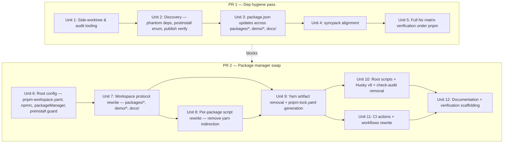

# refactor: Migrate from Yarn 4 to pnpm workspaces

## Overview

We are migrating the castore monorepo from Yarn 4.10.2 workspaces to pnpm 10 workspaces in two independently mergeable PRs. **PR 1** performs a dependency hygiene audit (still on Yarn, adds missing explicit `devDependencies` currently masked by hoisting). **PR 2** performs a mechanical tooling-layer swap (lockfile, workspace protocol, CI, documentation).

## Problem Frame

Yarn 4 with `nodeLinker: node-modules` hoists dev tooling (Babel plugins, ESLint plugins, `scripts/`, `commonConfiguration/`) and hides undeclared dependencies. The ESLint rule `import/no-extraneous-dependencies` catches only `src/**`, not tooling or config. Migration to pnpm with `strict-peer-dependencies=true` and a strict linker enforces a complete dependency graph and aligns package-manager choice with other projects in the org. (see origin: `specs/requirements/2026-04-17-yarn-to-pnpm-migration-requirements.md`)

## Requirements Trace

- **R1.** `pnpm install` runs without `shamefully-hoist=true` and without warnings (empty `public-hoist-pattern[]`).
- **R2.** All Nx targets work through `pnpm nx ...` with identical semantics, including `test-stylelint`.
- **R3.** Published tarballs are functionally equivalent - same files, same `exports`, and no regression in `dependencies`/`peerDependencies` ranges.
- **R4.** CI (`test-pr.yml`, `deploy-docs.yml`, `release-to-npm.yml`) passes with cold-install times <= baseline + 10%.
- **R5.** Husky hook + commitlint + `syncpack format` in `postinstall` remain functional under pnpm postinstall gating (`onlyBuiltDependencies` allow-list).
- **R6.** `strict-peer-dependencies=true` active on main after PR 2 merge (gating, not deferred).
- **R7.** No window where an external contributor can silently regenerate `yarn.lock` on a fork branch - `preinstall: only-allow pnpm` guard is active.
- **R8.** `packageManager` field pinned with Corepack SHA-256 hash for tamper-evident pinning.

## Scope Boundaries

- No version bumps except: (a) what pnpm strict mode forces, and (b) `syncpack fix-mismatches` patch/minor alignment. No major bumps.
- No public API changes in package code (`packages/*/src/index.ts`).
- No changes to `commonConfiguration/babel.config.js` or the tsc/tsc-alias pipeline.
- No changes to `nx.json` or Nx cache semantics.
- No migration to pnpm-native features (catalogs, advanced filters).

### Deferred to Separate Tasks

- **Canary publish rehearsal** via `workflow_dispatch`: `release-to-npm.yml` is trigger-bound to `on: release: published` with `ref: main`. Adding `workflow_dispatch` is a separate change outside migration scope. Rely on publish parity diff + runtime smoke test in PR 2; first real tag release after merge remains a de facto integration test.
- **NPM_TOKEN scope audit + rotation**: requires npmjs.org org admin access; outside implementer scope. Separate security task.
- **Bulk SHA pinning of all GitHub Actions** (`JS-DevTools/npm-publish@v2`, `JamesIves/github-sponsors-readme-action@v1.5.0`, `EndBug/add-and-commit`, actions/*): separate security hardening PR with Dependabot/Renovate configuration for SHA-pin awareness.
- **`dependency-review-action` on PRs changing `pnpm-lock.yaml`**: supply-chain tamper detection. Separate follow-up.
- **npm OIDC "Trusted Publishing"** as replacement for long-lived NPM_TOKEN: separate security initiative.
- **`sync-readme-sponsors.yml` PAT scope review** + `JamesIves/...` SHA pin: unrelated to package manager swap.

## Context & Research

### Relevant Code and Patterns

- Root package.json: workspaces, `packageManager: yarn@4.10.2`, `engines.node: ^22.19.0`, husky postinstall, `type: module`.
- `.yarnrc.yml`: `nodeLinker: node-modules`, `enableGlobalCache: false`, `yarnPath: .yarn/releases/yarn-4.10.2.cjs`. No PnP, no resolutions, no custom plugins -> straightforward mapping to pnpm.
- `eslint.config.js`: already enforces `import/no-extraneous-dependencies` for `src/**` files.
- `commonConfiguration/babel.config.js`: custom `addImportExtension` plugin rewrites import specifiers for `.cjs`/`.mjs` per build env. Uses only Node built-ins (`fs`, `path`), no workspace-specific resolution.
- `nx.json`: Nx 21 with `@nx/workspace/presets/npm.json` preset, `defaultBase: main`. Package-manager-agnostic.
- `packages/*/package.json`: dual CJS/ESM/types build via babel + tsc-alias; conditional `exports`; sibling `@castore/*` as `workspace:` (Yarn 4 bare syntax - **pnpm requires `workspace:*`**).
- `docs/package.json`: Docusaurus workspace with 4 `workspace:` bare deps (`@castore/core`, `command-json-schema`, `demo-blueprint`, `lib-react-visualizer`).
- `.github/actions/install-node-modules/action.yml`: `actions/setup-node@v3` + 2 cache steps (yarn cache dir + `**/node_modules`).
- `.github/workflows/release-to-npm.yml`: per-package `JS-DevTools/npm-publish@v2` from `./packages/X/package.json` (not from `dist/`). Action auto-packs. `cp README.md ./packages/core/README.md` step before publish.
- Per-package script patterns (for example `packages/core/package.json`): `"package": "rm -rf dist && yarn package-cjs && yarn package-esm && yarn package-types"`; `"watch": "concurrently 'yarn:package-* --watch'"`; `"test": "yarn test-type && yarn test-unit && yarn test-circular && yarn test-linter"`; direct binaries through `yarn <bin>` wrappers.

### Institutional Learnings

- `docs/solutions/` does not exist - this is the first plan-level artifact in the repo.

### External References

- pnpm 10 default: postinstall scripts blocked except `onlyBuiltDependencies` allow-list (fail-closed); `dedupe-peer-dependents=true` default.
- `corepack use pnpm@X.Y.Z` generates `packageManager: pnpm@X.Y.Z+sha256.<hash>` in package.json. Corepack verifies hash only on first download; runtime enforcement is via `pnpm/action-setup` integrity check.
- `concurrently` supports generic `npm:` prefix (works equivalently with pnpm/npm/yarn). `yarn:` prefix is Yarn-specific.
- `npm-audit-resolver@3.0.0-RC` has no `--pnpm` flag; `pnpm audit` is the native replacement with overrides through `.pnpmfile.cjs` or `pnpm.overrides`.

## Key Technical Decisions

- **Split into 2 PRs** (dep hygiene -> swap). PR 2 requires PR 1 as a prior merge. Reason: PR 2 is mechanical and easier to review without noise from dependency updates. (see origin)
- **`strict-peer-dependencies=true` is gating in PR 2**, not deferred. Flipping this flag after merge would negate primary migration driver (2). (Updated from document review; previously deferred.)
- **`preinstall: "only-allow pnpm"`** with `only-allow` pinned as a devDependency (not `npx only-allow`). Removes network fetch on each install + reduces supply-chain attack surface. (Adversarial + security review.)
- **`packageManager` pin format:** `pnpm@10.<minor>.<patch>+sha256.<hash>` generated via `corepack use pnpm@10.<minor>.<patch>`. Actual runtime enforcement is `pnpm/action-setup@<sha>` in CI, not Corepack cache.
- **Canary publish demoted to follow-up.** Publish parity diff (normalized against current-main build) + runtime smoke test in scratch pnpm project cover load-bearing parts of publish flow; canary only duplicated reliability without independent signal.
- **`check-audit`/`resolve-audit` removed** from root scripts and `npm-audit-resolver` removed from devDependencies. Replaced by `pnpm audit --prod` as optional dev command.
- **`**/node_modules` cache step removed in CI.** pnpm store is cached via `actions/setup-node@v4 cache: 'pnpm'`. Per-workspace symlinks are re-materialized each run - accepted tradeoff; baseline measurement verifies <= +10%.
- **`.nx/cache` is in `.gitignore` (verified)** and is not CI-cached (verified). `nx reset` is a merge-checklist step after PR 2 merge due to potential cache-hash drift.
- **Per-package scripts use direct binaries** (`depcruise`, `eslint`, `vitest`, `tsc`) where possible, `pnpm run <script>` only for internal script chains. Root scripts use `pnpm exec <bin>` (different binary resolution scope).
- **Published `peerDependencies` `"@castore/core": "*"` kept**, not rewritten to `workspace:*`. Trade-off: local CI does not detect peer range drift, but published format remains readable and package-manager-agnostic.

## Open Questions

### Resolved During Planning

- *Gating strict-peer-deps?* -> Gating in PR 2 (active in PR 2 `.npmrc`, not follow-up).
- *Canary publish mechanism?* -> Demoted to follow-up; workflow trigger modification is a separate change.
- *NPM_TOKEN audit in scope?* -> Follow-up (admin access required).
- *Bulk SHA pinning in scope?* -> Only `pnpm/action-setup`; rest is follow-up.
- *Corepack SHA verification reality?* -> Enforcement is `pnpm/action-setup` in CI; Corepack is only documentation-level pinning.
- *`.nx/cache` status?* -> Ignored by git, not CI-cached. Forced `nx reset` as post-merge checklist item.
- *`npm-audit-resolver --pnpm`?* -> Does not exist. Remove scripts + dependency, optionally replace with `pnpm audit`.
- *Publish mechanism in `release-to-npm.yml`?* -> Per-package `JS-DevTools/npm-publish` from `./packages/X/package.json` (source, not `dist/`). Action auto-packs. `workspace:*` rewrite occurs at pack time via pnpm.
- *Docs workspace in scope?* -> Yes, `docs/package.json` has `workspace:` bare deps that must be rewritten.

### Deferred to Implementation

- **Exact pnpm 10.x.y version:** latest stable at PR 2 open time, pinned through `corepack use pnpm@10.<minor>.<patch>`.
- **Exact `onlyBuiltDependencies[]` content:** output of PR 1 Unit 2 (postinstall enumeration step). Minimum known: `husky`.
- **Is any `public-hoist-pattern[]` entry required?** Default no; add only if PR 1/2 CI reveals a concrete blocking case. Every entry requires PR-level justification.
- **Is `pnpm-lock.yaml` dedupe needed after first generation?** Decide after first `pnpm install`; if `pnpm dedupe --check` flags, include in the same commit.

## High-Level Technical Design

> *This illustrates sequencing and blast-radius shape and is directional guidance for review, not implementation specification. The implementing agent should treat it as context, not code to reproduce.*



## Implementation Units

### PR 1 — Dep Hygiene Pass

- [ ] **Unit 1: Side-worktree + audit tooling**

**Goal:** Reproducible isolated sandbox where we can run pnpm install + full Nx matrix without affecting the main Yarn-based development environment.

**Requirements:** R1, R2 (preparation)

**Dependencies:** none

**Files:**
- Create: `scripts/audit-pnpm-side-worktree.sh` (helper script, uses `git worktree add` + isolated `$PNPM_HOME`).
- Create: `scripts/audit/.npmrc` (side-worktree-only; `strict-peer-dependencies=true`, `auto-install-peers=false`, `resolution-mode=highest`, without `shamefully-hoist`).

**Approach:**
- `git worktree add ../castore-pnpm-audit` -> new working copy of current branch.
- In that worktree, copy `scripts/audit/.npmrc` to root.
- Temporarily add `pnpm-workspace.yaml` (scope copied from root `workspaces` field).
- Run `pnpm install` - first pass to surface `ERR_PNPM_UNDECLARED_DEPENDENCY` and `ERR_PNPM_PEER_DEP_ISSUES`.

**Patterns to follow:**
- `scripts/setPackagesVersions.ts` as existing tooling script pattern (ESM, ts-node invocation).
- No writes to main worktree - side worktree is temporary.

**Test scenarios:**
- Test expectation: none - setup utility only, no behavioral change in repo.

**Verification:**
- Script `./scripts/audit-pnpm-side-worktree.sh` creates isolated directory and prints state summary (path, `.npmrc` content).

---

- [ ] **Unit 2: Discovery — phantom deps, postinstall enum, publish verify**

**Goal:** In side worktree, collect 4 outputs that feed the rest of both PRs: (1) missing deps per package, (2) packages with postinstall/install lifecycle scripts, (3) actual publish command behavior, (4) syncpack behavior with `workspace:*`.

**Requirements:** R1, R3, R5

**Dependencies:** Unit 1

**Files:**
- Create: `scripts/audit/outputs/phantom-deps.txt` (ad hoc; add to `.gitignore` or commit as audit trail - committing is preferred).
- Create: `scripts/audit/outputs/postinstall-packages.txt`.
- Create: `scripts/audit/outputs/publish-mechanism-notes.md`.
- Create: `scripts/audit/outputs/syncpack-workspace-protocol-check.md`.

**Approach:**
- (1) Run `pnpm install` in side worktree, collect errors into `phantom-deps.txt`. Then run `pnpm nx run-many --target=test-type,test-unit,test-linter,test-circular,test-stylelint,package --all` - runtime phantom deps appear as module-not-found errors, collect and append.
- (2) Use `pnpm list --depth=Infinity --json | jq '...'` to enumerate packages with `scripts.postinstall|install|preinstall` (direct and transitive). Output -> `postinstall-packages.txt`. Minimum known: `husky`. Remaining candidates become allowed list candidates.
- (3) Document that `release-to-npm.yml` runs `JS-DevTools/npm-publish@v2` per package with `package: ./packages/X/package.json` (source, not `dist/`). It auto-packs via `npm pack` + rewrites `workspace:*` protocol at pack time. pnpm CLI `publish` would do the same + rewrite `workspace:*` to exact version. Action uses nested `npm publish` logic - verify in release notes for the specific `@v2` tag.
- (4) In side worktree: after adding explicit deps in Unit 3 and changing `workspace:` -> `workspace:*` locally (to be reverted later), run `pnpm install && pnpm postinstall` (which runs `syncpack format`). Verify `syncpack` does not rewrite `workspace:*` into something else. If it does, Unit 10 must remove `syncpack format` from postinstall.

**Patterns to follow:**
- Commit audit outputs as `scripts/audit/outputs/*` - PR 1 reviewers need readable input for PR 2.

**Test scenarios:**
- Test expectation: none - discovery pass, output is audit data, not behavior.

**Verification:**
- All 4 output files exist and contain concrete data (not placeholders).
- `phantom-deps.txt` format is `<package-path>: <missing-dep>` so Unit 3 can apply fixes mechanically.

---

- [ ] **Unit 3: `package.json` updates across `packages/*`, `demo/*`, `docs/`**

**Goal:** Every workspace `package.json` declares all runtime and tooling deps it actually imports or executes.

**Requirements:** R1, R2, R5

**Dependencies:** Unit 2 (`phantom-deps.txt`)

**Files:**
- Modify: `packages/*/package.json` (all needed, based on phantom-deps list).
- Modify: `demo/*/package.json` (blueprint, implementation, visualization).
- Modify: `docs/package.json`.

**Approach:**
- For each entry in `phantom-deps.txt`: add dep to target `package.json` `devDependencies` (or `dependencies` if runtime-imported from `src/**`).
- For adapters that currently have `@castore/core: "workspace:"` in both `devDependencies` and `peerDependencies`: keep both - pnpm requires dev link to local workspace; peer is for consumers.
- Use `jq` for mechanical edits where possible; manual preview before commit.
- Versions: add only new entries, do not change existing ones (syncpack handles alignment in Unit 4).

**Patterns to follow:**
- `packages/core/package.json` as reference pattern for core package.
- `packages/event-storage-adapter-dynamodb/package.json` as reference pattern for adapter (`core` in both `peerDependencies` + `devDependencies`).

**Test scenarios:**
- **Integration:** `yarn install --immutable` on main still passes without errors (new deps resolve from yarn cache/registry).
- **Integration:** `nx run-many --target=test-linter,test-unit,test-type,test-circular,test-stylelint,package --all` green on Yarn (non-regression).
- **Integration:** In side worktree, `pnpm install` runs without `ERR_PNPM_UNDECLARED_DEPENDENCY` (at most `ERR_PNPM_PEER_DEP_ISSUES` remain, handled in Unit 4).

**Verification:**
- `git diff` shows only `package.json` files (no source file changes).
- CI `test-pr` is green on Yarn.

---

- [ ] **Unit 4: `syncpack` alignment**

**Goal:** Unified versions for shared devDependencies across workspaces (for example `typescript`, `vitest`, `@babel/*` family, `eslint`, `prettier`).

**Requirements:** R1, R5

**Dependencies:** Unit 3

**Files:**
- Modify: multiple `package.json` files (syncpack output).

**Approach:**
- `yarn syncpack list-mismatches` -> manual review list.
- `yarn syncpack fix-mismatches` - only if auto-fix matches highest patch/minor without major changes.
- Flag major mismatches and decide case-by-case (likely none if Unit 3 hygiene added no major dependencies).

**Patterns to follow:**
- `postinstall: syncpack format` already uses this tooling - repo is syncpack-friendly.

**Test scenarios:**
- **Happy path:** After `fix-mismatches`, `yarn syncpack list-mismatches` output is empty.
- **Integration:** `yarn install --immutable` + `nx run-many --target=test-*` green.

**Verification:**
- `yarn syncpack list-mismatches` has no output.
- CI `test-pr` is green.

---

- [ ] **Unit 5: Full Nx matrix verification under pnpm**

**Goal:** Final PR 1 exit criterion - pnpm in side worktree truly runs all test targets, not just `install`. Captures runtime phantom deps that install-time diagnostics miss.

**Requirements:** R1, R2, R5

**Dependencies:** Unit 4

**Files:**
- Append to: PR 1 description (handoff note for PR 2).

**Approach:**
- In side worktree (with `package.json` updates from Unit 3+4, local `workspace:*` changes, `.npmrc` from Unit 1):
  - `pnpm install` - clean, 0 undeclared + 0 peer issues.
  - `pnpm nx run-many --target=test-type,test-unit,test-linter,test-circular,test-stylelint,package --all` - all green.
  - `pnpm nx run docs:build` - Docusaurus build OK.
- If green: revert local `workspace:*` changes (keep only audit outputs + package.json additions).
- Write PR 1 description section "Handoff to PR 2" with:
  - List of `onlyBuiltDependencies` for `.npmrc`.
  - Publish mechanism findings.
  - Syncpack verdict (OK / remove from postinstall).

**Test scenarios:**
- **Integration:** Install + full Nx matrix + Docusaurus build under pnpm, all green.

**Verification:**
- PR 1 description contains handoff section.
- All 4 audit output files committed in PR 1.

---

### PR 2 — Package Manager Swap

- [ ] **Unit 6: Root config — `pnpm-workspace.yaml`, `.npmrc`, `packageManager`, preinstall guard**

**Goal:** New package-manager-level configuration that anchors the migration: workspace discovery, strict install settings, version pinning, guard against wrong package manager invocation.

**Requirements:** R1, R5, R6, R7, R8

**Dependencies:** PR 1 merged (handoff required)

**Files:**
- Create: `pnpm-workspace.yaml`.
- Create: `.npmrc` (root).
- Modify: `package.json` (root - packageManager, preinstall script, workspaces field removal, only-allow devDependency).

**Approach:**
- `pnpm-workspace.yaml`:
  ```yaml
  packages:
    - 'packages/*'
    - 'demo/*'
    - 'docs'
  ```
- `.npmrc`:
  ```
  strict-peer-dependencies=true
  auto-install-peers=false
  resolution-mode=highest
  # onlyBuiltDependencies allow-list is fail-closed for unknown packages.
  # Every addition requires security review (CODEOWNERS rule for this file as follow-up).
  only-built-dependencies[]=husky
  # <any others from PR 1 Unit 2 output>
  ```
- Root `package.json`:
  - Remove `workspaces` field.
  - `packageManager: "pnpm@10.<minor>.<patch>+sha256.<hash>"` - generate via `corepack use pnpm@10.<minor>.<patch>` in fresh local workspace.
  - Add `scripts.preinstall: "only-allow pnpm"`.
  - Add `only-allow` as devDependency (pinned exact version).

**Patterns to follow:**
- `.yarnrc.yml` as existing package manager config file -> `.npmrc` is its equivalent.

**Test scenarios:**
- **Happy path:** `pnpm install` passes cleanly; `pnpm install` runs `only-allow pnpm` -> pass.
- **Error path:** `yarn install` (fork contributor simulation) -> `only-allow pnpm` prints "You must use pnpm" and exits non-zero.
- **Integration:** `pnpm install` postinstall chain runs - `husky` installs git hooks, `syncpack format` runs.

**Verification:**
- Fresh clone + `pnpm install` passes.
- `pnpm install` + `.git/hooks/commit-msg` exists (husky installed successfully).

---

- [ ] **Unit 7: Workspace protocol rewrite**

**Goal:** Every cross-workspace `@castore/*` dependency uses pnpm-compatible `workspace:*` syntax.

**Requirements:** R3

**Dependencies:** Unit 6

**Files:**
- Modify: `packages/*/package.json` (where `@castore/*: "workspace:"` appears in `dependencies` or `devDependencies`).
- Modify: `demo/*/package.json`.
- Modify: `docs/package.json`.

**Approach:**
- Bulk edit: regex replace `"workspace:"` -> `"workspace:*"` in every workspace `package.json`.
- Do not rewrite `peerDependencies`: `@castore/core: "*"` stays `*` (see Key Technical Decisions).
- Verify `syncpack` after rewrite does not rewrite `workspace:*` -> `workspace:^X.Y.Z` (should already be confirmed by PR 1 Unit 2 output).

**Patterns to follow:**
- Yarn 4 bare syntax `"workspace:"` appears 20+ times across repo; use uniform regex.

**Test scenarios:**
- **Happy path:** `grep -r '"workspace:"' packages/ demo/ docs/` has no results; `grep -r '"workspace:\*"'` count is correct.
- **Integration:** `pnpm install` after rewrite runs clean; workspace links are `node_modules/@castore/core/ -> ../../packages/core`.

**Verification:**
- `pnpm list --recursive --depth=0` shows `@castore/*` links as `link:...` (local).

---

- [ ] **Unit 8: Per-package script rewrite**

**Goal:** Remove Yarn indirection from all internal script chains. Use direct binaries where possible, `pnpm run <script>` for cross-script chains, `concurrently 'npm:...'` generic prefix.

**Requirements:** R2, R4

**Dependencies:** Unit 6

**Files:**
- Modify: `packages/*/package.json` (scripts blocks).
- Modify: `demo/*/package.json`.
- Modify: `docs/package.json`.

**Approach:**
- For each script value pattern:
  - `"yarn <script>"` in chains (for example `yarn package-cjs && yarn package-esm`) -> `"pnpm run <script>"`.
  - `"yarn <bin>"` where `<bin>` is a local devDependency binary (eslint, vitest, tsc, depcruise, babel) -> `"<bin>"` (direct call; pnpm resolves through `node_modules/.bin` same as Yarn).
  - `"concurrently 'yarn:<prefix>-* --watch'"` -> `"concurrently 'npm:<prefix>-* --watch'"` (generic prefix).
- Use jq-based bulk rewrite script for readable diff:
  - For example: `jq '.scripts |= with_entries(.value |= gsub("yarn "; "pnpm run "))' packages/*/package.json` - with manual review of output.

**Patterns to follow:**
- Existing per-package script structure; do not change script names or semantics, only command syntax.

**Test scenarios:**
- **Happy path:** `pnpm nx run core:test-unit` -> green (`test-unit` internally runs `vitest run`).
- **Happy path:** `pnpm nx run core:watch` -> starts `concurrently` with `npm:package-*` expansion, both (CJS + ESM) watch processes run.
- **Happy path:** `pnpm package` from root via Nx -> per-package chain (`package-cjs`, `package-esm`, `package-types`) runs, `dist/` generated.
- **Edge case:** `pnpm run lint-fix --silent` - without yarn indirection, error codes propagate correctly.

**Verification:**
- `grep -r '"yarn ' packages/ demo/ docs/` has no results in scripts blocks.
- `pnpm nx run-many --target=package,test-unit,test-type --all` is green.

---

- [ ] **Unit 9: Yarn artifact removal + `pnpm-lock.yaml` generation**

**Goal:** Clean breakpoint - no Yarn artifacts in repo, pnpm lockfile committed.

**Requirements:** R3, R7

**Dependencies:** Unit 6, Unit 7, Unit 8

**Files:**
- Delete: `yarn.lock`.
- Delete: `.yarn/` (entire directory including `releases/yarn-4.10.2.cjs`).
- Delete: `.yarnrc.yml`.
- Create: `pnpm-lock.yaml`.
- Modify: `.gitignore` (remove yarn-specific blocks: `.pnp.*`, `.yarn/*` patterns, `yarn-debug.log*`, `yarn-error.log*`).

**Approach:**
- `git rm -r yarn.lock .yarn .yarnrc.yml`.
- `pnpm install` - generates `pnpm-lock.yaml`.
- `git add pnpm-lock.yaml`.
- Update `.gitignore`: remove yarn section, add pnpm section only if needed (in practice, pnpm store is global, no per-repo artifact to ignore).

**Patterns to follow:**
- `.gitignore` line patterns from existing file.

**Test scenarios:**
- **Happy path:** Fresh clone -> `pnpm install` passes; `pnpm-lock.yaml` content-addressable integrity hash check passes.
- **Integration:** `git status` after `pnpm install` is clean (no unexpected file changes).

**Verification:**
- `ls .yarn* yarn.lock` -> no such files.
- `pnpm install --frozen-lockfile` passes without regenerating lockfile.

---

- [ ] **Unit 10: Root scripts + Husky v9 fix + `check-audit` removal**

**Goal:** Root-level `package.json` scripts are fully pnpm-native; yarn-specific scripts removed, pre-existing Husky v9 syntax fixed.

**Requirements:** R2, R5

**Dependencies:** Unit 9

**Files:**
- Modify: `package.json` (root - scripts block, devDependencies).

**Approach:**
- Root scripts transformations:
  - `test: "nx run-many --target=test --all"` -> unchanged (Nx CLI is package-manager-agnostic; invoked via `pnpm test` = `pnpm run test` = `nx run-many ...`).
  - `test-circular: "yarn depcruise ..."` -> `"pnpm exec depcruise --validate .dependency-cruiser.js ."`.
  - `check-audit: "check-audit --yarn"` -> **remove script**.
  - `resolve-audit: "resolve-audit --yarn"` -> **remove script**.
  - `npm-audit-resolver` -> **remove from devDependencies**.
  - `postinstall: "husky install && syncpack format"` -> `"husky && syncpack format"` (v9 deprecation fix).
  - `set-packages-versions: "ts-node scripts/setPackagesVersions"` -> unchanged.
  - `graph: "nx dep-graph"` -> unchanged.

**Patterns to follow:**
- Per-package `test-circular` script keeps direct `depcruise` invocation (different resolve scope).

**Test scenarios:**
- **Happy path:** `pnpm install` (via postinstall) installs husky git hooks without deprecation warning.
- **Happy path:** `pnpm test-circular` passes (deps resolved).
- **Happy path:** `pnpm test` -> Nx run-many, all packages green.

**Verification:**
- `.git/hooks/commit-msg` exists and contains husky wrapper.
- `pnpm install` output does not include `'husky install' command is DEPRECATED` warning.

---

- [ ] **Unit 11: CI action + workflow rewrites**

**Goal:** All GitHub Actions CI fragments use pnpm; cache strategy is pnpm-native; `pnpm/action-setup` is SHA-pinned.

**Requirements:** R4, R7, R8

**Dependencies:** Unit 9

**Files:**
- Modify: `.github/actions/install-node-modules/action.yml`.
- Modify: `.github/actions/package/action.yml`.
- Modify: `.github/actions/lint-and-tests/action.yml`.
- Modify: `.github/actions/get-affected-packages-paths/get-affected-paths.sh`.
- Modify: `.github/workflows/deploy-docs.yml`.
- Modify: `.github/workflows/release-to-npm.yml`.

**Approach:**
- `install-node-modules/action.yml` - full rewrite:
  - Upgrade `actions/setup-node@v3` -> `@v4`, `actions/cache@v3` -> `@v4`.
  - Add `pnpm/action-setup@<pinned-commit-sha>` before setup-node with `version: <exact-pnpm-10.x.y>`.
  - `actions/setup-node@v4` with `cache: 'pnpm'`, `node-version: 22`.
  - **Remove** `**/node_modules` cache step and its `cache-hit` conditional.
  - Install step: `pnpm install --frozen-lockfile`.
- `package/action.yml`: `yarn package` -> `pnpm package`.
- `lint-and-tests/action.yml`: explicit `yarn test-linter`, `yarn test-stylelint`, `yarn test-unit`, `yarn test-type`, `yarn test-circular` -> `pnpm <target>` (all 5 explicit lines).
- `get-affected-paths.sh`: `yarn nx show project` -> `pnpm exec nx show project`; `yarn nx show projects` -> `pnpm exec nx show projects`.
- `deploy-docs.yml`: `yarn nx run docs:build` -> `pnpm nx run docs:build`.
- `release-to-npm.yml`:
  - `yarn set-packages-versions ${{...}}` -> `pnpm set-packages-versions ${{...}}`.
  - Keep others unchanged (`JS-DevTools/npm-publish@v2`, `cp README.md ...`).

**Patterns to follow:**
- Composite action structure in `.github/actions/*`.
- `uses: ./.github/actions/...` references from workflows.

**Test scenarios:**
- **Happy path:** `test-pr.yml` is green on PR.
- **Happy path:** `deploy-docs.yml` runs from main after PR 2 merge, Docusaurus build succeeds.
- **Integration:** Cold CI run (empty cache) -> pnpm store fill + install. Second run (warm store) -> reduced install time.

**Verification:**
- `test-pr` CI job is green.
- `grep -r "yarn" .github/` returns only comments or external action names (for example `.yarn/releases/yarn-...` - but that file no longer exists).

---

- [ ] **Unit 12: Documentation + verification scaffolding**

**Goal:** Documentation matches new workflow; verification tooling for exit criteria (publish parity, runtime smoke test, lockfile drift) is scaffolded for repeatability.

**Requirements:** R2, R3, R4

**Dependencies:** Unit 10, Unit 11

**Files:**
- Modify: `README.md`.
- Modify: `CONTRIBUTING.md`.
- Modify: `CLAUDE.md` (root - *Common commands* and build pipeline section).
- Modify: `docs/docs/1-installation.md` (verify/update if it contains yarn).
- Modify: `packages/*/README.md` (add `pnpm add` + `npm install` variants next to existing `yarn add`).
- Create: `scripts/verify/publish-parity.sh` (normalized `npm pack --dry-run` diff vs current-main build).
- Create: `scripts/verify/runtime-smoke-test.sh` (scratch pnpm project, install 2 tarballs, deep import).
- Create: `scripts/verify/lockfile-drift-check.sh` (independent regeneration + diff - renamed from "integrity" to "drift").

**Approach:**
- Docs: use sed/manual replacement `yarn <cmd>` -> `pnpm <cmd>` where package-manager-specific; keep packaging commands (for example `npm publish`) unchanged.
- `scripts/verify/publish-parity.sh`:
  1. For each `packages/X`: run equivalent pre-publish chain (pnpm package + `cp README.md ./packages/core/README.md` copy step for core).
  2. `npm pack --dry-run --json` -> JSON listing of files + integrity.
  3. Checkout `main`, run same pre-publish chain + `npm pack --dry-run`.
  4. Normalize (strip `version` field, sort `files[].path`) and diff.
  5. Exit non-zero if tarball `package.json` differs in `dependencies`/`peerDependencies` ranges.
- `scripts/verify/runtime-smoke-test.sh`:
  1. `mktemp -d` scratch project with `package.json` containing `"type": "module"` + `"engines": "node >=22"`.
  2. `pnpm init && pnpm add file:../castore/packages/core/.tarball file:../castore/packages/event-storage-adapter-in-memory/.tarball`.
  3. Test script: `import { EventStore, EventType } from '@castore/core'; import { InMemoryStorageAdapter } from '@castore/event-storage-adapter-in-memory'; ... deep import on submodule path ...`.
  4. `node smoke-test.mjs` - exit 0 if all imports resolve and basic API call passes.
- `scripts/verify/lockfile-drift-check.sh`:
  1. Docker/fresh container (or clean npm environment), `rm -rf node_modules ~/.pnpm-store/v3/*`.
  2. `pnpm install --frozen-lockfile=false` - fresh resolve.
  3. `diff pnpm-lock.yaml committed-pnpm-lock.yaml`.
  4. Exit non-zero + summary on diff. **Note:** this is drift detection (committed vs fresh resolve mismatch), not tamper detection.

**Patterns to follow:**
- Existing `scripts/` directory conventions - ESM/`ts-node` or bash.
- `CLAUDE.md` section patterns.

**Test scenarios:**
- **Happy path:** `./scripts/verify/publish-parity.sh` -> green (no unintended diff).
- **Happy path:** `./scripts/verify/runtime-smoke-test.sh` -> green; `node smoke-test.mjs` exit 0.
- **Error path:** if publish parity changes `dependencies` range, script fails with concrete diff output.
- **Edge case:** runtime smoke test with scratch project on layout different from repo (scratch is pnpm-native) - verifies `addImportExtension` Babel plugin rewrites resolve under symlinked `.pnpm/` layout.

**Verification:**
- `grep -r "yarn" README.md CONTRIBUTING.md CLAUDE.md` returns only context mentions, not command invocations.
- All 3 verify scripts are executable and run locally with zero exit.

**Execution note:** PR 2 description contains merge checklist with these post-merge steps:
1. `nx reset` on CI runners (Nx cache invalidation after package manager swap).
2. Run `runtime-smoke-test.sh` with tarballs built manually from main after merge (sanity check).
3. Monitor first real tag release - `deploy-docs` + `release-to-npm.yml` behavior.

## System-Wide Impact

- **Interaction graph:** CI workflows (`test-pr`, `deploy-docs`, `release-to-npm`) directly depend on custom composite actions in `.github/actions/`. Changing install-node-modules action affects all three workflows at once.
- **Error propagation:** `preinstall: only-allow pnpm` guard fails fast with clear message if a contributor runs another package manager. `strict-peer-dependencies=true` changes peer mismatch warnings into hard errors.
- **State lifecycle risks:** lockfile format transition. After PR 2 merge, developers with cached `node_modules` must run `rm -rf node_modules && pnpm install` (documented in CONTRIBUTING).
- **API surface parity:** published `@castore/*` packages keep identical exports and types; only internal `dependencies`/`peerDependencies` range format may change (verified by parity script).
- **Integration coverage:** runtime smoke test + publish parity diff are the only tests that verify tarball behavior under pnpm layout without real publish.
- **Unchanged invariants:**
  - `src/index.ts` public exports in all packages.
  - Babel config (`commonConfiguration/babel.config.js`) input/output.
  - Nx target names and semantics.
  - CJS/ESM/types triple-build pipeline.

## Risks & Dependencies

| Risk | Likelihood | Impact | Mitigation |
|---|---|---|---|
| `JS-DevTools/npm-publish@v2` auto-pack under pnpm symlinked `node_modules` includes incorrect files in tarball | Low | Medium | Publish parity diff (Unit 12) - file listing diff vs current-main build. If diff appears, block PR 2 merge and investigate. |
| `addImportExtension` Babel plugin produces broken ESM import specifiers under pnpm `.pnpm/` layout | Low-medium | Medium | Runtime smoke test (Unit 12) - scratch pnpm project with deep import, not only package-entry import. |
| `syncpack format` in `postinstall` rewrites `workspace:*` to unexpected value | Low | Medium | PR 1 Unit 2 verifies this behavior; if risky, move `syncpack format` from postinstall to `package` target. |
| strict peer deps + `auto-install-peers=false` breaks install due to unexpected transitive peer | Medium | Low | PR 1 Unit 5 (full Nx matrix under pnpm) catches all; in PR 2, remaining issues handled by adding explicit peer to root devDependencies. |
| Nx cache poisoning due to package-manager change (cached task hashes refer to Yarn-era resolution) | Low | Low | Merge checklist: `nx reset` on CI runners post-merge. `.nx/cache` is in `.gitignore`, CI does not cache it -> limited blast radius. |
| External contributors with long-lived fork branches cannot rebase cleanly | Medium | Low | GitHub Issue with 7-day warning before PR 2 merge + proactive maintainer rebase help. `preinstall` guard prevents silent Yarn regeneration. |
| First real tag release after PR 2 merge fails in `release-to-npm.yml` | Low | High | Canary publish is deferred, but publish parity + runtime smoke test cover pack behavior. First release remains integration test - document rollback via `npm deprecate` if needed. |
| Cold install time under pnpm for 20-package monorepo exceeds baseline + 10% | Medium | Low | Merge checklist: baseline recorded before merge; monitor 3 CI runs after merge. If regression persists, consider explicit `node_modules` cache step (symlinks preserved) as follow-up. |

## Documentation / Operational Notes

- **CLAUDE.md update:** Common commands section + build pipeline section require updates; packageManager references.
- **CONTRIBUTING.md:** pnpm installation guide link + migration note for existing contributors.
- **README.md:** install example changes minimally (downstream can still use any package manager).
- **Per-package README.md:** add pnpm/npm variants for sample consumer install.
- **Rollback:** PR 2 is commit-level reversible via `git revert`; `yarn.lock` + `.yarn/` remain in git history. Worst-case recovery window: 1 hour.
- **Monitoring:** after PR 2 merge, monitor 3 `test-pr` CI runs for cold-install regression; `deploy-docs` on main push; first tag release for `release-to-npm`.

## Sources & References

- **Origin document:** [specs/requirements/2026-04-17-yarn-to-pnpm-migration-requirements.md](../requirements/2026-04-17-yarn-to-pnpm-migration-requirements.md)
- Related code (Yarn config): `.yarnrc.yml`, `.yarn/releases/yarn-4.10.2.cjs`, root `package.json` workspaces field.
- Related code (publish pipeline): `.github/workflows/release-to-npm.yml`, `scripts/setPackagesVersions.ts`.
- Related code (CI): `.github/actions/{install-node-modules,package,lint-and-tests,get-affected-packages-paths}`, `.github/workflows/{test-pr,deploy-docs,release-to-npm}.yml`.
- Related code (build): `commonConfiguration/babel.config.js`, `nx.json`, `eslint.config.js`.
- External: pnpm 10 changelog, `pnpm/action-setup` GitHub Action, Corepack docs (Node 22).
