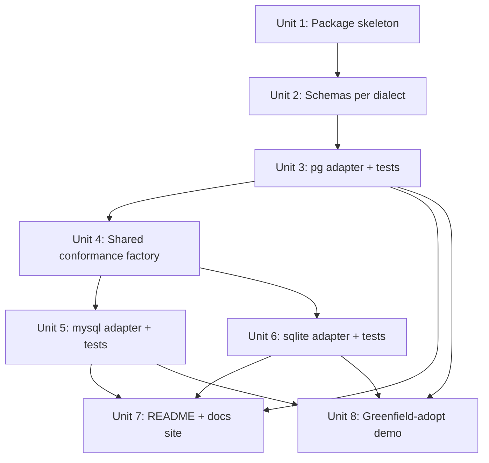

# feat: event-storage-adapter-drizzle — Drizzle-based SQL event storage adapter

## Overview

Add a new workspace package, `@castore/event-storage-adapter-drizzle`, that implements Castore's `EventStorageAdapter` interface against any caller-supplied Drizzle DB instance. Ships first-class support for PostgreSQL, MySQL, and SQLite in one package, with a shared conformance test suite that runs byte-identically across all three dialects.

The adapter exports per-dialect `eventColumns` and a pre-built `eventTable`. Users may pass the default table or spread `eventColumns` into their own table with a custom name and extra columns (tenant_id, correlation_id, audit columns). Users own connection lifecycle and migrations (via their own `drizzle-kit` setup); the adapter only issues queries against the table reference it was constructed with.

The existing `@castore/event-storage-adapter-postgres` is not modified in this work. A concrete deprecation trigger is set for after v1.1 of the new adapter, conditional on at least one internal production deployment.

## Problem Frame

Castore currently ships one SQL adapter, tied to the `postgres` npm client and owning its own DDL. Teams on MySQL, SQLite/Turso/libSQL, or teams that want to reuse their Drizzle setup, cannot adopt Castore's SQL story without forking. The new adapter closes that gap for teams already on (or willing to adopt) Drizzle ORM. See origin: [specs/requirements/2026-04-17-event-storage-adapter-drizzle-requirements.md](../requirements/2026-04-17-event-storage-adapter-drizzle-requirements.md).

## Requirements Trace

Carried forward from the requirements doc (see origin for full text):

- **R1**–**R4**: new workspace package, exposed adapter class(es), constructor accepts `{ db, eventTable }`, driver packages are not declared deps (peers are `@castore/core` + `drizzle-orm`).
- **R5**–**R7**: first-class pg + mysql + sqlite with documented per-dialect fallbacks; per-dialect sub-entrypoints; observable equivalence at parsed-value level (no byte/key-order guarantees on JSON).
- **R8**–**R10**, **R22**: export `eventColumns` and `eventTable` per dialect; column identity owned by the package; users may spread columns into their own table with custom name + extras (extras must be nullable / defaulted). Adapter queries against the passed table reference.
- **R11**: single `EventAlreadyExistsError` (code aligned with core's `eventAlreadyExistsErrorCode`) regardless of dialect.
- **R12**, **R13**, **R19**: `pushEventGroup` atomic via Drizzle transactions; class-type identity check for grouped events (no DB-instance identity); outer-tx composition not supported in v1.
- **R14**, **R15**, **R16**, **R21**: existing postgres adapter unchanged in this work; v1 is greenfield-only (no migration tooling, no byte-compatibility promise); docs site recommends the Drizzle adapter as the default SQL path on release; deprecation trigger set for v1.1.
- **R17**, **R18**: shared behavior suite runs against pg + mysql + sqlite; test matrix covers push/get round-trip, version conflict, pushEventGroup atomicity + rollback, pagination, reverse order, and per-dialect fallback paths.
- **R20**: README documents the supported-driver allow-list (`drizzle-orm/node-postgres`, `drizzle-orm/postgres-js`, `drizzle-orm/mysql2`, `drizzle-orm/better-sqlite3`, `drizzle-orm/libsql` local). No runtime check.

## Scope Boundaries

- No changes to `@castore/event-storage-adapter-postgres` in this work.
- No in-place migration, no copy-migration tooling, no byte-compatibility promise between adapters. Greenfield-only.
- Non-transactional Drizzle drivers (Cloudflare D1, `drizzle-orm/neon-http`, PlanetScale serverless) are outside the supported-driver allow-list. No runtime rejection; undocumented behavior if used.
- No per-call tx override. Outer-transaction composition is forbidden in v1.
- No schema renames or column-type overrides. Users may extend (add columns) but not redefine.
- No bundled `drizzle-kit` config. Users run their own migrations.
- No changes to `packages/core`'s `EventStorageAdapter` interface.

### Deferred to Separate Tasks

- **Postgres adapter deprecation (R21)**: executed in a later PR once the Drizzle adapter has a minor release + at least one internal production deployment. Not part of this plan.
- **Schema rename / column-type override (if post-ship tracking shows material demand)**: future v2 RFC.

## Context & Research

### Relevant Code and Patterns

- `packages/event-storage-adapter-postgres/src/adapter.ts` — the reference for query shapes, `pushEventGroup` transaction flow, `listAggregateIds` pagination logic, and error-code detection (SQLSTATE 23505). Acts as the semantic source of truth for the new adapter's behavior on pg.
- `packages/event-storage-adapter-postgres/src/error.ts` — exact shape of `PostgresEventAlreadyExistsError` (extends `Error`, implements `EventAlreadyExistsError` from core, carries `code + eventStoreId + aggregateId + version`). The Drizzle adapter's error class mirrors this shape.
- `packages/event-storage-adapter-postgres/src/adapter.unit.test.ts` — canonical test topology: `testcontainers/postgresql` with 100s `beforeAll`, `createEventTable` in `beforeEach`, `dropEventTable` in `afterEach`, full matrix of pushEvent / getEvents / listAggregateIds / pushEventGroup tests. The shared conformance suite (Unit 4) refactors these into a dialect-parametric factory.
- `packages/event-storage-adapter-in-memory/src/adapter.ts` — simpler, non-transactional `pushEventGroup` implementation with explicit manual rollback (pop-on-fail). Useful reference for how failure rollback is expected to look to callers, even though our Drizzle implementation uses real DB transactions.
- `packages/event-storage-adapter-postgres/{babel,eslint,vite}.config.js`, `.dependency-cruiser.js`, `project.json`, `tsconfig.json`, `tsconfig.build.json` — the standard package skeleton. Each is a thin re-export / extend of the shared root config. The new package mirrors all of them 1:1.
- `packages/event-storage-adapter-postgres/eslint.config.js` — precedent for disabling `max-lines`, `@typescript-eslint/no-unsafe-*`, `strict-boolean-expressions`, and `no-non-null-assertion` in DB-adapter packages. The Drizzle package reuses this override block; the per-dialect file split (R6) is driven by tree-shaking, not the `max-lines` rule.
- `packages/core/src/eventStorageAdapter.ts` — interface contract. The Drizzle adapter implements all five methods.
- `packages/core/src/event/groupedEvent.ts` and `Command` integration — `pushEventGroup` contract (`[GroupedEvent, ...GroupedEvent[]]` tuple, `force` option).

### Institutional Learnings

No `docs/solutions/` entries exist yet for this repo (searched and empty). No prior Drizzle work in the codebase.

### External References

No external research was dispatched. Drizzle-specific API details (per-dialect `RETURNING`, ON CONFLICT, transaction API shape, JSON column transformers) are well documented at https://orm.drizzle.team and are resolved at implementation time via the Drizzle docs and its TypeScript types. The plan captures the *decisions* that depend on those APIs; the exact call shapes are a per-unit implementation detail.

## Key Technical Decisions

- **Column identity owned, table composition open** (R8, R9, R22). The package exports `eventColumns` (Drizzle column-definition object) AND a pre-built `eventTable` per dialect. Users may pass `eventTable` directly or spread `eventColumns` into their own table. Queries reference columns via the passed table handle (`table.aggregateName`, etc.) so custom names and extras are transparent. Compile-time source-shape check: a per-dialect `EventTableContract<'<dialect>'>` TS type the adapter constructor uses to constrain the `eventTable` parameter. This only verifies what the user wrote in their Drizzle schema module — it cannot detect DB-side drift (a user manually editing generated migrations, renaming columns, or pointing drizzle-kit at a mismatched existing table). Runtime drift surfaces as a driver-level "column does not exist" error on first query; catching that case is out of scope for v1.
- **Unique constraint is part of the contract, exported as a constraint-builder helper.** Because a user-composed table needs the unique tuple (aggregate_name, aggregate_id, version) for version-conflict detection, the package exports a second-arg factory (e.g. `eventTableConstraints(table)`) users pass into `pgTable/mysqlTable/sqliteTable`'s third argument. Documented in README with an example.
- **One package, per-dialect sub-entrypoints** (R6). Resolve the R6 deferred question with sub-path exports: `@castore/event-storage-adapter-drizzle/pg`, `/mysql`, `/sqlite`. Package `exports` field is configured so each entrypoint ships its own `dist/{cjs,esm,types}`. The root `eslint.config.js` `no-restricted-imports` rule uses a flat `@castore/*/*` pattern with no allow-list — it WILL match the declared sub-paths for any internal consumer (demos, tests outside this package). Unit 1 narrows that rule by adding the three declared sub-paths to an allow-list (or equivalent exception), committed upfront rather than as a reactive fallback. No wildcard `./*` export — the public surface is exactly `.`, `./pg`, `./mysql`, `./sqlite`.
- **Root `.` entrypoint** ships as a minimal module. `src/index.ts` re-exports only the shared `DrizzleEventAlreadyExistsError` class and the per-dialect contract types (as type-only re-exports). It does NOT re-export any adapter class or dialect schema — users must import those from the appropriate `/pg`, `/mysql`, or `/sqlite` sub-path. This keeps the root bundle tiny, satisfies Node's ESM loader for consumers that accidentally do `import ... from '@castore/event-storage-adapter-drizzle'`, and honors R6's tree-shaking goal.
- **Contract types are split per-dialect, not shared.** `src/pg/contract.ts`, `src/mysql/contract.ts`, `src/sqlite/contract.ts` each import only from their respective `drizzle-orm/{pg,mysql,sqlite}-core` subpath. A single shared `common/contract.ts` would drag all three dialect type graphs into every bundle and defeat R6. `src/common/` is reserved for truly dialect-agnostic code (the error class).
- **Class-type group check only** (R13). Each per-dialect adapter class does `groupedEvent.eventStorageAdapter instanceof ThisAdapterClass` — same structure as `PostgresEventStorageAdapter`. No DB-instance identity, no synthetic Symbol tag.
- **Minimum MySQL version is 8.0.21** (product commitment, resolves the requirements-doc deferred question on this). This version-floor lets the mysql adapter use native `RETURNING` and CTEs in `listAggregateIds` — the adapter ships with no re-select fallback and no two-query pagination fallback. A separate fallback would fix `force=true` concurrency semantics only by serializing writes; requiring MySQL 8.0.21+ is simpler, safer, and aligned with current AWS RDS / PlanetScale / Aurora MySQL v3 defaults. Aurora Serverless v1 / RDS MySQL 5.7 users stay on the existing postgres adapter or a self-managed solution. Documented in the README's supported-driver allow-list.
- **Error detection approach** (R5, R11). Error-shape expectations below are tentative — Unit 3 is explicitly test-first so the first version-conflict integration test observes the real `err` object from each driver (including any `DrizzleError` wrapping of `.cause`) and the concrete detector is written into the adapter from that observation. Key Decisions records the expected shape; the detector implementation is confirmed against the running driver, not assumed.
  - **pg** (both `postgres-js` and `node-postgres`): native `RETURNING *` and `ON CONFLICT ... DO UPDATE`. Expected error shape: `code === '23505'` (possibly wrapped on `.cause` depending on Drizzle version).
  - **mysql** (`mysql2`, MySQL 8.0.21+ only): native `RETURNING` and `INSERT ... ON DUPLICATE KEY UPDATE`. Expected error shape: `errno === 1062` or `.code === 'ER_DUP_ENTRY'`.
  - **sqlite** (`better-sqlite3` / `libsql` local): native `RETURNING` on SQLite 3.35+ (shipping with both drivers). `INSERT ... ON CONFLICT ... DO UPDATE` supported. Expected error shape: `.code === 'SQLITE_CONSTRAINT_UNIQUE'`.
- **Timestamp column type per dialect** (R10, flagged as deferred in requirements).
  - pg: `timestamp('timestamp', { withTimezone: true, precision: 3 }).notNull().defaultNow()` → TIMESTAMPTZ(3). Matches existing adapter semantics.
  - mysql: `datetime('timestamp', { mode: 'string', fsp: 3 }).notNull().default(sql\`CURRENT_TIMESTAMP(3)\`)` → DATETIME(3). Returned as ISO-string via `mode: 'string'`.
  - sqlite: `text('timestamp').notNull().$defaultFn(() => new Date().toISOString())` → TEXT storing ISO-8601 strings. Lexicographic sort = chronological sort as long as the format is fixed-width ISO-8601, which `toISOString()` guarantees.
  All three sort stably by ascending/descending timestamp for `listAggregateIds` pagination (the pageToken encodes an ISO string in every case).
- **JSON payload handling** (R7, R10). pg uses `jsonb`. mysql uses `json` (helper returns a parsed value, but note MySQL re-serializes — no byte guarantees). sqlite uses `text('payload', { mode: 'json' })` — Drizzle's built-in JSON mode wraps `JSON.parse`/`JSON.stringify` transparently. Adapter's public contract says: `payload` / `metadata` are parsed JS values; callers must not rely on key order round-tripping.
- **Transaction API shape** (R12). All three dialect adapters use Drizzle's `db.transaction(async (tx) => { ... })`. The adapter does NOT accept a per-call tx override (R19). The `pushEventGroup` implementation iterates grouped events inside one `db.transaction(...)` call on `this.db`. If any inner call throws, Drizzle rolls back.
- **No runtime driver probe** (R20). The README's supported-driver allow-list is documentation only. If a user wires an unsupported driver (D1, neon-http), construction succeeds but `pushEventGroup` will throw at first call with whatever error the driver surfaces. This is explicitly called out in the README.
- **Shared conformance test suite** (R17, R18). A factory `makeAdapterConformanceSuite({ setup, teardown, adapterFactory, dialectName })` lives in the package (NOT in `lib-test-tools`, which today only contains mock helpers and is not the right home). Each per-dialect test file imports the factory and provides its testcontainer / in-process setup. This guarantees byte-identical assertions across dialects.
- **Build artifacts per entrypoint.** Each of `pg`, `mysql`, `sqlite` sub-entrypoints emits its own `dist/cjs/{pg,mysql,sqlite}/index.cjs`, `dist/esm/...`, `dist/types/...`, plus a tiny root `dist/cjs/index.cjs` / `dist/esm/index.mjs` / `dist/types/index.d.ts` built from `src/index.ts` (shared error class + type-only contract re-exports). The `exports` map in `package.json` has four explicit entries (`.`, `./pg`, `./mysql`, `./sqlite`) and NO wildcard. Tree-shaking works because users import from exactly one sub-path; the root bundle has no dialect code in it. Babel's `addImportExtension` plugin (in `commonConfiguration/babel.config.js`) handles per-extension rewrites.

## Open Questions

### Resolved During Planning

- **Q: Does the R6 per-dialect layout trip the repo's "no `@castore/*/*`" ESLint rule?** A: Yes. Confirmed by reading `eslint.config.js` — the `no-restricted-imports` rule uses a flat `@castore/*/*` pattern with no exception. Unit 1 narrows the rule by allow-listing the three declared sub-paths.
- **Q: Where does the shared conformance suite live?** A: Inside the package itself (`packages/event-storage-adapter-drizzle/src/__tests__/conformance.ts`), not in `lib-test-tools`. Rationale: `lib-test-tools` today hosts mock/mute helpers; a cross-dialect DB conformance suite is a different concern.
- **Q: Does SQLite's TEXT-encoded ISO-8601 timestamp sort stably for pagination?** A: Yes, `Date.prototype.toISOString()` produces fixed-width ISO-8601 strings whose lexicographic order equals chronological order.
- **Q: Which MySQL/SQLite versions are supported at v1?** A: MySQL 8.0.21+ (RETURNING + CTE support — required for the adapter's query shapes). MariaDB is not supported at v1 (would need a 10.5+ floor plus per-dialect quirks that don't fit the "one mysql entrypoint" goal). SQLite 3.35+ (shipping with current `better-sqlite3` and `libsql` local). Older MySQL / MariaDB users stay on the existing postgres adapter or wait for a future minor that adds a two-query fallback.

### Deferred to Implementation

- **Exact Drizzle error shape per driver.** Will be verified during Unit 3 / 5 / 6 by triggering a unique-constraint violation and logging `err` (including any `DrizzleError.cause` chain), then writing the mapping into each adapter's error detector. The five supported drivers (node-postgres, postgres-js, mysql2, better-sqlite3, libsql-local) each get an explicit test case.
- **`mysql2`-only install cross-check.** During Unit 1, verify that a user who installs only `@castore/event-storage-adapter-drizzle` + `drizzle-orm` + `mysql2` (no `pg`, no `better-sqlite3`) can type-check and import from `/mysql` without TypeScript errors. The per-dialect `contract.ts` split should prevent type-graph drift, but the cross-check closes the loop.
- **`.npmrc` `only-built-dependencies[]` allow-list adjustment.** `better-sqlite3` has a native build step. If `pnpm install` fails in CI for the new package's devDependencies, add `better-sqlite3` (and anything else flagged) to the allow-list with a short justification comment. Resolved in Unit 1 by running install and checking.
- **Demo placement.** Whether the greenfield-adopt demo (Unit 8) extends an existing `demo/*` workspace or becomes a small new example under `packages/event-storage-adapter-drizzle/examples/`. Decided during Unit 8 based on what fits with the existing demo structure.

## Output Structure

Expected new file layout under `packages/event-storage-adapter-drizzle/` (per-unit `Files:` sections below are authoritative):

    packages/event-storage-adapter-drizzle/
    ├── .dependency-cruiser.js
    ├── babel.config.js
    ├── eslint.config.js
    ├── package.json
    ├── project.json
    ├── README.md
    ├── tsconfig.build.json
    ├── tsconfig.json
    ├── vite.config.js
    └── src/
        ├── index.ts               # root '.' export: DrizzleEventAlreadyExistsError + type-only contract re-exports
        ├── common/
        │   └── error.ts           # DrizzleEventAlreadyExistsError
        ├── pg/
        │   ├── adapter.ts
        │   ├── adapter.unit.test.ts
        │   ├── contract.ts        # EventTableContract<'pg'>
        │   ├── index.ts
        │   └── schema.ts          # eventColumns, eventTable, eventTableConstraints
        ├── mysql/
        │   ├── adapter.ts
        │   ├── adapter.unit.test.ts
        │   ├── contract.ts        # EventTableContract<'mysql'>
        │   ├── index.ts
        │   └── schema.ts
        ├── sqlite/
        │   ├── adapter.ts
        │   ├── adapter.unit.test.ts
        │   ├── contract.ts        # EventTableContract<'sqlite'>
        │   ├── index.ts
        │   └── schema.ts
        └── __tests__/
            └── conformance.ts     # dialect-parametric test factory

Docs-site changes live under `docs/docs/` (Unit 7). The greenfield demo (Unit 8) may land in `demo/*` or as a new `examples/` folder inside the package.

## High-Level Technical Design

> *This illustrates the intended approach and is directional guidance for review, not implementation specification. The implementing agent should treat it as context, not code to reproduce.*

**Construction and query flow (pg shown; mysql / sqlite analogous):**

```
// User side — simple case
import { drizzle } from 'drizzle-orm/postgres-js'
import postgres from 'postgres'
import { eventTable } from '@castore/event-storage-adapter-drizzle/pg'
import { DrizzlePgEventStorageAdapter } from '@castore/event-storage-adapter-drizzle/pg'

const db = drizzle(postgres(process.env.DB_URL))
const adapter = new DrizzlePgEventStorageAdapter({ db, eventTable })

// User side — extended table
import { eventColumns, eventTableConstraints } from '@castore/event-storage-adapter-drizzle/pg'
import { pgTable, uuid, text } from 'drizzle-orm/pg-core'

const myEvents = pgTable('my_events', {
  ...eventColumns,
  tenantId: uuid('tenant_id').notNull().defaultRandom(),  // user must default non-null extras
  correlationId: text('correlation_id'),                   // nullable is fine
}, eventTableConstraints)

const adapter = new DrizzlePgEventStorageAdapter({ db, eventTable: myEvents })
```

**Adapter method boundaries:**

```
pushEvent(event, opts)
  └─ INSERT ... [ON CONFLICT ... DO UPDATE if opts.force] RETURNING *
     └─ on unique-violation → throw DrizzleEventAlreadyExistsError
     └─ return { event: mapRowToEventDetail(row) }

pushEventGroup(opts, ...groupedEvents)
  └─ validate: all groupedEvents.eventStorageAdapter instanceof ThisClass
  └─ validate: all have context
  └─ this.db.transaction(tx => {
       for each groupedEvent: pushEventInTx(tx, event, {eventStoreId: context.eventStoreId, force: opts.force})
     })
  └─ rollback is automatic on thrown error (Drizzle handles it)

getEvents(aggregateId, context, opts)
  └─ SELECT columns FROM table WHERE aggregate_name = context.eventStoreId AND aggregate_id = aggregateId
     + minVersion/maxVersion/limit/reverse

listAggregateIds(context, opts)
  └─ WITH CTE (pg); analogous query (mysql/sqlite) that returns
     (id, aggregate_id, timestamp, remaining_count) filtered by aggregate_name + timestamp range
  └─ pageToken encodes lastEvaluatedKey = { aggregateId, initialEventTimestamp }

groupEvent(event)
  └─ return new GroupedEvent({ event, eventStorageAdapter: this })
```

**Per-dialect file split:**

Each of `src/pg/`, `src/mysql/`, `src/sqlite/` is independently compiled into its own sub-entrypoint. Shared code (`common/error.ts`, `common/contract.ts`) is small and gets inlined into each bundle. `src/__tests__/conformance.ts` is test-only — never shipped.

## Implementation Units

**Dependency graph:**



Units 5 and 6 can proceed in parallel once Unit 4 lands. Units 1–4 are strictly sequential. Units 7 (README + docs) and 8 (drizzle-integration demo) each wait on all three dialect implementations but do NOT depend on each other — they can land in parallel or in either order.

- [ ] **Unit 1: Package skeleton + workspace wiring**

**Goal:** Create the new package with all standard build/test/lint config, the shared error + contract files, and an empty-but-importable surface per dialect. Verify the per-dialect sub-path exports pass lint and dependency-cruiser.

**Requirements:** R1, R4, R6 (module-layout decision), R20 (README stub).

**Dependencies:** None.

**Files:**
- Create: `packages/event-storage-adapter-drizzle/package.json`
- Create: `packages/event-storage-adapter-drizzle/project.json` (`implicitDependencies: ["core"]`)
- Create: `packages/event-storage-adapter-drizzle/tsconfig.json`
- Create: `packages/event-storage-adapter-drizzle/tsconfig.build.json`
- Create: `packages/event-storage-adapter-drizzle/eslint.config.js` (mirrors pg-adapter override block)
- Create: `packages/event-storage-adapter-drizzle/.dependency-cruiser.js` (re-export root)
- Create: `packages/event-storage-adapter-drizzle/babel.config.js` (re-export common)
- Create: `packages/event-storage-adapter-drizzle/vite.config.js` (re-export common testConfig)
- Create: `packages/event-storage-adapter-drizzle/README.md` (stub; full README in Unit 7)
- Create: `packages/event-storage-adapter-drizzle/src/index.ts` (re-exports `DrizzleEventAlreadyExistsError` + type-only re-exports of per-dialect contracts)
- Create: `packages/event-storage-adapter-drizzle/src/common/error.ts` (`DrizzleEventAlreadyExistsError`)
- Create: `packages/event-storage-adapter-drizzle/src/pg/index.ts` (empty re-export stub)
- Create: `packages/event-storage-adapter-drizzle/src/pg/contract.ts` (`EventTableContract<'pg'>`, imports only from `drizzle-orm/pg-core`)
- Create: `packages/event-storage-adapter-drizzle/src/mysql/index.ts` (stub)
- Create: `packages/event-storage-adapter-drizzle/src/mysql/contract.ts` (`EventTableContract<'mysql'>`, imports only from `drizzle-orm/mysql-core`)
- Create: `packages/event-storage-adapter-drizzle/src/sqlite/index.ts` (stub)
- Create: `packages/event-storage-adapter-drizzle/src/sqlite/contract.ts` (`EventTableContract<'sqlite'>`, imports only from `drizzle-orm/sqlite-core`)
- Modify: root `eslint.config.js` `no-restricted-imports` rule to allow-list the three declared sub-paths of `@castore/event-storage-adapter-drizzle`.
- Modify: root `.npmrc` `only-built-dependencies[]` IF install fails for devDeps with native build (e.g. `better-sqlite3`).

**Approach:**
- `package.json` declares `@castore/core` and `drizzle-orm` as `peerDependencies`. Dialect-specific driver packages (`postgres`, `pg`, `mysql2`, `better-sqlite3`, `@libsql/client`) go in `devDependencies` for tests. `testcontainers/postgresql` and `testcontainers/mysql` also in devDeps.
- `exports` map has exactly four entries: `"."`, `"./pg"`, `"./mysql"`, `"./sqlite"`. No wildcard `"./*"`. Each points at its own `dist/{esm,cjs,types}/<path>/index.{mjs,cjs,d.ts}`. The `.` bundle is built from `src/index.ts` and contains only the shared error class + type-only contract re-exports — no adapter class, no dialect code.
- `DrizzleEventAlreadyExistsError` extends `Error implements EventAlreadyExistsError` with `code = eventAlreadyExistsErrorCode` from `@castore/core`, plus `eventStoreId?`, `aggregateId`, `version` fields. Mirrors `PostgresEventAlreadyExistsError` exactly.
- Each per-dialect `contract.ts` defines `EventTableContract<'<dialect>'>` — a TypeScript-only type that constrains the `eventTable` constructor arg of that dialect's adapter. Asserts the presence of the required columns (`aggregateName`, `aggregateId`, `version`, `type`, `payload`, `metadata`, `timestamp`) with the dialect-specific Drizzle column types, while allowing extras. Imports come ONLY from the dialect's own `drizzle-orm/{pg,mysql,sqlite}-core` subpath. The root `src/index.ts` re-exports these types with `export type { ... }` so TS consumers that only import from `/pg` don't drag mysql/sqlite types into their module graph.
- Root-ESLint adjustment: update `no-restricted-imports.patterns[0]` from a bare `group: ['@castore/*/*']` to include an exception for the three declared sub-paths of this package (e.g. by splitting the group into a disallow list that excludes the specific allow-listed sub-paths, or by adding a second allow-list entry — exact ESLint shape decided at implementation). This is the minimum narrow change; no other parts of the rule are touched.

**Patterns to follow:**
- `packages/event-storage-adapter-postgres/package.json`, `project.json`, `tsconfig.json`, `tsconfig.build.json`, `eslint.config.js`, `.dependency-cruiser.js`, `babel.config.js`, `vite.config.js` — mirror structure.
- `packages/event-storage-adapter-postgres/src/error.ts` — mirror for `DrizzleEventAlreadyExistsError`.

**Test scenarios:**
- Happy path: `pnpm nx run event-storage-adapter-drizzle:test-linter` passes on the stub code.
- Happy path: `pnpm nx run event-storage-adapter-drizzle:test-circular` passes (dependency-cruiser).
- Happy path: `pnpm nx run event-storage-adapter-drizzle:test-type` passes.
- Happy path: `pnpm nx run event-storage-adapter-drizzle:package` produces `dist/{cjs,esm,types}/index.{cjs,mjs,d.ts}` for the root AND `dist/{cjs,esm,types}/{pg,mysql,sqlite}/index.{cjs,mjs,d.ts}` for each sub-entrypoint.
- Edge case (must pass): a test import `@castore/event-storage-adapter-drizzle/pg` from inside another workspace (e.g. a throwaway fixture in `demo/` or a temporary `*.unit.test.ts` file in a different package) does not trip the narrowed root ESLint rule. This is the acid test — intra-package relative imports don't trigger the rule, so the ESLint change must be verified against a cross-package import.

**Verification:**
- `pnpm nx run event-storage-adapter-drizzle:test` runs green (types + lint + circular pass; unit returns zero tests with `--passWithNoTests`).
- `pnpm install` completes without needing to bypass `only-built-dependencies`; if it fails, the adjustment is recorded in `.npmrc` with an inline comment.

---

- [ ] **Unit 2: Per-dialect schemas (`eventColumns`, `eventTable`, constraint helper)**

**Goal:** Export the three per-dialect schema artifacts. No adapter logic yet.

**Requirements:** R8, R9, R10, R22.

**Dependencies:** Unit 1.

**Files:**
- Create: `packages/event-storage-adapter-drizzle/src/pg/schema.ts`
- Create: `packages/event-storage-adapter-drizzle/src/mysql/schema.ts`
- Create: `packages/event-storage-adapter-drizzle/src/sqlite/schema.ts`

**Approach:**
- Each `schema.ts` exports:
  - `eventColumns` — plain object of Drizzle column definitions matching the contract (aggregate_name, aggregate_id, version, type, payload, metadata, timestamp). See Key Technical Decisions for per-dialect column types.
  - `eventTableConstraints(table)` — factory returning the unique-index config that callers pass as the 3rd arg of `pgTable`/`mysqlTable`/`sqliteTable`.
  - `eventTable` — a pre-built Drizzle table built from `{...eventColumns}` + `eventTableConstraints`, default table name `event`.
- Column names on the DB side use snake_case (`aggregate_name`, `aggregate_id`) to match the existing postgres adapter's columns. TypeScript property names use camelCase.
- `aggregate_id` column type per dialect is fixed by R9. Picking a permissive default across dialects: pg `text`, mysql `varchar(64)`, sqlite `text`. This accommodates all three ID shapes the existing postgres adapter supports (UUID / ULID / custom VARCHAR) without the adapter enforcing any one of them. Users who specifically want native UUID typing in pg (for constraint-level rejection of non-UUIDs) cannot get it in v1; that's a v2 schema-extension ask.

- Unique constraint: `UNIQUE (aggregate_name, aggregate_id, version)` — constraint name `event_unique_key` or similar. Each dialect declares it via its `uniqueIndex(...)` helper inside `eventTableConstraints`.

**Patterns to follow:**
- Match the existing postgres adapter's table structure (see origin doc R10 and postgres adapter README).

**Test scenarios:**
- Type-check: `pnpm nx run event-storage-adapter-drizzle:test-type` passes, proving `eventColumns` and `eventTable` are correctly typed and exportable.
- Type-only test file(s) at `packages/event-storage-adapter-drizzle/src/{pg,mysql,sqlite}/schema.type.test.ts` (executed by `test-type`, NOT `test-unit` — see `commonConfiguration/vite.config.js` which only picks up `.unit.test.ts`):
  - **Happy path (contract)**: `expectTypeOf(eventTable).toMatchTypeOf<EventTableContract<'pg'>>()` for each dialect.
  - **Happy path (extension)**: a user-spread composite table with an extra nullable column satisfies `EventTableContract<'pg'>`.
  - **Error path (missing column)**: a user-spread table missing `version` fails the `EventTableContract` type check (`expectTypeOf(...).not.toMatchTypeOf<...>()`).
  - **Error path (wrong type)**: a user-spread table that renames `aggregateId` to `id` fails the contract.

**Verification:**
- Schemas compile, `test-type` is green, manually inspecting generated types shows `eventColumns` has all seven required properties.

---

- [ ] **Unit 3: pg adapter**

**Goal:** Implement `DrizzlePgEventStorageAdapter` for PostgreSQL (both `postgres-js` and `node-postgres` drivers). First dialect — establishes the baseline adapter pattern the other two dialects copy.

**Requirements:** R2, R3, R5 (pg portion), R7, R10, R11, R12, R13, R19, R22.

**Dependencies:** Units 1, 2.

**Files:**
- Create: `packages/event-storage-adapter-drizzle/src/pg/adapter.ts`
- Create: `packages/event-storage-adapter-drizzle/src/pg/adapter.unit.test.ts`
- Modify: `packages/event-storage-adapter-drizzle/src/pg/index.ts` (export `DrizzlePgEventStorageAdapter` + re-export schema + error).

**Approach:**
- `DrizzlePgEventStorageAdapter` constructor: `{ db: NodePgDatabase<...> | PostgresJsDatabase<...>, eventTable: EventTableContract<'pg'> }`. Stores both on the instance.
- `pushEvent(event, options)`: one `INSERT ... VALUES (...) ON CONFLICT (aggregate_name, aggregate_id, version) DO UPDATE SET ...` when `options.force === true`, else plain `INSERT ... RETURNING *`. On duplicate (PostgreSQL error `code = '23505'`), throw `DrizzleEventAlreadyExistsError`. Map the returned row to `EventDetail` (omit `id`, cast `version` → number, parse `timestamp` → ISO string).
- `pushEventGroup(options, ...groupedEvents)`:
  1. Validate all `groupedEvents[i].eventStorageAdapter instanceof DrizzlePgEventStorageAdapter` — throw helpful error otherwise (R13).
  2. Validate all have `context` (match postgres adapter behavior).
  3. Reuse the in-memory adapter's timestamp-coherence logic (`parseGroupedEvents`) — either port the helper or write a small inline equivalent. This keeps cross-adapter behavior consistent.
  4. `this.db.transaction(async (tx) => { for each groupedEvent, insert using tx. If any throws, re-throw → Drizzle rolls back. })`.
- `getEvents(aggregateId, context, opts)`: `SELECT ... FROM eventTable WHERE aggregateName = context.eventStoreId AND aggregateId = aggregateId` + min/max/limit/reverse. Reference columns via `this.eventTable.aggregateName` etc., so user-extended tables work.
- `listAggregateIds(context, opts)`: port the postgres adapter's CTE + pageToken logic. The CTE counts matching `version = 1` rows (the "first event per aggregate") and the outer select returns the paginated slice. PageToken encodes `{ limit, initialEventAfter, initialEventBefore, reverse, lastEvaluatedKey: { aggregateId, initialEventTimestamp } }` as JSON — matching the existing postgres adapter's format so behavior is literally identical.
- `groupEvent(event)`: `new GroupedEvent({ event, eventStorageAdapter: this })`.

**Execution note:** Implement test-first for `pushEvent` + `getEvents` round-trip and the version-conflict error, because the dialect-local error-shape mapping needs to be observed against the real Drizzle output before `DrizzleEventAlreadyExistsError` can be thrown from the correct branch.

**Technical design:** See High-Level Technical Design above.

**Patterns to follow:**
- `packages/event-storage-adapter-postgres/src/adapter.ts` — structure and naming of methods, `parseInputs` / `parsePageToken` logic for `listAggregateIds`, `toEventDetail` mapper.
- `packages/event-storage-adapter-postgres/src/adapter.unit.test.ts` — test topology (testcontainers 100s `beforeAll`, per-test table reset via `beforeEach`/`afterEach`).

**Test scenarios:**
The pg test file directly exercises the adapter with `testcontainers/postgresql`. Some of these assertions get promoted into the shared conformance suite in Unit 4.
- **Happy path**: `pushEvent` returns the event with a server-generated timestamp; `getEvents` returns it. (With `postgres-js` driver.)
- **Happy path**: `pushEvent` then `getEvents` with `minVersion`, `maxVersion`, `limit`, `reverse` variations — each returns the expected slice.
- **Happy path**: `pushEventGroup` across two adapter instances against the same DB succeeds; both aggregates have exactly one event after the call.
- **Happy path**: `listAggregateIds` returns aggregates ordered by `initialEventTimestamp`, paginates correctly via `pageToken`, honors `initialEventAfter` / `initialEventBefore` / `reverse`.
- **Happy path (extended table)**: construct adapter with a user-spread table that adds a nullable `tenant_id TEXT` column and a defaulted `correlation_id UUID DEFAULT gen_random_uuid()` column. `pushEvent` succeeds; the extra columns are populated by the DB; `getEvents` returns the event shape without the extras (adapter only reads its own columns).
- **Error path**: second `pushEvent` with same `(aggregate_name, aggregate_id, version)` throws `DrizzleEventAlreadyExistsError` with `code === eventAlreadyExistsErrorCode` and the right `aggregateId` / `version`.
- **Error path**: `pushEventGroup` with a second-position event whose version already exists rolls back the first event. `getEvents` shows no trace of the first event after the failed group.
- **Error path**: `pushEventGroup` with a `GroupedEvent` bound to a non-DrizzlePgEventStorageAdapter throws; no DB mutation.
- **Error path (same-DB, different adapter class)**: a `GroupedEvent` whose `eventStorageAdapter` is a mysql/sqlite Drizzle adapter or the in-memory adapter throws. (The strictness is class-type per R13.)
- **Integration (driver coverage, smoke only)**: a small smoke test (push one event, read it back, trigger one version conflict) runs twice — once with `drizzle-orm/postgres-js`, once with `drizzle-orm/node-postgres`. Both pass. Full conformance suite runs only once against pg (via Unit 4's factory) — the dual-driver check exists to confirm error-code detection works across both driver shapes, not to re-run the entire suite.
- **Edge case**: `force: true` on an existing version updates the row and returns the new one.
- **Edge case**: `getEvents` on an unknown aggregateId returns `{ events: [] }`.

**Verification:**
- `pnpm nx run event-storage-adapter-drizzle:test-unit` green.
- pushEventGroup failure test shows zero rows in the first aggregate after rollback.
- Both postgres-js and node-postgres driver variants pass identically.

---

- [ ] **Unit 4: Shared conformance test factory + pg wiring**

**Goal:** Extract dialect-agnostic behavior assertions from the pg test file into a factory that the mysql and sqlite tests import. Prevents behavior drift across dialects (R7, R17).

**Requirements:** R7, R17, R18.

**Dependencies:** Unit 3.

**Files:**
- Create: `packages/event-storage-adapter-drizzle/src/__tests__/conformance.ts`
- Modify: `packages/event-storage-adapter-drizzle/src/pg/adapter.unit.test.ts` (refactor to call the factory with pg setup).

**Approach:**
- Factory signature:
  ```
  makeAdapterConformanceSuite({
    dialectName: string,
    setup: () => Promise<{ adapterA, adapterB, reset: () => Promise<void>, teardown: () => Promise<void> }>
  })
  ```
  Each `describe` block inside calls the shared assertion functions with `adapterA` / `adapterB` closed over, wrapping with `beforeAll` / `beforeEach` / `afterAll`.
- Assertions included in the shared suite (from Unit 3's scenarios):
  - push + get round-trip with all query option variations
  - version-conflict error (type check on `DrizzleEventAlreadyExistsError` + code)
  - `pushEventGroup` happy path + atomicity rollback
  - `pushEventGroup` rejects non-class instances (the class is passed via the setup callback)
  - `listAggregateIds` unpaginated + paginated + with time bounds + reverse
  - `force: true` override
  - empty aggregate returns `{ events: [] }`
- Dialect-specific behavior (driver-specific error detection, JSON round-trip parity, extended-table usage) stays in the per-dialect test file. The shared factory covers only the assertions R17/R18 name as cross-dialect conformance; anything not named there belongs in the per-dialect tests.
- The extended-table test case (adapter with a user-spread table including tenant_id + correlation_id) is NOT in the shared factory. It lives in each per-dialect `adapter.unit.test.ts` as a dialect-local test, since its setup and column-type specifics differ per dialect.

**Patterns to follow:**
- `describe` / `it` nesting mirrors `packages/event-storage-adapter-postgres/src/adapter.unit.test.ts`.

**Test scenarios:**
- The pg test, after refactor, still passes.
- **Integration**: refactor should not remove any assertion that existed in Unit 3's test file — scenarios are moved, not deleted.
- **Meta**: compile-time — the factory accepts a typed `adapterClass` that the `instanceof` assertions close over, so mistakes in the dialect wiring become type errors.

**Verification:**
- pg tests still green after refactor.
- Line count of `src/pg/adapter.unit.test.ts` drops materially (most of its body moved into the factory).

---

- [ ] **Unit 5: mysql adapter + tests**

**Goal:** Implement `DrizzleMysqlEventStorageAdapter` against MySQL 8.0.21+ only. Uses native `RETURNING` and CTEs throughout — no fallback paths in v1.

**Requirements:** R2, R5 (mysql portion), R7, R10, R11, R12, R13, R17, R22.

**Dependencies:** Units 2, 3, 4.

**Files:**
- Create: `packages/event-storage-adapter-drizzle/src/mysql/adapter.ts`
- Create: `packages/event-storage-adapter-drizzle/src/mysql/adapter.unit.test.ts`
- Modify: `packages/event-storage-adapter-drizzle/src/mysql/index.ts` (export adapter + schema + error).

**Approach:**
- Mirror the pg adapter's structure closely — MySQL 8.0.21+ provides `RETURNING` and `INSERT ... ON DUPLICATE KEY UPDATE` with native support, so no fallback code paths.
- Testcontainer pinned to a MySQL 8.0.21+ image (e.g. `mysql:8.0.36`). Document the minimum-version contract in the README (Unit 7).
- `pushEvent`: `INSERT ... VALUES (...) [ON DUPLICATE KEY UPDATE ...] RETURNING *` when `force=true`, plain `INSERT ... RETURNING *` otherwise. Map the returned row to `EventDetail`.
- Error detection: Drizzle re-throws the `mysql2` error. Check for `.code === 'ER_DUP_ENTRY'` or `.errno === 1062` (including `.cause` walk if Drizzle wraps). Throw `DrizzleEventAlreadyExistsError`.
- `pushEventGroup`: identical transaction structure to pg, using Drizzle's mysql `transaction` API.
- `listAggregateIds`: same CTE shape as pg; MySQL 8 supports `WITH` natively.
- Timestamp column: `datetime('timestamp', { mode: 'string', fsp: 3 })` returns ISO string, compatible with the pageToken format.
- JSON column: use `json('payload')`. MySQL returns parsed values; key order is not preserved — that's the contract (R7).

**Execution note:** Before implementing `pushEvent`, hit the real MySQL container with a deliberate duplicate-key INSERT and log `err` to confirm the exact shape from Drizzle + mysql2. Then write the error detector.

**Patterns to follow:**
- Unit 3's `DrizzlePgEventStorageAdapter` — file structure, method signatures, error mapping approach.

**Test scenarios:**
- All shared conformance suite scenarios pass against MySQL 8.0.21+ (the main reliability signal for this unit).
- **Error path**: version-conflict error correctly detected from mysql2 driver and mapped to `DrizzleEventAlreadyExistsError`.
- **Edge case**: JSON payload with Unicode and nested objects round-trips to parsed-value equal (not byte-equal). Assertion: `expect(parsed).toStrictEqual(original)` confirms parsed-value equivalence even when MySQL reorders keys.
- **Edge case (extended-table)**: adapter constructed with a user-spread table that adds a nullable `tenant_id VARCHAR(64)` column — `pushEvent` and `getEvents` behave identically to the default-table case; the extra column is untouched by the adapter.
- **Error path**: `pushEventGroup` with a non-mysql-adapter-class grouped event throws.

**Verification:**
- Shared conformance suite green against MySQL.
- Test log shows the mysql2 error shape is mapped correctly, not leaking raw driver errors.

---

- [ ] **Unit 6: sqlite adapter + tests**

**Goal:** Implement `DrizzleSqliteEventStorageAdapter` against both `better-sqlite3` (sync-wrapped) and `libsql` (async). In-process tests, no testcontainers.

**Requirements:** R2, R5 (sqlite portion), R7, R10, R11, R12, R13, R17, R22.

**Dependencies:** Units 2, 3, 4.

**Files:**
- Create: `packages/event-storage-adapter-drizzle/src/sqlite/adapter.ts`
- Create: `packages/event-storage-adapter-drizzle/src/sqlite/adapter.unit.test.ts`
- Modify: `packages/event-storage-adapter-drizzle/src/sqlite/index.ts` (export adapter + schema + error).

**Approach:**
- Mirror the pg adapter, using Drizzle's sqlite-core API.
- `RETURNING` and `ON CONFLICT ... DO UPDATE` both native in SQLite 3.35+ (shipped with better-sqlite3 and libsql current). No fallback needed.
- Transaction API: Drizzle's `db.transaction(async (tx) => { ... })` — sync-backed for better-sqlite3 (Drizzle marshals), async for libsql.
- Error detection: the SQLITE_CONSTRAINT_UNIQUE error code is surfaced on the error object. Check for it.
- Timestamp column: `text('timestamp')` with `$defaultFn(() => new Date().toISOString())`. Lexicographic sort = chronological sort.
- JSON column: `text('payload', { mode: 'json' })` — Drizzle parses / stringifies for us.

**Execution note:** Implement test-first for a `pushEvent` / `getEvents` round-trip to confirm `mode: 'json'` transformer behavior before writing the adapter's mapping layer.

**Patterns to follow:**
- Unit 3's pg adapter structure.
- In-process DB setup: `:memory:` file for better-sqlite3 happy-path tests; a temp-file DB for concurrency tests.

**Test scenarios:**
- All shared conformance suite scenarios pass against SQLite with `drizzle-orm/better-sqlite3` + `:memory:`.
- **Integration (driver coverage, smoke only)**: a small smoke test (push one event, read it back, trigger one version conflict) runs against `drizzle-orm/libsql` + a local file. Dual-driver coverage exists to confirm the two sqlite drivers surface the unique-constraint error identically — full conformance runs only once.
- **Error path**: version-conflict error mapped correctly from the SQLITE_CONSTRAINT_UNIQUE error shape (both drivers).
- **Edge case**: JSON payload with `null`, arrays, and nested objects round-trips to parsed-equal values.
- **Edge case (extended-table)**: adapter constructed with a user-spread table adding a nullable `tenant_id TEXT` column — behavior is identical to the default-table case.
- **Error path**: `pushEventGroup` with a non-sqlite-adapter-class grouped event throws.

**Verification:**
- Shared conformance suite green against both better-sqlite3 and libsql.
- No testcontainers needed — SQLite tests complete in milliseconds, keeping overall `test-unit` wall-clock dominated by pg + mysql testcontainer startup.

---

- [ ] **Unit 7: README, supported-driver allow-list, docs site integration**

**Goal:** Write the package README and update the Docusaurus site to mark the Drizzle adapter as the recommended SQL path on release (R16). Document the greenfield-only scope (R15), the schema-extension mechanism, and the supported-driver allow-list (R20).

**Requirements:** R8, R9, R14, R15, R16, R19, R20.

**Dependencies:** Units 3, 5, 6 (the README needs working examples per dialect).

**Files:**
- Modify: `packages/event-storage-adapter-drizzle/README.md` (full content)
- Modify: `docs/docs/4-packages.md` (add a new Drizzle adapter section mirroring the existing postgres-adapter section's structure; add a short note at the top of the postgres-adapter section cross-linking the Drizzle section; mark the Drizzle section as the recommended SQL option)

**Approach:**
- README sections: Installation (with peerDeps + driver allow-list + MySQL 8.0.21+ minimum), Usage (simple and extended-table examples per dialect), Supported Drivers, Migration note ("this adapter is greenfield-only. Users with an existing `event-storage-adapter-postgres` event table should stay on that adapter until a future v2 of this package ships a migration tool — that work is explicitly deferred and is not part of the R21 deprecation trigger."), Transaction composition ("do not call from within a caller-opened Drizzle transaction in v1"), Per-dialect notes (MySQL 8.0.21+ floor, SQLite 3.35+ floor, JSON canonicalization rule).
- Docs-site update: packages live in a single file at `docs/docs/4-packages.md` — confirmed by reading the docs tree. Add the new section there; do NOT create a new per-package file or a new directory. No deprecation warning on the postgres-adapter section per R14.

**Test scenarios:**
- Test expectation: none — docs / README change, no behavioral test targets.
- Sanity: `pnpm --filter docs build` succeeds (Docusaurus build compiles without broken links).

**Verification:**
- Docusaurus builds (`pnpm --filter docs build` passes).
- Runnable verification of README examples is deferred to Unit 8, whose demo covers the same install → migrate → push → read flow the README documents. Unit 7's own scope ends at "docs build green".

---

- [ ] **Unit 8: Drizzle-integration demo / e2e fixture**

**Goal:** Satisfy the "integration" success criterion — a demo showing a team with an existing Drizzle schema module adding Castore event-sourcing on top. The demo starts from a Drizzle project that already has its own schema + drizzle-kit config, spreads `eventColumns` into an existing schema file, runs drizzle-kit to apply the migration, then constructs an `EventStore` and pushes/reads events. This matches the stated target audience ("teams that already use Drizzle ORM"), not a greenfield setup.

**Requirements:** Success Criteria "Greenfield-adopt test" from origin — reframed here as "integration test", since the real value is proving the extended-table path works end-to-end for a team that already runs drizzle-kit.

**Dependencies:** Units 3, 5, 6 (does NOT depend on Unit 7).

**Files:**
- Create: one of
  - `demo/<existing>/src/drizzle-integration-example.ts` (if the existing demo workspace can be extended), OR
  - `packages/event-storage-adapter-drizzle/examples/drizzle-integration/` with a minimal TS program + drizzle-kit config + npm scripts that simulates a pre-existing Drizzle schema getting augmented with `eventColumns`. Decide during implementation.
- The e2e fixture itself IS the test — a script that compiles and runs end-to-end.

**Approach:**
- Pick one dialect (pg). Demo starts with a pre-existing schema file (e.g. a `users` table), adds a new schema file for the event table that spreads `eventColumns` into a custom-named table with a `tenant_id` extra column, runs drizzle-kit to produce + apply the migration, constructs a `DrizzlePgEventStorageAdapter`, pushes and reads events, asserts equality.
- Hook into the package's `test` target (or a separate `demo` target) so CI runs it.

**Test scenarios:**
- **Integration**: running the demo script end-to-end against a testcontainer pg instance produces the expected events, and the `users` table (pre-existing schema) is untouched.
- **Happy path**: the demo's `EventStore` / `Command` / `EventType` definitions are unchanged compared to an equivalent postgres-adapter-based setup — only the adapter construction line differs.

**Verification:**
- `pnpm <demo-command>` runs green in CI.
- Generated migration SQL contains exactly the columns from `eventColumns` plus the user's `tenant_id` extra.

---

## System-Wide Impact

- **Interaction graph:** the new package plugs into `@castore/core`'s `EventStorageAdapter` slot. No other adapters or messaging packages change. `ConnectedEventStore` continues to work unchanged because the adapter contract is unchanged.
- **Error propagation:** `DrizzleEventAlreadyExistsError` carries the same `code` as core's `eventAlreadyExistsErrorCode`, so existing `EventStore` consumers that branch on `error.code` keep working without modification.
- **State lifecycle risks:** `pushEventGroup` atomicity depends on the caller-supplied DB supporting interactive transactions. This is a hard contract surface; the README allow-list (R20) is the mitigation. Non-transactional drivers (D1, neon-http) will silently partially-commit on a mid-group failure — out of scope for v1.
- **API surface parity:** the new adapter covers the full `EventStorageAdapter` interface. No partial implementation.
- **Integration coverage:** shared conformance suite running against all three dialects in CI is the core parity guarantee.
- **Unchanged invariants:**
  - `@castore/core`'s `EventStorageAdapter` interface: unchanged.
  - `@castore/event-storage-adapter-postgres`: not modified in this work. Its adapter, DDL helper, and README stay as-is.
  - Other adapters (DynamoDB, HTTP, in-memory, Redux): untouched.
  - Root ESLint, dependency-cruiser, and Babel configs: not altered (unless Unit 1 reveals a need to narrow the no-internal-paths rule for the declared sub-paths; that adjustment is narrow and documented when applied).

## Risks & Dependencies

| Risk | Mitigation |
|------|------------|
| Per-dialect Drizzle error shapes drift across driver versions (e.g. a future `mysql2` bump changes `.code` casing). | Test each supported driver explicitly in its unit test. Consider pinning supported driver version ranges in the README's allow-list. |
| Users pass a non-transactional Drizzle DB (D1, neon-http). `pushEventGroup` commits partially, violating Castore invariants. | Explicit allow-list in README (R20); explicit "unsupported" section in the docs-site page; test-only: consider a warning comment in the adapter's `pushEventGroup` JSDoc pointing at the allow-list. |
| `pushEventGroup` failure mid-way on MySQL's transaction-isolation defaults leaves partial writes. | Use the default isolation level mysql2 exposes (REPEATABLE READ). Add an explicit rollback test in the shared suite that passes against the real DB. |
| MySQL 8.0.21+ floor cuts off users on Aurora Serverless v1 / RDS MySQL 5.7. | Accepted. Those users stay on `event-storage-adapter-postgres` or wait for a future minor that ships a fallback path. README makes this explicit. |
| Existing postgres-adapter production users have no migration path when R21's deprecation fires. | Accepted for v1. README explicitly defers migration tooling to v2 and frames the R21 deprecation as "new projects only until v2 ships"; this may delay the actual deprecation cutover depending on internal deployment timeline. |
| `@testcontainers/mysql` adds ~100s to CI wall-clock for this package's test target. | Accept the cost; it only runs on packages that changed (Nx affected) so it doesn't balloon every CI run. Parallelize with `@testcontainers/postgresql` within the same Vitest process if the harness allows. |
| Drizzle is pre-1.0 at time of writing and may introduce breaking changes in minor releases. | Peer-depend on a caret range that matches current stable, test explicitly, and bump the floor as needed in later versions. Document the tested Drizzle version in the README. |
| The declared sub-path exports trip the root ESLint `@castore/*/*` rule for internal repo consumers. | Verify in Unit 1; if it trips, narrow the ESLint config to whitelist the three declared sub-paths. Plan assumes this is resolvable without broader config change. |
| `.npmrc` `only-built-dependencies[]` blocks `better-sqlite3` postinstall. | Add `better-sqlite3` to the allow-list with inline justification in Unit 1 if the install actually fails. Resolved by direct observation, not speculation. |

## Documentation / Operational Notes

- README (Unit 7): installation, usage (simple + extended-table), supported drivers, migration note, JSON canonicalization note, fallback behavior per dialect.
- Docs site (Unit 7): new page for the Drizzle adapter; recommended-default designation; cross-link from the existing postgres-adapter page.
- `docs/docs/4-packages.md`: add the new package to the top-level listing.
- No runbook or operational impact beyond the above — adapter is a library-only change.

## Sources & References

- **Origin document:** [specs/requirements/2026-04-17-event-storage-adapter-drizzle-requirements.md](../requirements/2026-04-17-event-storage-adapter-drizzle-requirements.md)
- Related code:
  - `packages/event-storage-adapter-postgres/src/adapter.ts` (reference adapter)
  - `packages/event-storage-adapter-postgres/src/error.ts` (reference error class)
  - `packages/event-storage-adapter-postgres/src/adapter.unit.test.ts` (reference test topology)
  - `packages/event-storage-adapter-in-memory/src/adapter.ts` (reference `pushEventGroup` structure)
  - `packages/core/src/eventStorageAdapter.ts` (interface contract)
- Related plans: [specs/plans/2026-04-17-001-refactor-yarn-to-pnpm-migration-plan.md](./2026-04-17-001-refactor-yarn-to-pnpm-migration-plan.md) — sets the pnpm + Nx conventions this plan follows.
- External docs (implementation-time reference): https://orm.drizzle.team (Drizzle per-dialect API, transactions, JSON column modes).
