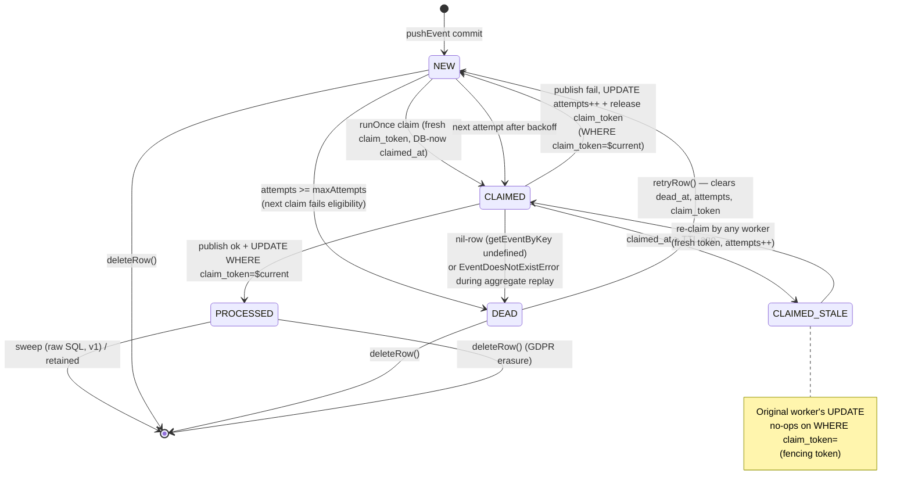

# feat: G-01 Transactional Outbox (Drizzle adapter)

## Overview

Ship a transactional outbox on the `@castore/event-storage-adapter-drizzle` package (pg + mysql + sqlite). Atomically persist events and outbox rows in one DB transaction; a new relay sub-entrypoint (`@castore/event-storage-adapter-drizzle/relay`) drains outbox rows and publishes to message channels at-least-once, preserving per-aggregate FIFO. Breaks `ConnectedEventStore.pushEvent` semantics in outbox mode (resolves on commit, not on publish). Closes the write-side of N4 zero-event-loss for the D1 finance profile; consumer dedup (G-03) is a mandatory follow-up before the greenfield product reaches production (see origin §3).

## Problem Frame

`ConnectedEventStore.pushEvent` today (`packages/core/src/connectedEventStore/connectedEventStore.ts:134`) writes an event, then calls `publishPushedEvent` fire-and-forget. A crash, Lambda timeout, or EventBridge throttle between commit and publish drops the message with no framework-level retry. In finance workloads this violates N4. The outbox pattern turns the dual-write into two phases separated by a durable commit and moves delivery into a relay worker with per-aggregate FIFO, retry, and dead-row surfacing.

Target area: `packages/event-storage-adapter-drizzle/` plus a single guard inside `packages/core/src/connectedEventStore/publishPushedEvent.ts`. Detection is via `Symbol.for('castore.outbox-enabled')` on the adapter instance — no change to the `EventStorageAdapter` interface in core (see origin R8).

## Requirements Trace

Every origin R# is addressed by one or more implementation units.

| Origin R# | Concern | Unit(s) |
|---|---|---|
| R1, R2 | Package layout + sub-entrypoints + `outboxTableConstraints` | U2, U8 |
| R3 | Adapter `outbox` option + atomic write | U3 |
| R4 | peerDependencies unchanged | U3, U8 |
| R5, R6 | Pure-outbox `pushEvent` semantics + `publishPushedEvent` short-circuit | U1 |
| R7 | `pushEventGroup` atomicity | U3 |
| R8 | Core untouched; symbol-tag detection | U1, U3 |
| R9 | Outbox schema shape + unique + index | U2 |
| R10 | Symbol-keyed `getEventByKey` + nil-row dead path | U3, U5 |
| R11 | Registry validation + missing-entry behavior | U5, U7 |
| R12 | Per-dialect claim primitives + short-lived tx | U4 |
| R13 | Claim lease TTL + DB-authoritative time | U4, U6 |
| R14 | FIFO exclusion predicate + **fencing-token rule** | U4, U6 |
| R15 | Exponential backoff + configurable knobs | U6 |
| R16 | `dead_at` transition + FIFO block + onDead | U6 |
| R17 | `last_error` cap + payload scrubber + GDPR scope | U6 |
| R18 | `runOnce` / `runContinuously` / graceful `stop` | U6 |
| R19 | Hooks (`onDead`, `onFail`) with swallow semantics | U6 |
| R20 | `retryRow` + `deleteRow` + structured warning return | U7 |
| R21 | Caller-side authz + threat-model acknowledgment | U7, U11 |
| R22 | Liveness query templates (age + depth + dead-count) | U11 |
| R23 | `assertOutboxEnabled(adapter, { mode })` helper | U7 |
| R24, R25 | Multi-dialect coverage; driver allow-list | U4, U9 |
| R26 | Encryption-at-rest classification | U11 |
| R27 | Trust boundary + dedicated DB creds note | U11 |
| R28 | Conformance suite + fault-injection | U9, U10 |
| R29 | Docs + 2 runtime recipes + migration note | U11 |
| R30 | Non-drizzle adapters unchanged | U1 (no change to their paths) |
| R31 | Migration coordination (outbox with/after event table) | U3, U11 (U3 atomic write contract; U11 deploy-order playbook) |
| §2 SC | Success criteria (zero-loss, FIFO, hooks, admin, docs) | U9, U10 |

## Scope Boundaries

- Only `event-storage-adapter-drizzle` receives outbox support. `event-storage-adapter-postgres`, DynamoDB, in-memory, HTTP, Redux adapters are untouched.
- pg + mysql (8.0.1+) + sqlite ship at v1 first-class parity.
- No built-in DLQ table, no sweep API export, no multi-channel fan-out, no consumer dedup helper (G-03), no Prometheus/OTel exporter, no CDC alternative, no `waitForPublish` primitive — see origin §3 and §7 v1.1 candidates.
- Admin API is `retryRow` + `deleteRow` only in v1. `listDeadRows`, `listPendingRows`, `forceDead`, `onDelete` hook are v1.1.
- Lifecycle hooks in v1 are `onDead` + `onFail` only. `onClaim`, `onPublish` are v1.1.
- No framework-enforced authz on admin API — caller obligation (origin R21).
- **v1 closes the write-side half of N4.** Consumer-side dedup (G-03) is mandatory before any production traffic with N4 intent. This is the honest scope restatement decided during planning; see Key Technical Decisions.

### Deferred to Separate Tasks

- **G-03 consumer dedup helper**: separate brainstorming cycle, separate plan. Shipping pre- or post-G-01 is a team decision; this plan does not assume it lands first.
- **v1.1 outbox enhancements**: multi-channel fan-out, full admin API (listDead/listPending/forceDead/onDelete), exported sweep with per-aggregate marker, `waitForPublish`, bounded-backlog / circuit-breaker semantics, `@castore/event-outbox-relay-drizzle` split package, first-party error classifier, group-correlation column. Each is an independent follow-up cycle.

## Context & Research

### Relevant Code and Patterns

Drizzle adapter (primary work surface):
- `packages/event-storage-adapter-drizzle/src/index.ts` — root barrel (type-only dialect re-exports; tree-shaking intact).
- `packages/event-storage-adapter-drizzle/src/common/` — `eventDetail.ts`, `error.ts`, `walkErrorCauses.ts`, `parseGroupedEvents.ts`, `getEvents.ts`, `listAggregateIds.ts`. **Reuse `walkErrorCauses` for outbox error classification; never introduce new `err.code === …` checks.**
- Per-dialect dirs (`src/{pg,mysql,sqlite}/`): each has `schema.ts`, `contract.ts`, `adapter.ts`, `index.ts`, `adapter.unit.test.ts`, `schema.type.test.ts`. Follow this exact shape for outbox additions.
- `packages/event-storage-adapter-drizzle/src/__tests__/conformance.ts` — `makeAdapterConformanceSuite` factory, 14 shared scenarios. Outbox suite sits alongside as `makeOutboxConformanceSuite`.
- `packages/event-storage-adapter-drizzle/examples/drizzle-integration.unit.test.ts` — greenfield-adopt example pattern; clone shape for runtime recipes.
- `packages/event-storage-adapter-drizzle/package.json` — `exports` map declares `.`, `./pg`, `./mysql`, `./sqlite`. Add `./relay` with the same quad-entry shape (types / import / require / default).
- `eslint.config.js` — `no-restricted-imports` regex `^@castore/(?!event-storage-adapter-drizzle/(?:pg|mysql|sqlite)$)[^/]+/.+` on lines 94 and 208. Must add `relay` to the allow-list in both JS and TS blocks.

Core (single touchpoint):
- `packages/core/src/connectedEventStore/publishPushedEvent.ts` — primary edit; add outbox-capability probe as first action.
- `packages/core/src/connectedEventStore/connectedEventStore.ts` — `pushEvent` path (line 134), `onEventPushed` accessor (lines 162–173), mutable `eventStorageAdapter` setter (lines 146–154). Do NOT probe at construction; probe per-invocation inside `publishPushedEvent`.
- `packages/core/src/eventStorageAdapter.ts` — interface unchanged.
- `packages/core/src/messaging/channel/{notificationMessageChannel,stateCarryingMessageChannel,messageChannelAdapter}.ts` — envelope shapes the relay builds at publish time.
- `packages/core/src/index.ts` — export the `Symbol.for(...)` string constants and `isOutboxEnabledAdapter(adapter): adapter is Adapter & OutboxCapability` type-predicate helper so consumers get both runtime branching and TS narrowing.

### Institutional Learnings

Four `docs/solutions/` docs apply; all are load-bearing.

- `docs/solutions/integration-issues/drizzle-orm-api-gaps-multi-dialect-adapter-2026-04-18.md` — **MySQL has no `RETURNING`**; use INSERT then same-tx re-SELECT on a natural key or a caller-generated UUID id. **better-sqlite3 rejects `db.transaction(async cb)`**; use raw `BEGIN` / `COMMIT` / `ROLLBACK` via `db.run(sql\`…\`)`. Error classification lives on `.cause` / `.sourceError` / `.originalError` — route every classifier through `walkErrorCauses`.
- `docs/solutions/best-practices/multi-dialect-adapter-package-patterns-2026-04-18.md` — Generic index-callback factory for `outboxTableConstraints`. Phantom `__dialect?` on contracts. Shared conformance factory with container lifecycle owned by the per-dialect file. **Falsy JSON hazard:** always use `value === null || value === undefined`, never `!value`.
- `docs/solutions/developer-experience/pnpm10-eslint9-native-deps-allow-list-2026-04-18.md` — `no-restricted-imports` regex is flat-config; `allow` key is silently rejected; use the negative-lookahead regex pattern. Verify sub-path exports with a cross-package probe import.
- `docs/solutions/workflow-issues/ce-resolve-pr-feedback-parallel-dispatch-file-overlap-2026-04-19.md` — when PR review clusters imply multi-file refactors, expand file lists by refactor scope and run full-package `pnpm test` after every parallel batch.

### External References

Skipped intentionally. Local patterns are strong (drizzle adapter just landed), the outbox pattern itself is well-established, and the origin doc has already captured the key design decisions. See Phase 1.2 decision.

## Key Technical Decisions

- **Symbol-tagged capability, not a core interface change.** `Symbol.for('castore.outbox-enabled')` (boolean) and `Symbol.for('castore.outbox.getEventByKey')` (function) as own-properties on the adapter instance. Uses the global symbol registry so cross-realm and duplicate-install cases still agree on identity. A `packages/core/src/index.ts` type-predicate helper gives consumers TS narrowing. Rationale: keeping `EventStorageAdapter` untouched avoids rippling through DynamoDB, postgres legacy, in-memory, HTTP, and Redux adapters (origin R8). The capability-extension pattern decision itself (typed `capabilities?` field vs. symbol-per-feature) is deferred — see Open Questions.
- **Probe inside `publishPushedEvent`, not at construction.** `ConnectedEventStore.eventStorageAdapter` is a mutable setter; the probe runs per-invocation so hot-swaps are honored (origin R6).
- **Pointer-shaped outbox rows.** No payload column. Relay reads the source event row at publish time via the symbol-keyed single-row lookup. Single source of truth for G-04 crypto-shredding compatibility; acknowledged trade-off: bus sees publish-time row, not commit-time row.
- **Per-aggregate FIFO via dialect-native primitives.** pg: `pg_try_advisory_xact_lock(hashtext(aggregate_name || ':' || aggregate_id))` (xact-scoped, no session-scope leak). mysql: earliest-per-aggregate `SELECT ... FOR UPDATE SKIP LOCKED` subquery (explicit FIFO; naive SKIP LOCKED would hide rows held by another worker and race). sqlite: single-writer by construction; cross-aggregate parallelism is exempt from the success criterion.
- **Fencing-token rule is mandatory (R14).** Every post-claim UPDATE (mark-processed, mark-dead, increment-attempts, release-claim) includes `WHERE claim_token = $currentToken`. Prevents slow-worker double-publish under TTL re-claim.
- **DB-authoritative timestamps.** All outbox timestamps (`created_at`, `claimed_at`, `processed_at`, `last_attempt_at`, `dead_at`) set via dialect server-time (`NOW()` on pg/mysql, `strftime('%Y-%m-%dT%H:%M:%fZ', 'now')` on sqlite). Worker wall-clock is not trusted across nodes.
- **Raw SQL for dialect-specific locking, typed query builder elsewhere.** Drizzle cannot idiomatically express `pg_try_advisory_xact_lock` or the MySQL composite-key `FOR UPDATE SKIP LOCKED` subquery. Use `sql\`…\`` fragments only where necessary, exercised by the conformance suite on every dialect.
- **Outbox lives in the drizzle adapter, not a separate package.** Relay ships as `@castore/event-storage-adapter-drizzle/relay` sub-entrypoint. Separate package (`@castore/event-outbox-relay-drizzle`) deferred to v1.1 if peer-dep graphs diverge.
- **Conformance suite home.** `packages/event-storage-adapter-drizzle/src/__tests__/outboxConformance.ts`, alongside the existing `conformance.ts`. **Do not relocate to `@castore/lib-test-tools`** — that package is scoped to `mockEventStore` / `muteEventStore` only. (The origin doc's R28 reference to `lib-test-tools` is inaccurate; this plan overrides it.)
- **Runtime recipes under `packages/event-storage-adapter-drizzle/examples/`.** Matches the existing `drizzle-integration.unit.test.ts` location. Lambda recipe exercises `runOnce()`; container recipe exercises `runContinuously()` + `stop()` on SIGTERM.
- **v1 closes the write-side half of N4.** Per planning decision: G-03 consumer dedup is a mandatory follow-up; `retryRow` returns `{ warning: 'at-most-once-not-guaranteed', rowId }` as structured warning; README states v1 is not finance-safe alone.
- **Monitoring-only backlog guard.** No `pushEvent` warning when aggregate has a dead row, no `AggregateBlockedError`. Operators use the three liveness queries (age, depth, dead-count) per R22. A bounded-backlog guard is a v1.1 candidate.
- **Commitlint honored.** No `--no-verify`. Commit messages use `feat(drizzle-adapter): …` scope.

## Open Questions

### Resolved During Planning

- **G-01 vs. G-03 sequencing.** Resolved: restate scope (v1 closes write-side half of N4; G-03 is mandatory follow-up). Documented in Scope Boundaries and origin §3.
- **Dead-row silent backlog guard.** Resolved: monitoring-only (three liveness queries in R22). No framework guard in v1.
- **Three-dialect scope.** Resolved: ship all three dialects at v1 first-class (consistent with drizzle adapter spec R5).
- **Conformance suite location.** Resolved: alongside existing `conformance.ts` in the drizzle adapter package, not `lib-test-tools` (see Key Technical Decisions). Origin R28 reference is an inaccuracy this plan overrides.
- **Runtime recipe directory.** Resolved: `packages/event-storage-adapter-drizzle/examples/` (matches `drizzle-integration.unit.test.ts` precedent).
- **ConnectedEventStore outbox-detection mechanism.** Resolved: symbol-tag per-invocation probe inside `publishPushedEvent`. Rejected: `supportsOutbox()` core method (would ripple to every adapter); constructor-time probe (misses mutable setter).
- **retryRow return shape.** Resolved: `{ warning: 'at-most-once-not-guaranteed', rowId }` promoted from origin OQ to committed in R20.
- **Bootstrap assertion mechanism.** Resolved: `assertOutboxEnabled(adapter, { mode?: 'warn' | 'throw' })` helper, default `'warn'`. No adapter-constructor side effect.

### Deferred to Implementation

- **pg advisory-lock throughput + `hashtext` collision risk.** `hashtext` is 32-bit; across ~100k aggregates the birthday-bound collision probability is ~69 %, serializing unrelated aggregates against each other. Also, `aggregate_name` containing `:` (which we do not currently forbid) creates false serialization via the `aggregate_name || ':' || aggregate_id` hash input. Implementation concretes: (a) switch delimiter to a character illegal in eventStoreId / aggregateId (e.g., `\x00` or simply XOR `hashtext(name)` with `hashtext(id)`), (b) document the collision reality in R22 docs, (c) measure actual serialization in the drain test (Open Question below). Not a v1 blocker; collision does not cause correctness failure, only throughput degradation.
- **Single-relay-instance `runOnce` concurrency.** Planning ensures the `workerClaimToken` is generated fresh per claim batch (`crypto.randomUUID()` inside `claim()`, not at relay construction), so two concurrent `runOnce()` calls on one relay instance claim disjoint rowsets with distinct tokens. Test coverage is added under U6.
- **Registry defensive-copy at construction.** U7 factory deep-copies the registry array and builds a frozen lookup Map at construction; post-construction mutations to the caller's array have no effect. Prevents accidental invalidation of construction-time validation. Tested in U7.
- **Exact Drizzle expression for `pg_try_advisory_xact_lock` and MySQL composite-key `FOR UPDATE SKIP LOCKED` subquery.** Confirmed in Key Decisions that raw `sql\`…\`` fragments are acceptable; exact string is finalized when the conformance suite is wired and passes.
- **Concrete numeric defaults: `baseMs`, `ceilingMs`, `maxAttempts`, `claimTimeoutMs`, polling cadence per dialect.** Suggested starting points in U6. An empirical drain test (~10k outbox rows, single pg relay) on the test harness confirms final values.
- **`last_error` scrubber implementation.** The requirement (R17) is "must not persist strings containing event payload data". Concrete scrubber (regex-based strip of JSON-like fragments, depth-limited parse, or bus-adapter-specific whitelist) is owned by U6.
- **pg15+ `UNIQUE NULLS NOT DISTINCT`.** Not needed in v1 (channel_id dropped per scope), but watch for any NULL column semantics that might trip unique constraints.
- **Typed capability-extension pattern for future gaps (G-02/G-03/G-04).** Resolve whether to introduce `capabilities?` typed field on `EventStorageAdapter` before the second capability lands, or continue symbol-per-feature. Not a v1 blocker; note as follow-up OQ in U1 completion.

## Output Structure

```text
packages/event-storage-adapter-drizzle/
├── package.json                              # MODIFY: add "./relay" to exports
├── src/
│   ├── index.ts                              # MODIFY: re-export capability symbols, isOutboxEnabled helper (types only)
│   ├── common/
│   │   ├── outbox/
│   │   │   ├── backoff.ts                    # NEW: exp-backoff + jitter helper (Phase A; consumed by U6)
│   │   │   ├── scrubber.ts                   # NEW: last_error JSON-parse-and-redact scrubber (Phase A; consumed by U6)
│   │   │   ├── fencedUpdate.ts               # NEW: shared WHERE id=? AND claim_token=? UPDATE wrapper (U4)
│   │   │   └── types.ts                      # NEW: shared types (OutboxRow, RelayRegistryEntry, RelayOptions, hook types)
│   │   └── ...                               # existing (eventDetail.ts, error.ts, walkErrorCauses.ts, etc.)
│   │
│   │   # Note: outbox-capability symbols + isOutboxEnabledAdapter predicate live in @castore/core
│   │   # (packages/core/src/connectedEventStore/outboxCapability.ts, U1), imported here by adapters and relay.
│   ├── pg/
│   │   ├── schema.ts                         # MODIFY: add outboxColumns, outboxTable, outboxTableConstraints
│   │   ├── adapter.ts                        # MODIFY: accept outbox option, set capability symbols, pushEventInTx writes outbox
│   │   ├── outbox/
│   │   │   ├── claim.ts                      # NEW: pg-specific claim SQL (advisory-lock + FIFO-exclusion predicate)
│   │   │   └── getEventByKey.ts              # NEW: pg-specific single-row event lookup
│   │   ├── contract.ts                       # MODIFY: extend with OutboxTableContract<pg>
│   │   ├── index.ts                          # MODIFY: add outbox exports
│   │   ├── adapter.unit.test.ts              # MODIFY: wire outbox conformance suite
│   │   └── schema.type.test.ts               # MODIFY: type-test outbox contracts
│   ├── mysql/                                # MODIFY: parallel to pg/ (earliest-per-aggregate FOR UPDATE SKIP LOCKED)
│   ├── sqlite/                               # MODIFY: parallel to pg/ (single-writer; raw BEGIN/COMMIT)
│   ├── relay/
│   │   ├── index.ts                          # NEW: public factory + barrel exports
│   │   ├── factory.ts                        # NEW: createOutboxRelay() constructor + registry validation
│   │   ├── runOnce.ts                        # NEW: claim-publish-mark cycle (calls dialect-specific claim)
│   │   ├── runContinuously.ts                # NEW: supervised loop + graceful stop()
│   │   ├── publish.ts                        # NEW: envelope reconstruction + nil-row dead path
│   │   ├── retry.ts                          # NEW: attempts increment + backoff + dead transition
│   │   ├── hooks.ts                          # NEW: onDead + onFail dispatch with swallow semantics
│   │   ├── admin.ts                          # NEW: retryRow + deleteRow
│   │   ├── assertOutboxEnabled.ts            # NEW: bootstrap helper
│   │   ├── errors.ts                         # NEW: OutboxClaimConflictError, OutboxPublishError, etc. (preserve cause)
│   │   └── *.unit.test.ts                    # NEW: unit tests per module
│   └── __tests__/
│       ├── conformance.ts                    # existing (event-store conformance)
│       ├── outboxConformance.ts              # NEW: makeOutboxConformanceSuite factory
│       ├── outboxFaultInjection.ts           # NEW: crash-simulation helpers shared across dialect test files
│       └── outboxConformance.type.test.ts    # NEW: type-level contract check
├── examples/
│   ├── drizzle-integration.unit.test.ts      # existing
│   ├── outbox-lambda-runonce.example.ts      # NEW: cron-Lambda recipe using runOnce()
│   └── outbox-container-continuously.example.ts   # NEW: long-running container recipe with SIGTERM → stop()
└── README.md                                 # MODIFY: outbox section + runtime recipes + liveness queries + GDPR playbook

packages/core/src/
├── index.ts                                  # MODIFY: export OUTBOX_ENABLED_SYMBOL, OUTBOX_GET_EVENT_SYMBOL, isOutboxEnabledAdapter
└── connectedEventStore/
    ├── publishPushedEvent.ts                 # MODIFY: outbox-capability short-circuit at top
    └── publishPushedEvent.unit.test.ts       # MODIFY: add short-circuit coverage

eslint.config.js                              # MODIFY: allow-list "relay" in no-restricted-imports regex (lines 94 + 208)

docs/
└── docs/event-storage/drizzle.md             # MODIFY or NEW companion page: outbox section
```

## High-Level Technical Design

> *This illustrates the intended approach and is directional guidance for review, not implementation specification. The implementing agent should treat it as context, not code to reproduce.*

### Outbox row lifecycle (state machine)



### Publish path (per row inside `runOnce`)

```
claim eligible batch (dialect-specific SQL — see U4)
  └─ short transaction: SELECT eligible + UPDATE claim_token/claimed_at + COMMIT
for each claimed row:
  ├─ lookup = adapter[Symbol.for('castore.outbox.getEventByKey')](name, id, ver)
  ├─ if lookup === undefined:
  │    UPDATE dead_at=NOW(), last_error='source event row missing'
  │      WHERE id=$row.id AND claim_token=$current   ← fencing
  │    await hooks.onDead(row, 'source event row missing')
  │    continue
  ├─ registry entry = registryByEventStoreId[row.aggregate_name]
  ├─ if registry entry missing:
  │    UPDATE dead_at=NOW(), last_error='no channel registered for aggregate_name=X'
  │      WHERE id=$row.id AND claim_token=$current
  │    await hooks.onDead(...)
  │    continue
  ├─ envelope = buildEnvelope(row, lookup, registry entry)
  │    (branch on NotificationMessageChannel vs StateCarryingMessageChannel;
  │     StateCarrying calls registry.connectedEventStore.getAggregate(…))
  ├─ try: await registry.channel.publishMessage(envelope)
  │    UPDATE processed_at=NOW() WHERE id=$row.id AND claim_token=$current  ← fencing
  │    await hooks.onPublish (deferred to v1.1)
  ├─ catch (err):
  │    attempts++; last_error=scrubbed(err.message)
  │    if attempts >= maxAttempts:
  │      UPDATE dead_at=NOW(), last_error=... WHERE id AND claim_token=$current
  │      await hooks.onDead(row, err)
  │    else:
  │      UPDATE attempts++, last_error, last_attempt_at=NOW(), release claim_token
  │        WHERE id AND claim_token=$current
  │      await hooks.onFail(row, err, attempts, nextBackoffMs)
```

### Claim-eligibility predicate (per-aggregate FIFO)

```
Eligible rows:
  processed_at IS NULL
  AND dead_at IS NULL
  AND (claim_token IS NULL
       OR claimed_at < NOW() - interval 'claimTimeoutMs')
  AND NOT EXISTS (
    SELECT 1 FROM outbox earlier
    WHERE earlier.aggregate_name = o.aggregate_name
      AND earlier.aggregate_id   = o.aggregate_id
      AND earlier.version        < o.version
      AND (earlier.processed_at IS NULL OR earlier.dead_at IS NOT NULL)
  )

Dialect notes:
- pg: wrap the claim UPDATE with pg_try_advisory_xact_lock(hashtext(aggregate_name || ':' || aggregate_id))
  inside the same short transaction.
- mysql: outer SELECT uses earliest-per-aggregate composite-key IN-subquery + FOR UPDATE SKIP LOCKED
  so workers never race on non-earliest rows.
- sqlite: single-writer; no per-aggregate lock; the predicate alone suffices.
```

### Capability detection and short-circuit (publishPushedEvent)

```
publishPushedEvent(connectedEventStore, message):
  // Read the raw property via the getter on ConnectedEventStore (returns EventStorageAdapter | undefined).
  // Do NOT call connectedEventStore.getEventStorageAdapter() — that getter throws UndefinedEventStorageAdapterError
  // when no adapter is configured, which would regress the legacy in-memory / no-adapter path (R30).
  const adapter = connectedEventStore.eventStorageAdapter
  if (adapter !== undefined && adapter[OUTBOX_ENABLED_SYMBOL] === true):
    return  // outbox mode: relay handles publish
  // ... existing NotificationMessageChannel / StateCarryingMessageChannel branches ...
```

One edit, two call sites (line 137 `pushEvent` path and line 168 `onEventPushed` path). Probe runs per-invocation so the mutable `eventStorageAdapter` setter is honored. Uses the non-throwing property accessor (`connectedEventStore.eventStorageAdapter` getter at `connectedEventStore.ts:152-154`) rather than `getEventStorageAdapter()` to preserve the legacy no-adapter path.

## Implementation Units

### Phase A — Core plumbing + schema

- [x] **Unit 1: Core outbox-capability short-circuit** — shipped (PR #4)

**Goal:** Add the symbol-tag constants and type-predicate helper to core; short-circuit `publishPushedEvent` when the adapter has `Symbol.for('castore.outbox-enabled') === true`.

**Requirements:** R5, R6, R8, R30

**Dependencies:** None.

**Files:**
- Create: `packages/core/src/connectedEventStore/outboxCapability.ts`
- Modify: `packages/core/src/connectedEventStore/publishPushedEvent.ts`
- Modify: `packages/core/src/index.ts` (re-export capability symbols + predicate)
- Test: `packages/core/src/connectedEventStore/publishPushedEvent.unit.test.ts`
- Test: `packages/core/src/connectedEventStore/outboxCapability.unit.test.ts` (new)

**Approach:**
- Export `OUTBOX_ENABLED_SYMBOL = Symbol.for('castore.outbox-enabled')` and `OUTBOX_GET_EVENT_SYMBOL = Symbol.for('castore.outbox.getEventByKey')` as named constants from `outboxCapability.ts`.
- Export type `OutboxCapability` (interface-shaped with a `readonly [OUTBOX_ENABLED_SYMBOL]: true` discriminant AND a `readonly [OUTBOX_GET_EVENT_SYMBOL]: (aggregateName, aggregateId, version) => Promise<EventDetail | undefined>` requirement — both must be present and well-typed).
- Export `isOutboxEnabledAdapter<A extends EventStorageAdapter>(adapter: A | undefined): adapter is A & OutboxCapability` type predicate. **Implementation must validate both symbols**: return true iff `adapter !== undefined && adapter[OUTBOX_ENABLED_SYMBOL] === true && typeof adapter[OUTBOX_GET_EVENT_SYMBOL] === 'function'`. This prevents a hostile or misconfigured adapter that sets only the boolean from silently short-circuiting the publish while failing the relay lookup.
- Edit `publishPushedEvent.ts` — first line: `const adapter = connectedEventStore.eventStorageAdapter;` (the non-throwing property getter at `connectedEventStore.ts:152-154`, returns `EventStorageAdapter | undefined`) followed by `if (isOutboxEnabledAdapter(adapter)) return;`. **Do NOT use `connectedEventStore.getEventStorageAdapter()`** — that method throws `UndefinedEventStorageAdapterError` when no adapter is configured, and using it would regress the legacy in-memory / no-adapter path (R30). The rest of `publishPushedEvent` is unchanged.
- `connectedEventStore.ts` itself requires **no changes** — the guard is inside `publishPushedEvent` so the mutable `eventStorageAdapter` setter is honored per-invocation.
- **Public export scope for v1:** the symbol constants, `OutboxCapability` type, and `isOutboxEnabledAdapter` predicate are exported from `packages/core/src/index.ts` so adapter authors can implement the capability without depending on the drizzle package. This IS additional public API surface on core (acknowledged in Risks — see Key Decisions), justified by the predicate's role in the core-level guard. The capability-extension pattern decision for future gaps (G-02/G-03/G-04) is explicitly deferred to a separate OQ (see Open Questions); it is a known trajectory cost accepted for v1 to avoid premature abstraction.

**TypeScript note (core has no ESLint relaxations):** `@castore/core` has no local override for `no-explicit-any` / `strict-boolean-expressions`. The predicate body uses typed Symbol indexing via the `OutboxCapability` interface shape (no `any` cast), explicit equality `=== true` (satisfies strict-boolean-expressions), and `typeof x === 'function'` for the lookup function check.

**Execution note:** Test-first. Write a failing test that spies on `publishPushedEvent` and asserts the adapter-with-symbol returns before either `NotificationMessageChannel.publishMessage` or `StateCarryingMessageChannel.publishMessage` is called. Then implement.

**Patterns to follow:**
- `vi.spyOn(publishPushedEventModule, 'publishPushedEvent')` pattern already used in `connectedEventStore.unit.test.ts`.
- Type-predicate helper pattern used widely in `@castore/core` (`is…` functions with `adapter is X` return type).

**Test scenarios:**
- Happy path: adapter with `Symbol.for('castore.outbox-enabled') === true` → `publishPushedEvent` resolves without invoking any channel mock; assert `NotificationMessageChannel.publishMessage` and `StateCarryingMessageChannel.publishMessage` are never called.
- Happy path (legacy): adapter without the symbol → `publishPushedEvent` behaves exactly as today (branches on channel class, calls `publishMessage`, replays aggregate on StateCarrying path).
- Edge case: adapter with `Symbol.for('castore.outbox-enabled') === false` (explicitly falsy) → legacy behavior (type predicate returns false).
- Edge case: adapter is `undefined` (legal for in-memory store without adapter, or any config path that sets no adapter) → legacy behavior; predicate returns false; **publishPushedEvent does NOT throw** (regression test against `getEventStorageAdapter()` misuse).
- Edge case: adapter has `Symbol.for('castore.outbox-enabled') === true` but `Symbol.for('castore.outbox.getEventByKey')` is not a function (hostile/misconfigured adapter) → predicate returns false; publish falls through to legacy branches. Prevents silent short-circuit without a valid lookup function.
- Edge case: `ConnectedEventStore.eventStorageAdapter` setter swaps the adapter between calls → subsequent call re-probes via the non-throwing getter and honors the new adapter's symbols. Verify per-invocation probe, not cached.
- Integration: `pushEvent` path (line 134) and `onEventPushed` accessor (lines 162–173) both short-circuit when the adapter has the symbol. Assert the assertion holds for both paths in a single fixture.
- Type test: `isOutboxEnabledAdapter` narrows the TS type such that `adapter[OUTBOX_GET_EVENT_SYMBOL]` becomes callable inside the guarded block without casts.

**Verification:**
- `pnpm --filter @castore/core test-unit` green.
- `pnpm --filter @castore/core test-type` green (predicate narrowing works).
- `pnpm test-circular` green.
- Legacy adapters (postgres, dynamodb, in-memory, http, redux, drizzle-without-outbox) continue to publish via the existing path — verified by running all adapter packages' test suites.

- [x] **Unit 2: Outbox schema (per-dialect)** — shipped (PR #4)

**Goal:** Export `outboxColumns`, `outboxTable`, and `outboxTableConstraints` from each of the three dialect sub-entrypoints. Schema matches origin R9 (10 columns, unique + index on `(aggregate_name, aggregate_id, version)`, no `channel_id`).

**Requirements:** R1, R2, R9

**Dependencies:** None (parallel with U1).

**Files:**
- Modify: `packages/event-storage-adapter-drizzle/src/pg/schema.ts`
- Modify: `packages/event-storage-adapter-drizzle/src/mysql/schema.ts`
- Modify: `packages/event-storage-adapter-drizzle/src/sqlite/schema.ts`
- Modify: `packages/event-storage-adapter-drizzle/src/pg/contract.ts`
- Modify: `packages/event-storage-adapter-drizzle/src/mysql/contract.ts`
- Modify: `packages/event-storage-adapter-drizzle/src/sqlite/contract.ts`
- Modify: `packages/event-storage-adapter-drizzle/src/pg/index.ts` (add outbox exports)
- Modify: `packages/event-storage-adapter-drizzle/src/mysql/index.ts`
- Modify: `packages/event-storage-adapter-drizzle/src/sqlite/index.ts`
- Create: `packages/event-storage-adapter-drizzle/src/common/outbox/backoff.ts` (pure-function exponential-backoff helper with jitter; no dependency on claim/publish loop, consumed by U6 retry and U6 runContinuously supervisor)
- Create: `packages/event-storage-adapter-drizzle/src/common/outbox/scrubber.ts` (pure-function `last_error` scrubber, JSON-parse-and-redact with depth limit; see U6 approach for spec; no dependency on claim/publish loop, consumed by U6 retry)
- Create: `packages/event-storage-adapter-drizzle/src/common/outbox/types.ts` (shared types — OutboxRow, RelayRegistryEntry, RelayOptions, hook types)
- Test: `packages/event-storage-adapter-drizzle/src/pg/schema.type.test.ts`
- Test: `packages/event-storage-adapter-drizzle/src/mysql/schema.type.test.ts`
- Test: `packages/event-storage-adapter-drizzle/src/sqlite/schema.type.test.ts`
- Test: `packages/event-storage-adapter-drizzle/src/common/outbox/backoff.unit.test.ts`
- Test: `packages/event-storage-adapter-drizzle/src/common/outbox/scrubber.unit.test.ts`

**Approach:**
- **Invariant (load-bearing for R11 registry routing):** the outbox column `aggregate_name` holds the logical `eventStoreId` value — the drizzle adapter writes `adapter.eventStoreId` into this column on every `pushEvent` / `pushEventGroup`, matching how the existing event table already populates `aggregate_name` from `context.eventStoreId` (see `packages/event-storage-adapter-drizzle/src/mysql/adapter.ts:163` and analogous pg/sqlite sites). The physical column name stays for consistency with the event-table schema; conceptually the value IS the `eventStoreId`. The relay's registry is keyed by `eventStoreId`, and it looks up rows by `aggregate_name` — same value, two names. No user-facing override of this mapping is supported in v1.
- `outboxColumns` per dialect mirrors the R9 column list. Dialect-specific types:
  - pg: `uuid` (id, default `gen_random_uuid()`), `varchar` / `text` (aggregate_name, aggregate_id), `bigint` / `integer` (version — match event table), `timestamptz(3)` (all timestamp columns, `defaultNow()`), `text` (claim_token, last_error with 2048-char CHECK constraint), `integer` (attempts, default 0).
  - mysql: `varchar(36)` id (UUID as string — mysql uuid ergonomics), `datetime(3)` timestamps, `varchar(2048)` last_error.
  - sqlite: TEXT for id/names/timestamps (ISO-8601 stored as TEXT with `$defaultFn` at creation but DB-authoritative for mutation timestamps via `strftime(...)` in write SQL), INTEGER for version/attempts.
- `outboxTableConstraints<TTable extends { …outbox columns… }>(table)` generic helper (matches `eventTableConstraints` pattern) returns an array with the unique constraint and the index. Third-arg callback returns an array (Drizzle 0.45 shape).
- `outboxTable` is a pre-built `pgTable('castore_outbox', outboxColumns, outboxTableConstraints)`. Default table name `castore_outbox`.
- `contract.ts` extends with `OutboxTableContract<Dialect extends 'pg'|'mysql'|'sqlite' = 'pg'>` carrying phantom `__dialect?` per existing pattern.
- Index re-exports: `outboxColumns`, `outboxTable`, `outboxTableConstraints`, plus type-only `OutboxTableContract`.

**Patterns to follow:**
- `packages/event-storage-adapter-drizzle/src/{pg,mysql,sqlite}/schema.ts` — `eventColumns` + `eventTableConstraints` pattern.
- Phantom dialect parameter from existing `EventTableContract<Dialect>`.

**Test scenarios (type tests):**
- Happy path: `outboxTable` accepted as `OutboxTableContract<'pg'>` on pg sub-entrypoint.
- Edge case: passing a user-spread table with extra columns (tenant_id, audit_column) still satisfies the contract.
- Edge case: passing a pg outbox table to a mysql contract is a type error (phantom discriminator rejects it).
- Edge case: a user-spread table missing one of the adapter-owned columns is a type error.
- Runtime DDL assertion (in the outbox conformance suite, U9): after `reset()` creates the outbox table, query the DB's information_schema / sqlite_master for constraints and indexes on the outbox table; assert the unique constraint on `(aggregate_name, aggregate_id, version)` exists. (No dependency on `drizzle-kit` — uses raw SQL introspection per dialect.)

**Verification:**
- `pnpm --filter @castore/event-storage-adapter-drizzle test-type` green.
- `pnpm --filter @castore/event-storage-adapter-drizzle test-unit` green (no new unit tests yet — schema is declarative).
- `pnpm --filter @castore/event-storage-adapter-drizzle test-linter` green (max-lines: 200 respected; split the per-dialect schema.ts if needed).

### Phase B — Adapter write path + lookup

- [x] **Unit 3: Adapter `outbox` option + atomic write** — shipped (PR #4)

**Goal:** Extend each dialect's adapter constructor to accept an `outbox` table. When present, atomically write the event row AND outbox row in one transaction on `pushEvent` and `pushEventGroup`. Set the two capability symbols on the adapter instance.

**Requirements:** R3, R5, R7, R8, R10

**Dependencies:** U1, U2.

**Files:**
- Modify: `packages/event-storage-adapter-drizzle/src/pg/adapter.ts`
- Modify: `packages/event-storage-adapter-drizzle/src/mysql/adapter.ts`
- Modify: `packages/event-storage-adapter-drizzle/src/sqlite/adapter.ts`
- Create: `packages/event-storage-adapter-drizzle/src/pg/outbox/getEventByKey.ts`
- Create: `packages/event-storage-adapter-drizzle/src/mysql/outbox/getEventByKey.ts`
- Create: `packages/event-storage-adapter-drizzle/src/sqlite/outbox/getEventByKey.ts`
- Create: `packages/event-storage-adapter-drizzle/src/common/outbox/types.ts`
- Test: `packages/event-storage-adapter-drizzle/src/pg/adapter.unit.test.ts` (extend)
- Test: `packages/event-storage-adapter-drizzle/src/mysql/adapter.unit.test.ts` (extend)
- Test: `packages/event-storage-adapter-drizzle/src/sqlite/adapter.unit.test.ts` (extend)

**Approach:**
- Each adapter constructor gains an optional `outbox?: OutboxTableContract<Dialect>` parameter.
- When `outbox` is present:
  - Set `this[OUTBOX_ENABLED_SYMBOL] = true`.
  - Set `this[OUTBOX_GET_EVENT_SYMBOL] = async (name, id, version) => { ... }` — wraps the dialect-specific single-row lookup from `outbox/getEventByKey.ts`. Returns `EventDetail | undefined`.
  - `pushEvent` wraps its existing insert in a transaction that also inserts into the outbox table in the same tx (per R3). Uses dialect-specific tx handle (`db.transaction(async tx => …)` on pg/mysql, raw `db.run(sql\`BEGIN\`)` / `COMMIT` / `ROLLBACK` on sqlite per the `drizzle-orm-api-gaps` doc).
  - `pushEventGroup` writes N event rows + N outbox rows in the single existing `db.transaction(...)` call. Rollback-on-mid-group-failure is inherited from Drizzle's transaction semantics.
- When `outbox` is absent: adapter behavior is byte-identical to today (non-breaking extension).
- Reuse `walkErrorCauses` for duplicate-key classification on outbox insert (the unique `(aggregate_name, aggregate_id, version)` constraint).
- `getEventByKey` (per dialect): single-row lookup `WHERE aggregate_name=? AND aggregate_id=? AND version=?` on the event table; returns mapped `EventDetail` via the existing `buildEventDetail` helper. On sqlite, TEXT timestamps come back as strings; on pg/mysql, Date objects — the existing `buildEventDetail` already handles this.

**Patterns to follow:**
- `pushEventInTx` private helper pattern used in each existing adapter.
- Falsy-payload rule: `value === null || value === undefined` in any payload/metadata mapping (see `docs/solutions/best-practices/multi-dialect-adapter-package-patterns-2026-04-18.md` §4).
- Raw `BEGIN`/`COMMIT`/`ROLLBACK` on sqlite via `db.run(sql\`BEGIN\`)` (see `docs/solutions/integration-issues/drizzle-orm-api-gaps-multi-dialect-adapter-2026-04-18.md`).
- `walkErrorCauses` for duplicate-key detection (no new `err.code === …` checks).

**Test scenarios:**
- Happy path: `pushEvent` with outbox configured writes one event row + one outbox row in one transaction; both visible after commit.
- Happy path: `pushEventGroup` with outbox configured writes N event rows + N outbox rows atomically.
- Edge case: `pushEventGroup` mid-group version-conflict on event #3 of 5 → entire transaction rolls back; no event rows AND no outbox rows persist.
- Edge case: duplicate event-row insert (version conflict) → `DrizzleEventAlreadyExistsError` thrown; outbox row NOT written (same tx rolls back).
- Edge case (mysql): MySQL has no `RETURNING` → verify the adapter uses INSERT + same-tx re-SELECT path and returns a correct `EventDetail`.
- Edge case (sqlite): raw `BEGIN`/`COMMIT` path handles the dual insert without crashing better-sqlite3 (no `db.transaction(async cb)`).
- Integration: adapter without `outbox` option → both capability symbols absent (`OUTBOX_ENABLED_SYMBOL` is undefined on the instance); `ConnectedEventStore` uses the legacy publish path.
- Integration: adapter with `outbox` option → `OUTBOX_ENABLED_SYMBOL === true`; `OUTBOX_GET_EVENT_SYMBOL` is a callable function returning `EventDetail | undefined`.
- Integration: `adapter[OUTBOX_GET_EVENT_SYMBOL](name, id, version)` returns the correct event for an existing key, `undefined` for a missing key.
- Edge case: `getEventByKey` on a payload containing `{ payload: { zero: 0, empty: '', falsy: false } }` round-trips exactly — verify `=== null || === undefined` guard not `!value`.

**Verification:**
- `pnpm --filter @castore/event-storage-adapter-drizzle test-unit` green on all three dialects.
- Both capability symbols probe-able from outside (`adapter[Symbol.for('castore.outbox-enabled')]`).
- Legacy no-outbox behavior byte-identical (existing conformance suite passes unchanged).

### Phase C — Relay core

- [x] **Unit 4: Per-dialect claim primitives + FIFO exclusion + fencing-token UPDATE helpers** — shipped (PR #5, derived sub-plan `2026-04-20-002`)

**Goal:** Implement the dialect-specific claim SQL (pg advisory-lock, mysql earliest-per-aggregate SKIP LOCKED, sqlite serial). Implement claim-token fencing in all post-claim UPDATEs.

**Requirements:** R12, R13, R14

**Dependencies:** U3.

**Files:**
- Create: `packages/event-storage-adapter-drizzle/src/pg/outbox/claim.ts`
- Create: `packages/event-storage-adapter-drizzle/src/mysql/outbox/claim.ts`
- Create: `packages/event-storage-adapter-drizzle/src/sqlite/outbox/claim.ts`
- Create: `packages/event-storage-adapter-drizzle/src/common/outbox/fencedUpdate.ts` (shared helper for `WHERE id=? AND claim_token=?` UPDATE wrapper)
- Test: `packages/event-storage-adapter-drizzle/src/pg/outbox/claim.unit.test.ts`
- Test: `packages/event-storage-adapter-drizzle/src/mysql/outbox/claim.unit.test.ts`
- Test: `packages/event-storage-adapter-drizzle/src/sqlite/outbox/claim.unit.test.ts`
- Test: `packages/event-storage-adapter-drizzle/src/common/outbox/fencedUpdate.unit.test.ts`

**Approach:**
- Each dialect's `claim.ts` exports a `claim(db, outboxTable, { batchSize, claimTimeoutMs, workerClaimToken, aggregateNames })` function returning `Promise<OutboxRow[]>`. The function:
  - Opens a short transaction.
  - Executes the dialect-specific claim SELECT with FIFO-exclusion predicate AND a filter `aggregate_name IN (aggregateNames)` so this relay only claims rows it is configured to publish (prevents silent-dead-pathing when multiple relay instances with disjoint registries share one outbox table — see R11 and the multi-relay-on-same-table scenario).
  - UPDATEs the selected rows: `SET claim_token = $workerClaimToken, claimed_at = <DB-now>`. On **pg**, use `UPDATE … RETURNING *` to get the rows in one round-trip. On **mysql**, UPDATE has no `.returning()` (see `docs/solutions/integration-issues/drizzle-orm-api-gaps-multi-dialect-adapter-2026-04-18.md`) — pre-fetch the row ids from the SELECT, then UPDATE by id, returning the SELECT's pre-fetched rows stamped with the new `claim_token`/`claimed_at` in application code (same tx). On **sqlite**, `UPDATE … RETURNING` is supported (SQLite 3.35+).
  - Commits.
- The relay factory (U7) passes the current registry's eventStoreIds as `aggregateNames` into the claim call.
- pg: wraps the claim transaction in `pg_try_advisory_xact_lock(hashtext(aggregate_name || ':' || aggregate_id))` per-aggregate — actually the advisory lock is per-candidate-aggregate; use a single-aggregate-at-a-time claim per pass and advance across aggregates on successive `runOnce` calls; alternative: acquire locks only for aggregates whose earliest row is eligible. Planning verifies which shape Drizzle expresses idiomatically; raw `sql\`select pg_try_advisory_xact_lock(...)\`` is acceptable.
- mysql: claim SELECT uses the composite-key `IN (SELECT aggregate_name, aggregate_id, MIN(version) FROM outbox WHERE processed_at IS NULL AND dead_at IS NULL GROUP BY ... )` subquery + `FOR UPDATE SKIP LOCKED`. Raw `sql\`…\`` fragment acceptable.
- sqlite: predicate alone (single-writer; no explicit lock).
- `fencedUpdate(db, outboxTable, { rowId, currentClaimToken, setClauses })` — generic helper that applies `WHERE id=? AND claim_token=?` and returns the affected-rows count. Returns 0 when the fencing token has been rotated by a concurrent worker; the caller is expected to treat this as "another worker owns this row now; our work is a no-op".
- DB-authoritative timestamps in every INSERT/UPDATE: pg `NOW()`, mysql `NOW(3)`, sqlite `strftime('%Y-%m-%dT%H:%M:%fZ','now')`.

**Execution note:** Test-first on the fencing-token path — it's the subtle correctness property.

**Patterns to follow:**
- Existing raw-SQL fragment usage in the drizzle adapter (see `sql<number>\`count(*)\`` patterns in `common/listAggregateIds.ts`).
- Transaction handle type aliases: `AnyPgDatabaseOrTx`, `AnyMySqlDatabaseOrTx`, `AnySQLiteDatabaseOrTx`.

**Test scenarios:**
- Happy path: claim finds eligible rows, fences them with a fresh worker token, returns them to the caller.
- Happy path: second worker's claim call returns disjoint rows (first worker's claimed rows are excluded by the `claim_token IS NOT NULL AND claimed_at >= NOW() - TTL` predicate).
- Edge case (TTL): set claimed_at to `NOW() - 2 * claimTimeoutMs` manually → next claim treats the row as stale and re-claims with a fresh token; `attempts` is incremented as part of re-claim.
- Edge case (FIFO): aggregate A versions 1, 2, 3. Mark A/v1 as dead. Claim query must NOT return A/v2 or A/v3 — the dead A/v1 blocks the aggregate.
- Edge case (FIFO): aggregate A versions 1, 2, 3. Claim A/v1; another worker attempts claim → A/v2 is NOT eligible (A/v1 is unprocessed); cross-aggregate B/v1 IS eligible.
- Edge case (fencing — critical): worker 1 claims row R with token T1. Simulate slow publish. Worker 2 TTL-re-claims with token T2. Worker 1's delayed `fencedUpdate(R, T1, { processed_at })` returns 0 affected rows (no-op); worker 2's `fencedUpdate(R, T2, { processed_at })` returns 1.
- Integration: pg — two concurrent `runOnce` calls against the same aggregate are serialized by `pg_try_advisory_xact_lock`; only one worker claims at a time.
- Integration: mysql — two concurrent `runOnce` calls DO NOT race on non-earliest rows (the composite-key subquery rules this out).
- Integration: sqlite — two concurrent `runOnce` calls serialize naturally; the second one waits for the write lock.
- Edge case: `claim_token` is a 128-bit cryptographically random value (`crypto.randomUUID()`); no worker regenerates the same token for distinct claims in the test.

**Verification:**
- `pnpm --filter @castore/event-storage-adapter-drizzle test-unit` green for all three dialects' `outbox/claim.unit.test.ts`.
- Fencing-token property: a test fixture that mutates `claim_token` between claim and `fencedUpdate` returns `affectedRows === 0`.
- Concurrent-worker test: two workers' rowsets are disjoint under the FIFO predicate.

- [x] **Unit 5: Relay publish path + envelope reconstruction + nil-row dead** — shipped (PR #5)

**Goal:** Given a claimed row, look up the event, build the right message envelope (Notification vs StateCarrying), and publish via the registered channel. Handle nil-row and missing-registry-entry dead paths.

**Requirements:** R10, R11, R16

**Dependencies:** U1, U3, U4.

**Files:**
- Create: `packages/event-storage-adapter-drizzle/src/relay/publish.ts` (envelope branching inline — Notification vs StateCarrying is a two-case switch, kept in-file until a second consumer materializes; extract only when v1.1 adds `AggregateExistsMessage`)
- Create: `packages/event-storage-adapter-drizzle/src/relay/errors.ts` (OutboxPublishError, OutboxMissingEventError, OutboxMissingChannelError — all preserve `cause`)
- Create: `packages/event-storage-adapter-drizzle/src/common/outbox/types.ts` (shared registry types if not in U3)
- Test: `packages/event-storage-adapter-drizzle/src/relay/publish.unit.test.ts`

**Approach:**
- `publish(row, registryEntry, adapter, hooks)`:
  1. Look up event via `adapter[OUTBOX_GET_EVENT_SYMBOL](row.aggregate_name, row.aggregate_id, row.version)`.
  2. If `undefined` → `fencedUpdate` sets `dead_at`, `last_error = 'source event row missing'` → `hooks.onDead(row, 'source event row missing')` → return.
  3. Build envelope: branch on `registryEntry.channel instanceof NotificationMessageChannel` vs `StateCarryingMessageChannel`. StateCarrying invokes `registryEntry.connectedEventStore.getAggregate(row.aggregate_id, { maxVersion: row.version })`; catch `EventDoesNotExistError` → same nil-row dead path.
  4. `await registryEntry.channel.publishMessage(envelope)`.
  5. `fencedUpdate` sets `processed_at = NOW()`. **If `fencedUpdate` returns 0 affected rows (claim_token rotated during slow publish — another worker re-claimed):** the publish went to the bus successfully; our mark-processed is a no-op; do NOT call `retry.handleFailure` (would falsely increment attempts on a row another worker owns). Log at debug level that a fenced no-op occurred; move to the next row in the batch. The new owning worker will publish again (at-least-once) and mark-processed under its own token. Do NOT fire `onPublish` or `onFail` in this case — deferred to v1.1. This behavior applies equally to `fencedUpdate` for `dead_at`, `attempts++`, and `release-claim-token` in the failure path (R14).
- Registry lookup by `aggregate_name` → `registryEntry`. If missing → `fencedUpdate` sets `dead_at`, `last_error = 'no channel registered for aggregate_name=X'` → `hooks.onDead(...)` → return.
- Error path: any exception from `publishMessage` is caught; `retry.ts` owns the attempts++/backoff/dead logic (U6).
- `last_error` is scrubbed by the common scrubber (see U6) before persistence.

**Patterns to follow:**
- Envelope shape from `packages/core/src/messaging/message.ts`.
- Channel type-guard pattern from `packages/core/src/messaging/channel/{notification,stateCarrying}MessageChannel.ts`.
- `walkErrorCauses` for any driver-level error classification.
- Error types with `{ cause }` preservation, matching `DrizzleEventAlreadyExistsError` (lesson from commit `ec6bb30`).

**Test scenarios:**
- Happy path: `NotificationMessageChannel` → `publishMessage({ eventStoreId, event })` called with correct shape; `processed_at` set via fenced UPDATE.
- Happy path: `StateCarryingMessageChannel` → `getAggregate` called with `maxVersion`; `publishMessage({ eventStoreId, event, aggregate })` called with aggregate state at that version.
- Edge case: `getEventByKey` returns `undefined` → immediate `dead_at`; `onDead` fires once; `publishMessage` never called.
- Edge case: registry has no entry for `aggregate_name` → immediate `dead_at` with `'no channel registered for aggregate_name=X'`; `publishMessage` never called.
- Edge case: StateCarrying + `getAggregate` throws `EventDoesNotExistError` (ancestor shredded) → nil-row dead path.
- Edge case (falsy payload): event with `{ payload: { zero: 0 }}` round-trips through envelope; `zero` field not corrupted.
- Error path: `publishMessage` throws → `retry.ts` hook receives the error with `cause` preserved; `processed_at` NOT set.
- Integration: fenced UPDATE on `processed_at` — if the row's `claim_token` has rotated (concurrent re-claim), the UPDATE affects 0 rows; the relay does not double-mark-processed; the second worker's publish is the authoritative one.

**Verification:**
- `pnpm --filter @castore/event-storage-adapter-drizzle test-unit` green.
- `publishMessage` never called when capability symbols indicate a nil-row or missing-registry dead path.
- `onDead` fires exactly once per transition.

- [x] **Unit 6: Relay lifecycle (runOnce, runContinuously, retry, hooks, backoff, scrubber)** — shipped (PR #5)

**Goal:** Wire the claim-publish-mark loop, backoff logic, hook dispatch with swallow semantics, and graceful shutdown. Includes the `last_error` scrubber.

**Requirements:** R13, R14 (attempts + fencing), R15, R16, R17, R18, R19

**Dependencies:** U4, U5.

**Files:**
- Create: `packages/event-storage-adapter-drizzle/src/relay/runOnce.ts`
- Create: `packages/event-storage-adapter-drizzle/src/relay/runContinuously.ts`
- Create: `packages/event-storage-adapter-drizzle/src/relay/retry.ts`
- Create: `packages/event-storage-adapter-drizzle/src/relay/hooks.ts`
- Test: `packages/event-storage-adapter-drizzle/src/relay/runOnce.unit.test.ts`
- Test: `packages/event-storage-adapter-drizzle/src/relay/runContinuously.unit.test.ts`
- Test: `packages/event-storage-adapter-drizzle/src/relay/retry.unit.test.ts`
- Test: `packages/event-storage-adapter-drizzle/src/relay/hooks.unit.test.ts`

_`backoff.ts` and `scrubber.ts` (pure utilities) moved to U2's file list — they are dialect-agnostic + have no dependency on the claim/publish loop, so landing them in Phase A unblocks earlier reuse. U6 consumes them._

**Approach:**
- `runOnce(state)`: calls dialect-specific `claim(...)`, then for each row `await publish(...)`, catching errors and forwarding to `retry.handleFailure(...)`.
- `retry.handleFailure(row, err, opts)`:
  - Increment `attempts` and set `last_error = scrub(err.message)`, `last_attempt_at = NOW()` via `fencedUpdate`.
  - If `attempts >= maxAttempts`: also set `dead_at = NOW()`; then `await hooks.onDead(row, err)`.
  - Else: release `claim_token` (set null) via the same `fencedUpdate` so the next runOnce can re-claim after backoff window elapses; `await hooks.onFail(row, err, attempts, nextBackoffMs)`.
  - Calculate `nextBackoffMs = min(baseMs * 2^(attempts - 1), ceilingMs)` with ±25% jitter.
- `runContinuously(state)`: supervised loop — wraps each `runOnce(...)` iteration in a try/catch. On any exception from `runOnce` (DB connection severed during claim, transaction rollback, advisory-lock timeout, etc.): log at `console.error`, invoke `hooks.onFail` with a synthetic `row: undefined` shape indicating claim-phase failure (hook must tolerate undefined row), apply an exponential backoff via the shared backoff helper (`baseMs … ceilingMs`, same knobs as publish-phase retry but tracked in-memory on `state`, not DB), then continue. Only `state.stopping` ends the loop cleanly. **Single DB blip must not kill the relay process.** If claimed 0 rows, `await sleep(pollingMs)` and check `state.stopping`.
- Graceful shutdown: `stop()` sets `state.stopping = true` and returns a promise. The promise resolves when (a) the current `runOnce` iteration settles (success, failure, or supervised-catch), AND (b) any in-flight `publishMessage` + fenced UPDATE have completed. **Contract for shutdown with errors:** if the in-flight publish rejects AND the subsequent fencedUpdate also rejects (e.g., DB connection dropped during SIGTERM), `stop()` resolves cleanly — the affected rows stay with non-null `claim_token` and will be TTL-reclaimed by the next relay instance. The `onFail` / `onDead` hooks fire best-effort before `stop()` resolves but hook exceptions are swallowed. `stop()` does NOT reject; it never surfaces shutdown-time errors via rejection (operators observe via logs + liveness queries). Hard-kill during `stop()` is the user's responsibility (process exit).
- `hooks.dispatch('onFail', ...)` / `hooks.dispatch('onDead', ...)`: awaits the hook, catches any exception, logs at `console.error` level with the hook name + error; never rethrows (swallow semantics per R19).
- `backoff(baseMs, ceilingMs, attempts, jitter = 0.25)`: pure function; returns `nextBackoffMs`.
- `scrub(rawError, maxLen = 2048)`: pure function that (a) stringifies the error message, (b) attempts `JSON.parse` on any substring that starts with `{` or `[` — if parse succeeds, walk the parsed value to a configurable max depth (default 3) and replace every string/number leaf value with `'<redacted>'` (keys preserved for shape debugging); stringify back. (c) As a fallback for malformed JSON fragments that would pass a naive regex: match outermost balanced `{...}` / `[...]` via a bracket-counting scan and replace with `{<redacted>}` / `[<redacted>]`. (d) Truncate the result to `maxLen` chars. **A single-level regex `\{[^{}]*\}` is insufficient** because it does not catch nested payloads (e.g. `{"customer":{"ssn":"..."}}`); the outer braces contain nested braces and the regex skips. Implementation is pure; no dependency on event data — operates on the stringified error message only. Conformance test: seed a failure whose message contains a realistic nested event payload (`{"event":{"aggregateId":"acc-1","payload":{"amount":100,"customer":{"ssn":"123-45-6789"}}}}`) and assert no leaf value appears in the persisted `last_error`.

**Execution note:** Test-first on (a) backoff math and (b) hook-swallow semantics (exception thrown from a hook does not stall the relay).

**Patterns to follow:**
- Existing transaction handle aliases for the fencedUpdate wrapper.
- Existing error-with-cause pattern (errors preserve upstream `cause`).

**Test scenarios:**
- Happy path: `runOnce` claims N rows, publishes each, marks all processed.
- Happy path: `runOnce` resolves cleanly when 0 rows are eligible.
- Edge case (backoff): `attempts = 1` → `backoff = baseMs ± 25%`; `attempts = 5` → `backoff = min(baseMs * 16, ceilingMs) ± 25%`; `attempts = 100` → `backoff = ceilingMs ± 25%` (no overflow).
- Edge case (hook throws): `onFail` throws → relay logs error; next row in the batch is still processed; no silent stall.
- Edge case (hook throws): `onDead` throws → relay logs error; mark-dead UPDATE still committed; `dead_at` is set.
- Edge case (last_error scrub): input `"failure payload: {\"accountNumber\": \"…\"}"` → persisted string does NOT contain `accountNumber`. Output length ≤ 2048.
- Error path: `publishMessage` throws → `retry.handleFailure` increments `attempts`, release claim, computes next backoff.
- Error path: attempts hits `maxAttempts` → `dead_at` is set; `onDead` fires exactly once; subsequent claims do NOT return this row (it's excluded).
- Integration (runContinuously): 50 rows fed into outbox, `runContinuously` starts, 100ms later assert all 50 published; `stop()` resolves in < pollingMs + in-flight publishMessage time.
- Integration (graceful shutdown): during a long-running `publishMessage`, call `stop()` — the current publish completes; no new claim happens; the promise from `stop()` resolves after the in-flight publish settles.
- Integration (fencing under TTL): row claimed by worker 1 with slow publish; TTL expires; worker 2 re-claims and publishes; worker 1's publish-success `fencedUpdate(processed_at)` returns 0 affected rows → relay treats as no-op (does NOT call `retry.handleFailure`, does NOT increment attempts, continues to next row in batch).
- Integration (fencing — dead path): same race but worker 1's publish fails → `fencedUpdate(attempts++, release claim)` returns 0 → treated as no-op; worker 2's publish/dead handling is authoritative.
- Integration (runContinuously supervisor): seed outbox; start `runContinuously`; inject a claim-phase error (e.g., mock the claim call to throw `Connection terminated` once) → relay logs, backs off, continues; subsequent successful claim drains remaining rows; `stop()` resolves cleanly.
- Integration (shutdown-with-errors): in-flight publishMessage rejects AND subsequent fencedUpdate rejects (simulated DB drop) during `stop()` → `stop()` resolves cleanly; the affected row retains its `claim_token` and will be TTL-reclaimed by a fresh relay instance.

**Verification:**
- `pnpm --filter @castore/event-storage-adapter-drizzle test-unit` green.
- Graceful `stop()` completes within `pollingMs + typical publishMessage time` in the harness (< 500 ms).
- Backoff monotonicity: `backoff(t, t*, N)` always ≤ `ceilingMs`.

- [x] **Unit 7: Admin API + registry validation + assertOutboxEnabled helper** — shipped (PR #5)

**Goal:** Ship `retryRow`, `deleteRow`, relay-constructor registry validation, and the `assertOutboxEnabled(adapter, { mode })` bootstrap helper.

**Requirements:** R11 (construction-time validation), R20, R21, R23

**Dependencies:** U6.

**Files:**
- Create: `packages/event-storage-adapter-drizzle/src/relay/admin.ts` (retryRow, deleteRow)
- Create: `packages/event-storage-adapter-drizzle/src/relay/factory.ts` (createOutboxRelay — includes registry validation)
- Create: `packages/event-storage-adapter-drizzle/src/relay/assertOutboxEnabled.ts`
- Test: `packages/event-storage-adapter-drizzle/src/relay/admin.unit.test.ts`
- Test: `packages/event-storage-adapter-drizzle/src/relay/factory.unit.test.ts`
- Test: `packages/event-storage-adapter-drizzle/src/relay/assertOutboxEnabled.unit.test.ts`

**Approach:**
- `retryRow(rowId, options?: { force?: boolean })`: clear `attempts`, `last_error`, `last_attempt_at`, `dead_at`, `claim_token`, `claimed_at` in a single UPDATE. **By default rejects with `RetryRowClaimedError` when the row has a non-null `claim_token`** (i.e., a worker currently owns it) — prevents the operator-race scenario where `retryRow` clears a live claim while a worker is mid-publish, causing guaranteed double-publish. Operators wanting the legacy "reset anything" behavior pass `{ force: true }`; the return value still carries `{ warning: 'at-most-once-not-guaranteed' }` as the explicit hazard signal. Default-safe behavior: dead rows are always retryable; claimed rows require either waiting for TTL (`claimTimeoutMs`) or explicit `force: true`. Return shape: `{ warning: 'at-most-once-not-guaranteed', rowId, forced: boolean }`.
- `deleteRow(rowId)`: `DELETE FROM <outbox> WHERE id = ?`. Return `{ rowId }`.
- `createOutboxRelay({ adapter, outboxTable, registry: [...], hooks?, options? })`:
  - Validate registry at construction: reject duplicate `eventStoreId`; assert each `eventStoreId === connectedEventStore.eventStoreId`.
  - Build registry lookup map keyed by `eventStoreId`.
  - Return `{ runOnce, runContinuously, stop, retryRow, deleteRow }`.
- `assertOutboxEnabled(adapter, { mode?: 'warn' | 'throw' } = { mode: 'warn' })`:
  - If `adapter === undefined || !isOutboxEnabledAdapter(adapter)`:
    - `mode === 'warn'`: log once via `console.warn` **only when `process.env.NODE_ENV === 'production'`** — matches origin R23 (opt-in aid for production; silent in dev/test to avoid training adopters to ignore the warning).
    - `mode === 'throw'`: throw `OutboxNotEnabledError` unconditionally (production-gate does NOT apply — when the caller explicitly asks for enforcement, honor it in every env so tests catch misconfig).
  - Default mode is `'warn'` for non-finance users. D1 finance callers pass `{ mode: 'throw' }` at app start to fail fast when outbox is missing.

**Patterns to follow:**
- Existing `DrizzleEventAlreadyExistsError` for the `OutboxNotEnabledError` + any construction-time error shape (preserve `cause` when applicable).
- Validation-at-construction pattern from existing `pushEventGroup` class-identity check.

**Test scenarios:**
- Happy path: `retryRow(deadRowId)` on a row with `dead_at IS NOT NULL` clears all state; next `runOnce` picks the row up; returns `{ warning: 'at-most-once-not-guaranteed', rowId, forced: false }`.
- Edge case: `retryRow(liveRowId)` on a row with `claim_token IS NOT NULL` (currently claimed by a worker) → throws `RetryRowClaimedError`; row state unchanged.
- Edge case: `retryRow(liveRowId, { force: true })` on a claimed row → forcibly clears state; returns `{ warning, rowId, forced: true }`; operator has accepted the double-publish hazard per docs.
- Happy path: `deleteRow(rowId)` removes the row; the event table is untouched.
- Happy path: `createOutboxRelay(...)` with a valid registry constructs successfully.
- Edge case: `retryRow` on a row where `dead_at` is null (never was dead) still works — just clears fields and re-enqueues.
- Edge case: `deleteRow` on a dead blocker unblocks newer same-aggregate rows on the next `runOnce` — verified via claim-eligibility query result.
- Edge case: `createOutboxRelay` with duplicate `eventStoreId` in registry → throws `DuplicateEventStoreIdError` at construction.
- Edge case: `createOutboxRelay` with a registry entry whose `eventStoreId !== connectedEventStore.eventStoreId` → throws `RegistryEntryMismatchError`.
- Edge case: `assertOutboxEnabled(adapter)` on an adapter without the symbol + `mode='warn'` → `console.warn` called once; no throw.
- Edge case: `assertOutboxEnabled(adapter, { mode: 'throw' })` on an adapter without the symbol → throws `OutboxNotEnabledError`.
- Edge case: `retryRow` and `deleteRow` are documented as caller-side-authz operations — no in-package authz check; this is tested by asserting the methods are unconditionally callable (documentation-only guard).
- (Removed: "fraudulent-processed threat" scenario was a test of documented absence, not a correctness property. The limit is captured in R21 of the origin and the README section in U11. No in-band test.)

**Verification:**
- `pnpm --filter @castore/event-storage-adapter-drizzle test-unit` green.
- `retryRow` return shape matches the documented contract exactly (`{ warning: 'at-most-once-not-guaranteed', rowId }`).

- [x] **Unit 8: Relay sub-entrypoint wiring (exports map + ESLint + index + barrel)** — shipped (PR #5)

**Goal:** Expose the relay via `@castore/event-storage-adapter-drizzle/relay`; update ESLint allow-list; wire index barrel.

**Requirements:** R1, R4

**Dependencies:** U7.

**Files:**
- Modify: `packages/event-storage-adapter-drizzle/package.json` (add `./relay` to exports)
- Modify: `eslint.config.js` (allow-list `relay` in the regex on line ~94 and ~208)
- Create: `packages/event-storage-adapter-drizzle/src/relay/index.ts` (public barrel)
- Modify: `packages/event-storage-adapter-drizzle/src/index.ts` (no runtime re-export of relay; relay is ONLY accessible via the sub-entrypoint to preserve tree-shaking)
- Create: `packages/event-storage-adapter-drizzle/src/relay/relay.type.test.ts` (type tests for public relay API)

**Approach:**
- `exports` map adds a fifth entry matching the existing shape: `"./relay": { types: "./dist/types/relay/index.d.ts", import: "./dist/esm/relay/index.mjs", require: "./dist/cjs/relay/index.cjs", default: "./dist/esm/relay/index.mjs" }`.
- ESLint regex updated in both the JS and TS `no-restricted-imports` blocks: `^@castore/(?!event-storage-adapter-drizzle/(?:pg|mysql|sqlite|relay)$)[^/]+/.+`.
- `src/relay/index.ts` exports the public surface: `createOutboxRelay`, `assertOutboxEnabled`, `OutboxRelay` (type), `RelayRegistryEntry` (type), `RelayOptions` (type), `OutboxRow` (type), hook types, error classes.
- Type test: import from `@castore/event-storage-adapter-drizzle/relay` (cross-package-style import) and assert public surface is type-safe.

**Patterns to follow:**
- Existing `exports` map entries for `./pg`, `./mysql`, `./sqlite`.
- ESLint flat-config `no-restricted-imports` rule with negative-lookahead (see `docs/solutions/developer-experience/pnpm10-eslint9-native-deps-allow-list-2026-04-18.md`).

**Test scenarios:**
- Happy path (type test): an external file imports `createOutboxRelay` from `@castore/event-storage-adapter-drizzle/relay` and constructs a relay without TS errors.
- Integration: run `pnpm package` and verify `dist/cjs/relay/index.cjs`, `dist/esm/relay/index.mjs`, `dist/types/relay/index.d.ts` are produced.
- Edge case: an external file imports from `@castore/event-storage-adapter-drizzle/relay/factory` → ESLint fails (internal sub-path import).
- Edge case: an external file imports from `@castore/event-storage-adapter-drizzle/mysql` → ESLint passes (existing allow-list entry).
- Cross-package probe: create a temporary test file in another workspace package that imports `createOutboxRelay` — build + lint both succeed.

**Verification:**
- `pnpm package` produces all three artifacts (CJS, ESM, types) for the relay sub-entrypoint.
- `pnpm test-linter` green at the root (confirming the regex fix applies in both scopes).
- `pnpm test-type` green in the drizzle adapter package.
- Cross-package import probe lints green.

### Phase D — Conformance + fault-injection tests

- [x] **Unit 9: Outbox conformance suite + per-dialect wiring** — shipped (PR #6, derived sub-plan `2026-04-24-001`)

**Goal:** Write `makeOutboxConformanceSuite({ dialectName, setup, teardown })` that runs all Success-Criteria scenarios against pg, mysql, sqlite.

**Requirements:** R28 (and Success Criteria §2)

**Dependencies:** U2, U3, U4, U5, U6, U7.

**Files:**
- Create: `packages/event-storage-adapter-drizzle/src/__tests__/outboxConformance.ts`
- Create: `packages/event-storage-adapter-drizzle/src/__tests__/outboxConformance.type.test.ts` (type-level contract check for the factory signature and registry/capability types)
- Modify: `packages/event-storage-adapter-drizzle/src/pg/adapter.unit.test.ts` (invoke the outbox conformance suite)
- Modify: `packages/event-storage-adapter-drizzle/src/mysql/adapter.unit.test.ts`
- Modify: `packages/event-storage-adapter-drizzle/src/sqlite/adapter.unit.test.ts`

**Approach:**
- Factory signature: `makeOutboxConformanceSuite<A extends EventStorageAdapter & OutboxCapability>({ dialectName, adapterClass, setup, teardown })`. Container lifecycle is owned by the per-dialect test file (same pattern as `makeAdapterConformanceSuite`).
- `setup()` returns `{ adapter, outboxTable, connectedEventStore, channel, reset }`. `reset()` recreates both event + outbox tables (`DROP + CREATE`) for test isolation.
- Scenarios covered (every item on the Success Criteria list + R28 minimum coverage):
  - Atomic commit under `pushEvent`.
  - Atomic commit under `pushEventGroup`.
  - Mid-group failure rolls back.
  - Per-aggregate FIFO with single relay, pg + mysql + sqlite.
  - Per-aggregate FIFO with two concurrent relays (pg + mysql only; sqlite exempt per §2).
  - Cross-aggregate parallelism (pg + mysql; sqlite exempt).
  - Claim TTL recovery: worker A claims, "dies", worker B reclaims after TTL.
  - **Fencing-token correctness:** worker A slow-publishes, worker B TTL-reclaims, worker A's mark-processed no-ops.
  - Max-attempts → dead transition; `onDead` fires exactly once.
  - Retried-then-re-dead: `retryRow` → fails again → `onDead` fires again.
  - `onFail` fires on every publish failure up to `maxAttempts`; then stops.
  - Dead row blocks newer same-aggregate rows; unblocked by `retryRow` success or `deleteRow`.
  - Nil-row dead path: delete event row; claim outbox row; immediate `dead_at`.
  - Registry validation: duplicate `eventStoreId` rejected at construction; mismatched id rejected.
  - Runtime missing registry entry: stamps `dead_at` with expected `last_error`.
  - `last_error` truncated at 2048 chars; payload-like JSON fragments scrubbed.
  - `retryRow` returns `{ warning: 'at-most-once-not-guaranteed', rowId }`.
  - `deleteRow` removes the outbox row; event row untouched.
  - Graceful `stop()` completes within pollingMs + in-flight publish time.
  - Liveness queries (age, depth, dead-count) return expected shapes.

**Patterns to follow:**
- `packages/event-storage-adapter-drizzle/src/__tests__/conformance.ts` factory pattern.
- Testcontainer wiring at file scope from each existing per-dialect test file.
- Reset approach: `DROP TABLE IF EXISTS <event>; DROP TABLE IF EXISTS <outbox>; CREATE TABLE <event> ...; CREATE TABLE <outbox> ...`.

**Test scenarios:** (the factory itself runs all scenarios above; per-dialect test files invoke it)

**Verification:**
- All three adapter test files invoke the outbox conformance suite + existing event-store conformance suite.
- `pnpm --filter @castore/event-storage-adapter-drizzle test-unit` green — full matrix (12 scenarios × 3 dialects = 36 tests minimum).
- `pnpm --filter @castore/event-storage-adapter-drizzle test` (type + unit + linter + circular) green.

- [x] **Unit 10: Fault-injection integration test** — shipped (PR #6)

**Goal:** Verify the core claim — "every committed event reaches the bus at-least-once, including under crash-before-claim, crash-between-claim-and-publish, crash-between-publish-and-mark-processed" — per dialect.

**Requirements:** Success Criteria §2 ("Zero-loss under induced failure")

**Dependencies:** U9.

**Files:**
- Create: `packages/event-storage-adapter-drizzle/src/__tests__/outboxFaultInjection.ts`
- Modify: `packages/event-storage-adapter-drizzle/src/{pg,mysql,sqlite}/adapter.unit.test.ts` (invoke fault-injection suite)

**Approach:**
- The fault-injection helper wraps `publishMessage` in a mock that can be toggled to throw at a deterministic point (pre-ack, post-ack-pre-return). It can also nuke the relay's in-memory state mid-run to simulate a crash (the outbox row stays claimed; the relay instance is GC'd; a new relay instance is created).
- Scenarios:
  - Push 100 events across 10 aggregates. For 30 % of them, the relay is "killed" immediately after claim (before publish). Restart the relay. Assert all 100 are eventually published; per-aggregate order preserved.
  - Repeat for "killed between publish-success and mark-processed" → rows remain claimed; TTL expires; new relay reclaims and re-publishes (double-send observable at the bus, as expected at-least-once). Test asserts at least one and at most `maxAttempts + 1` deliveries per event; per-aggregate order preserved for successful deliveries.
  - Repeat for "killed mid-aggregate-v2 while v1 was processed" → ensures FIFO block applies across a dead v2 and keeps v3+ waiting until v2 is resolved.
- The 100/30% numbers are guidance per origin R28; planning is allowed to adjust if the harness can't simulate reliably.

**Patterns to follow:**
- sqlite `concurrent pushEventGroup` test (adapter.unit.test.ts:232-373) — uses `Promise.all` to exercise overlapping transactions; extend the same technique.
- `vi.useFakeTimers()` for TTL advancement; `vi.spyOn(channel, 'publishMessage').mockImplementationOnce(...)` for deterministic failure injection.

**Test scenarios:**
- Error path (crash before claim): publish succeeds, mark-processed never runs, relay killed → next relay sees row as NEW → republishes (duplicate delivery) → processes normally. Test asserts exactly-once event in the DB, at-least-once on the bus.
- Error path (crash post-publish-pre-mark): same as above — classic at-least-once edge.
- Error path (crash post-claim-pre-publish): claim_token set, claimed_at set, publish never ran; new relay TTL-reclaims; publishes normally; processed_at set.
- Integration: after all "crashes", the final state is every committed event has `processed_at IS NOT NULL` in the outbox; per-aggregate version order was observed at the bus mock for each aggregate.
- Edge case: `maxAttempts` set to 3, failure rate 100% → every row lands in `dead_at`; test asserts all dead rows for a given aggregate are tagged with the expected `last_error`; `onDead` fired the expected count.

**Verification:**
- `pnpm --filter @castore/event-storage-adapter-drizzle test-unit` green (fault-injection suite passes on all three dialects).
- No stuck rows: final state asserts every non-dead row has `processed_at IS NOT NULL`.

### Phase E — Docs + runtime recipes

- [x] **Unit 11: Docs + runtime recipes + README + migration note** — shipped (PR #7) alongside U9/U10 work; no separate `g01-outbox-docs-plan.md` sub-plan was carved out.

**Goal:** Ship the two runtime recipes (Lambda + container), the docs site section, the README outbox chapter, and the migration note — per origin R29, R31, and the supporting R22, R26, R27 docs obligations.

**Requirements:** R22, R26, R27, R29, R31

**Dependencies:** U1–U10.

**Files:**
- Create: `packages/event-storage-adapter-drizzle/examples/outbox-lambda-runonce.example.ts`
- Create: `packages/event-storage-adapter-drizzle/examples/outbox-container-continuously.example.ts`
- Modify: `packages/event-storage-adapter-drizzle/README.md` (major new section)
- Modify: `docs/docs/...` — new subsection under the Drizzle adapter page covering: dual-write problem, outbox pattern, pushEvent semantic shift, minimal write-path setup, minimal relay setup, liveness queries (age + depth + dead-count) per dialect, PII / last_error, encryption-at-rest classification, IAM least-privilege note, operator runbook for dead-row resolution (including GDPR-erasure-vs-blocked-aggregate playbook and the `retryRow`-on-claimed-row hazard warning), schema-migration coordination (R31).
- Modify: `packages/event-storage-adapter-drizzle/README.md` migration note — `pushEvent` semantic shift; affected caller patterns (integration tests, in-process CQRS, operator runbooks, `onEventPushed` hook users, multi-`ConnectedEventStore` wrappers). Include a worked least-privilege DB-role template (e.g. `GRANT INSERT, UPDATE, SELECT ON outbox; GRANT SELECT ON events`) so operators have a copy-paste starting point.

**Approach:**
- **Lambda recipe** (`outbox-lambda-runonce.example.ts`): illustrates the shape of a handler that takes `{ adapter, registry }`, calls `runOnce()`, and exits. Demonstrates hook wiring (a no-op `onDead` that logs via `console.warn` — real users replace with PagerDuty). Does NOT include AWS-specific SAM or CDK templates (those are deployment-tool-specific); the recipe's value is the handler shape.
- **Container recipe** (`outbox-container-continuously.example.ts`): long-running `main()` that starts `runContinuously()` and wires a SIGTERM handler calling `stop()`.
- Both recipes use the in-memory bus adapter so they're runnable in the test harness (matching `drizzle-integration.unit.test.ts` style). Real users wire `message-bus-adapter-event-bridge` or `-sqs`.
- README outbox chapter sections: Quick start • Schema (the 10 columns) • `pushEvent` semantic change • Relay setup • Liveness queries • Admin API (`retryRow` / `deleteRow`) • Security & deployment (IAM least-privilege, dedicated DB creds, network restriction) • Known limits (unbounded backlog, G-03 dependency, multi-wrapper unsupported, no StateCarrying on hot aggregates without G-02) • Operator runbook (dead-row resolution, GDPR-erasure playbook).

**Patterns to follow:**
- `packages/event-storage-adapter-drizzle/examples/drizzle-integration.unit.test.ts` — greenfield-adopt example shape.
- Existing README structure of the drizzle adapter for section ordering.
- `docs/solutions/` frontmatter: `module`, `tags`, `problem_type`.

**Test scenarios:**
- Happy path (Lambda recipe): recipe file runs as a unit test (using in-memory bus + sqlite) → starts with N outbox rows → calls `runOnce()` → asserts all N are processed.
- Happy path (container recipe): recipe file runs as a unit test → starts `runContinuously` → after 100 ms, calls `stop()` → asserts all fed-in rows are processed and the promise resolves cleanly.
- Integration (Docusaurus build): `pnpm --filter docs build` green (no broken links from the new section).
- Lint: README markdown passes whatever linter the repo uses.

**Verification:**
- `pnpm --filter @castore/event-storage-adapter-drizzle test-unit` green (examples run as tests).
- Docs site `docs/docs/` renders the new subsection.
- README `packages/event-storage-adapter-drizzle/README.md` updated.
- Migration note covers all five affected caller categories (tests / in-process CQRS / operator runbooks / onEventPushed / multi-wrapper).

## System-Wide Impact

- **Interaction graph:** the only core touch is `publishPushedEvent.ts` — one guard at the top. `ConnectedEventStore.pushEvent` (line 134) and `ConnectedEventStore.onEventPushed` accessor (line 168) both resolve through this function, so both paths inherit the short-circuit atomically. No other callers.
- **Error propagation:** all new error types preserve `cause` via `new Error(message, { cause })`; classifier checks route through `walkErrorCauses`. The relay's retry path captures errors from `publishMessage` → scrubs → persists; it does not rethrow. Admin APIs surface DB errors directly (operator context).
- **State lifecycle risks:** the outbox row lifecycle (NEW → CLAIMED → PROCESSED | DEAD) is new state the team has not maintained before. Fencing-token correctness is the single subtle invariant — every post-claim UPDATE must include `WHERE claim_token = $current`. Conformance suite covers this; `docs/solutions/` capture after ship.
- **API surface parity:** non-drizzle adapters (in-memory, postgres legacy, DynamoDB, HTTP, Redux) gain nothing and change nothing — they do not set the capability symbols, so `publishPushedEvent` runs the legacy branch for them byte-for-byte. If future gaps (G-02/G-03/G-04) want outbox, they add the symbols to their adapters.
- **Integration coverage:** conformance suite + fault-injection test cover the claim-publish-mark-dead cycle, TTL reclaim, fencing, FIFO block, hook swallow. Examples exercise the Lambda and container topologies end-to-end.
- **Unchanged invariants:** `EventStorageAdapter` core interface — untouched. `ConnectedEventStore.pushEvent` type signature — untouched (behavior changes only when the adapter has the symbol). `message-bus-adapter-*` packages — untouched. Existing `conformance.ts` scenarios — unchanged (outbox is a new, separate suite).

## Risks & Dependencies

| Risk | Likelihood | Impact | Mitigation |
|---|---|---|---|
| MySQL `FOR UPDATE SKIP LOCKED` composite-key subquery doesn't express cleanly in Drizzle | Medium | Medium | Use raw `sql\`…\`` fragment per Key Technical Decisions; tested in conformance suite; other raw-SQL precedent exists in the adapter |
| pg `pg_try_advisory_xact_lock` doesn't bind through Drizzle's query builder | Medium | Low | Raw `sql\`…\`` fragment; xact-scoped so no session leaks; tested in conformance suite |
| sqlite's single-writer model makes "concurrent relay" scenarios flaky | Medium | Low | §2 Success Criteria exempts sqlite from cross-aggregate parallelism; tests explicitly single-worker on sqlite; documented in README |
| `better-sqlite3` rejects `db.transaction(async cb)` for outbox inserts | Low | High | Raw `BEGIN`/`COMMIT`/`ROLLBACK` pattern per `drizzle-orm-api-gaps` learning; sqlite adapter already uses this pattern |
| `last_error` scrubber over-aggressively strips legitimate error messages | Medium | Low | Start conservative (JSON-fragment match + length cap only); iterate on scrubber rules if real bus errors surface problem cases; user can always see `claim_token` + `aggregate_name/id/version` in the row to triage |
| Fencing-token UPDATE race: two workers simultaneously try to mark the same row processed | Low | High | Fencing-token predicate rejects all but one; conformance test covers this explicitly; `affectedRows === 0` treated as "work done by another worker"; design is correct-by-construction |
| `ConnectedEventStore.pushEvent` semantic change breaks callers who relied on post-push bus visibility | Medium | Medium | Explicit migration note (R29); named patterns; tests flush relay via `runOnce()` |
| `onEventPushed` hook users doing real work get silently broken | Low | Medium | Migration note enumerates this case; in-repo audit pass (`grep onEventPushed`) before ship to find internal callers |
| Operator forgets to configure `outbox` in production → N4 violated silently | Medium | High | `assertOutboxEnabled(adapter, { mode })` helper; docs recommend D1 callers use `mode: 'throw'`; backup: monitoring queries detect accumulating events |
| Multi-`ConnectedEventStore` wrappers (two channels around one base store) silently lose publishes | Low | High | Registry validation rejects at construction; migration note flags this pattern; follow-up v1.1 multi-channel fan-out |
| `docs/solutions/` learnings drift from reality after ship | Low | Low | `/ce-compound` run at the end of the implementation captures new learnings |
| G-03 (consumer dedup) does not ship before production traffic | High | Critical | Scope Boundary explicit; README/docs loud; `retryRow` returns `{ warning }`; planning decision: this is the acknowledged cost of G-01-first sequencing |
| `retryRow` called on an in-flight (non-dead) row → guaranteed double-publish | Medium | High | U7 defaults `retryRow` to reject with `RetryRowClaimedError` when `claim_token IS NOT NULL`; operator must explicitly pass `{ force: true }`. README warns loudly. Conformance test covers the default-safe path. |
| Two relay instances with disjoint registries share one outbox table → silent dead-pathing | Medium | High | U4 claim SQL filters by `aggregate_name IN (registry keys)` so a relay only claims rows it owns. Registry validation covers same-registry invariants. |
| Relay process dies on a transient DB error (claim-phase exception) | Medium | Medium | U6 `runContinuously` supervisor wraps every `runOnce` in try/catch; logs + backoff + continue. Only `stop()` ends the loop. Test coverage in U6. |
| Scrubber misses nested PII in `last_error` → GDPR violation | Medium | High | U6 scrubber uses JSON-parse-and-redact with depth limit, not a single-level regex. Conformance test with nested-payload fixture. |
| `publishPushedEvent` guard regresses legacy no-adapter path | Low | High | U1 uses the non-throwing property getter `connectedEventStore.eventStorageAdapter`, not `getEventStorageAdapter()`. Regression test explicitly asserts legacy adapter-undefined path continues to work. |

## Documentation / Operational Notes

- **Conventional commits:** every commit uses `feat(event-storage-adapter-drizzle): …` scope. No `--no-verify` (CLAUDE.md). If Husky commit-msg hook fails, fix the message.
- **PR target:** `selmeci/castore` (the fork). Never `castore-dev/castore`. Use `gh pr create --repo selmeci/castore`.
- **Migration docs:** README covers the `pushEvent` semantic shift with named affected patterns. The Docusaurus site gets a new subsection.
- **Rollout:** outbox is opt-in via the adapter `outbox` option — no rollout coordination needed for non-drizzle users. Drizzle users explicitly opt in by passing the table and configuring the relay. A staged rollout pattern for an existing drizzle deployment is documented in the README (add the outbox table → deploy writer with `outbox` option → deploy relay workers → validate liveness query → cut over downstream consumers to expect at-least-once dedup).
- **Monitoring:** the three liveness queries (R22) are the framework's observability contract. Users wire their alerting (PagerDuty / Datadog / CloudWatch) around them. The relay's `onDead` and `onFail` hooks are the second integration surface for alerting.
- **Learnings capture:** after ship, run `/ce-compound` to surface new `docs/solutions/` learnings (fencing-token patterns, raw-SQL-for-claim-primitives, symbol-capability extension pattern). These feed G-02/G-03/G-04 planning.

## Sources & References

- **Origin document:** [specs/requirements/2026-04-19-g01-transactional-outbox-requirements.md](../requirements/2026-04-19-g01-transactional-outbox-requirements.md)
- Gap analysis (for G-01 priority context): [specs/requirements/2026-04-16-castore-es-gap-analysis-research.md](../requirements/2026-04-16-castore-es-gap-analysis-research.md) §G-01
- Drizzle adapter spec (upstream dependency): [specs/requirements/2026-04-17-event-storage-adapter-drizzle-requirements.md](../requirements/2026-04-17-event-storage-adapter-drizzle-requirements.md)
- Drizzle adapter plan (shape template): [specs/plans/2026-04-17-002-feat-event-storage-adapter-drizzle-plan.md](./2026-04-17-002-feat-event-storage-adapter-drizzle-plan.md)
- Institutional learnings applied:
  - `docs/solutions/integration-issues/drizzle-orm-api-gaps-multi-dialect-adapter-2026-04-18.md`
  - `docs/solutions/best-practices/multi-dialect-adapter-package-patterns-2026-04-18.md`
  - `docs/solutions/developer-experience/pnpm10-eslint9-native-deps-allow-list-2026-04-18.md`
  - `docs/solutions/workflow-issues/ce-resolve-pr-feedback-parallel-dispatch-file-overlap-2026-04-19.md`
- Core code references:
  - `packages/core/src/connectedEventStore/connectedEventStore.ts:134` (pushEvent path)
  - `packages/core/src/connectedEventStore/publishPushedEvent.ts` (primary edit)
  - `packages/core/src/eventStorageAdapter.ts` (interface reference — NOT edited)
  - `packages/core/src/messaging/channel/{notification,stateCarrying}MessageChannel.ts`
- Drizzle adapter code references:
  - `packages/event-storage-adapter-drizzle/src/{pg,mysql,sqlite}/{schema,adapter,contract,index}.ts`
  - `packages/event-storage-adapter-drizzle/src/common/{walkErrorCauses,eventDetail}.ts`
  - `packages/event-storage-adapter-drizzle/src/__tests__/conformance.ts`
- Config references:
  - `eslint.config.js` lines 94 and 208 (`no-restricted-imports` regex)
  - `packages/event-storage-adapter-drizzle/package.json` (`exports` map)
