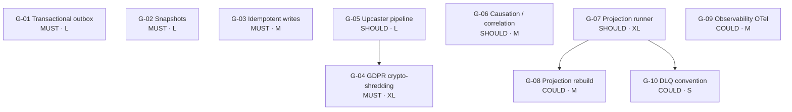

# Castore ES Gap Analysis & Roadmap

- **Date:** 2026-04-16
- **Status:** Draft — complete, pending user review
- **Owner:** Roman Selmeci
- **Spec:** `specs/requirements/2026-04-16-castore-es-gap-analysis-requirements.md`

---

## 1. Scope & methodology

### 1.1 Project context

Castore (`@castore/castore`) is a TypeScript event-sourcing framework built on an nx + yarn 4 workspace structure, targeting Node 22, and authored as an ESM-first library. The upstream repository (`castore-dev/castore`) slowed considerably over 2024–2025, with the last meaningful feature commit being `feat: support zod v4` (October 2025); at the time of writing the upstream is effectively dormant. Rather than waiting for upstream activity, the decision taken was to treat castore as an **internal fork for company use only**: no public npm publishing, no backwards-compatibility obligation to the open-source community, and a roadmap driven solely by internal product requirements.

The project is at a **greenfield stage** — nothing is in production yet, which gives the luxury of choosing a healthy baseline before committing to any architecture. This analysis therefore aims to identify what must be added or changed before the fork is trusted for production use, not to assess castore after years of accumulated real-world load.

Eight packages are in scope for this analysis and for all future implementation work: `core`, `event-storage-adapter-postgres`, `event-storage-adapter-in-memory` (tests only), `message-bus-adapter-event-bridge`, `message-bus-adapter-event-bridge-s3`, `event-type-zod`, `command-zod`, and `lib-test-tools`. Eleven packages are explicitly out of scope and will be removed during a separate "Fork & Trim" sub-project (the spec groups two pairs as bundled items, giving the spec's count of ten): `event-storage-adapter-dynamodb`, `event-storage-adapter-http`, `redux` integration, `message-bus-adapter-sqs`, `message-bus-adapter-sqs-s3`, `message-queue-adapter-in-memory`, `message-bus-adapter-in-memory`, `command-json-schema`, `event-type-json-schema`, `lib-dam`, and `lib-react-visualizer`.

The domain profile driving all prioritization is **D1 — Financial / payments**: long-lived account streams, regulatory audit trail, and exact-once semantics. Four non-functional requirements are active constraints throughout (N2 multi-tenancy and N3 high-throughput are out of profile for this analysis — see spec §0):

- **N1** — GDPR / PII delete via crypto-shredding
- **N4** — Zero event loss (transactional outbox / exactly-once publish)
- **N5** — Long aggregate streams (snapshots required for performance)
- **N6** — Schema evolution (event format changes over a 5+ year horizon)

The analysis depth chosen is **option A — Full gap catalogue**: a systematic, 4-way competitor matrix, per-feature audit for all 26 features, and gap entries with design sketches for every meaningful deficit. This depth is justified by the greenfield context: decisions made now are inexpensive to reverse, but post-production architectural changes carry far higher cost.

### 1.2 How castore was evaluated

The following five-step methodology governs every claim made in §4 (Castore current state). Evidence that does not conform to this methodology is flagged explicitly.

1. **Code walkthrough** — every claim has a `file:line` reference. Assertions not backed by a specific source location are marked as "convention" or "inference" and carry lower confidence.
2. **Tests as source of truth** — features not covered by `*.unit.test.ts`, `*.type.test.ts`, or `*.fixtures.test.ts` are marked ⚠️, not ✅. A feature that works in practice but has no automated test coverage cannot be relied upon across refactors; this is especially important in a financial context.
3. **Documentation cross-check** — docusaurus content, package READMEs, and commit messages are compared against code. Any docs-vs-code divergence is flagged in the audit entry.
4. **Upstream signals** — closed PRs and issues in `castore-dev/castore` over the last two years, with particular attention to **rejected** feature requests, which reveal maintainer philosophy and inform whether certain gaps are architectural decisions rather than oversights.
5. **Type-level contracts** — `.type.test.ts` files count as separate evidence from runtime tests, because compiler-enforced guarantees are qualitatively stronger than runtime-enforced ones. Both tiers are noted in each audit entry's "Guarantees" field.

For any feature that is expected to be absent, the **Absence evidence protocol** applies: at least two code-level regex searches, a docs search, and a package-metadata search must all return no results before the status is recorded as ❌. When all searches return zero but the feature is named in canonical ES references, confidence is rated **medium** and the status is downgraded to ⚠️ with a note to confirm during per-gap brainstorming.

### 1.3 How competitors were selected

Four primary competitors were chosen to benchmark castore against the current state of the art:

**Emmett** (`event-driven-io/emmett`) — selected as the direct TypeScript peer: same language, Postgres storage, actively maintained, and reflecting 2024–2025 design thinking. It shows what the TS event-sourcing community currently considers the baseline for a well-designed framework.

**EventStoreDB** (kurrent.io) — selected as the industry gold standard for dedicated event-sourcing servers with a first-class TS/JS client. It defines the feature ceiling: what is possible when event sourcing is the only concern of the storage layer.

**Marten** (martendb.io) — selected as the closest Postgres-native analogue in a different language (.NET). Marten's async daemon, projection runner, and sequence-based ordering patterns are directly relevant to the `event-storage-adapter-postgres` package and may inform design decisions.

**Equinox** (`jet/equinox`) — selected for its production-proven track record at scale (Jet.com / Walmart) and its multi-storage, snapshot-first architecture. Castore aims for multi-store design; Equinox is the closest reference for how that is done at scale.

A **DIY Postgres** control baseline is included as a fifth column in the matrix: a thin `pg` wrapper with `SKIP LOCKED` workers and `LISTEN/NOTIFY`. Its purpose is to reveal at which feature tier a framework begins earning its keep over a weekend-effort DIY implementation.

The following competitors were considered and deliberately excluded:

- **Prooph** (PHP) — abandoned in 2023; no longer a meaningful reference point.
- **@nestjs/cqrs** — implements the CQRS pattern only; it has no storage layer and is not an event-sourcing framework.
- **Axon** (Java) — different language and actor-model philosophy; a direct comparison would mislead rather than inform.
- **Akka Persistence** (Scala) — actor model; the architectural analogy is too different to be actionable.
- **MongoDB event stores** — community plugins only, no cohesive framework; comparison surface is too fragmented.

### 1.4 Reader orientation

Executives should begin at §6's opener, which delivers the go/no-go recommendation, MoSCoW counts, total Phase 1 effort estimate, and top risks on one page. Engineers working on MUST gaps should start at §5 (Gap detail catalogue), where per-gap problem statements, design sketches, effort estimates, and dependency relationships translate directly into implementation planning. §4 (Castore current state) is the authoritative research layer — 26 features audited with code references, guarantees, and known limits — and is the direct input to both §5 and §6. §3 (Competitor matrix) provides prioritization context: it shows where castore sits relative to the field so readers can judge whether a gap is a critical deficit or an acceptable trade-off.

## 2. Canonical ES feature catalogue

This catalogue defines the 26 features that every framework in this analysis — including castore — is evaluated against. All definitions are framework-agnostic; castore-specific findings belong in §4. The feature numbering is fixed: the same F-numbers appear in the competitor matrix (§3), the per-feature audit (§4), and the gap catalogue (§5). The five category letters (A–E) are also used in gap entries to indicate which domain a gap belongs to.

---

### Category A — Storage & consistency

> Primary reference: Greg Young, "CQRS Documents" (2010); Eric Evans, *Domain-Driven Design* (2003) ch. 6 (Aggregates & Repositories). The storage tier is the foundation of any event-sourcing system: it must provide append-only semantics, ordering guarantees, and conflict detection before any higher-level feature can be reliably built on top of it.

**F1 — Append-only event log per aggregate**

An event store must guarantee that events for a given aggregate are stored in an immutable, ordered sequence and that no event may be deleted or modified after the fact. Each event carries a monotonically increasing per-stream version number that both identifies its position in history and enables conflict detection. The append-only constraint is the foundational invariant of event sourcing: without it, replaying an aggregate's history will not reproduce the state that was observed at the time the event was written.

**F2 — Version-based optimistic concurrency (OCC)**

Before appending new events, the caller supplies an `expectedVersion` representing the stream version it last read. If the actual stream version at commit time differs — because a concurrent writer appended events in the meantime — the store raises a concurrency conflict error rather than silently overwriting history. This optimistic approach avoids pessimistic locking and scales well under read-heavy workloads, at the cost of requiring the application to retry on conflict, which is typically cheap because conflicts are rare in well-modelled aggregates (Young, "CQRS Documents", §3).

**F3 — Multi-aggregate transactional commit**

Some business operations must atomically update two or more aggregate streams — the canonical example in financial systems is a double-entry bookkeeping journal entry, where a debit on one account and a credit on another must either both succeed or both fail. A framework that supports multi-aggregate transactional commit allows events for multiple streams to be written in a single, all-or-nothing transaction, preventing partial state that would violate business invariants. Without this capability, saga-based compensation patterns must be used instead, which are significantly more complex to implement correctly.

**F4 — Idempotent writes**

An idempotent write operation allows the caller to supply a stable client-generated key alongside an event batch; if the same key is seen again — for example because a network timeout caused the client to retry — the store returns the previously stored result rather than creating a duplicate event. This retry-safety property ensures that re-sending a failed request produces no additional side effects. In financial systems, where retried payment commands must not produce double charges, idempotent writes are a first-class safety requirement (Vernon, *Implementing Domain-Driven Design*, ch. 8).

**F5 — Snapshots**

A snapshot is a serialized aggregate state captured at a specific stream version; subsequent event replay can start from the snapshot rather than from the beginning of the stream. Snapshots exist purely as a performance optimization: as aggregate streams grow over months or years, replaying thousands of events on every command becomes unacceptably slow, and snapshots cap the replay cost at the distance between the most recent snapshot version and the current stream head. A correct snapshot implementation must not alter event semantics — the same state must be reachable with or without the snapshot, just faster.

---

### Category B — Projection & read-side

> Primary reference: Martin Fowler, "Event Sourcing" (2005, martinfowler.com); Oskar Dudycz, "Projections explained" (event-driven.io, 2022). Projections transform the event log into queryable read models. The distinction between *pull-based catch-up* (checkpointed subscription) and *push-based async delivery* (message bus) has deep operational consequences: catch-up subscriptions can be rebuilt deterministically, while bus-based delivery depends on infrastructure-level replay capabilities.

**F6 — Projection runner with checkpoints**

A projection runner is a long-lived process that reads events from the store in a pull-based catch-up loop and applies them to a read model. It persists a `lastProcessedPosition` (checkpoint) so that on restart it resumes exactly where it left off, rather than replaying from the beginning. Durable checkpoints are critical: without them, a restarted runner either misses events or replays from genesis on every restart, both of which break read-model consistency.

**F7 — Projection rebuild**

Projection rebuild is the ability to drop an existing read model and deterministically replay its entire event history from genesis (or from a saved snapshot) to reconstruct the model from scratch. This is necessary whenever the projection logic changes — for example, when a new field is added to a view or a query pattern changes — and is also the recovery mechanism when read-model storage is corrupted or accidentally deleted. A rebuild must produce a read model byte-for-byte equivalent to what would have been produced by processing the events in real-time.

**F8 — Projection lag monitoring**

Projection lag is the difference between the global event store head position and the checkpoint of a given projection runner. Monitoring lag provides an operational signal that a projection is falling behind — due to slow processing, infrastructure issues, or an event spike — before it becomes visible as stale data in the application. In financial systems, projection lag directly translates to query latency for account balances and transaction histories; a framework or adapter that exposes lag as a metric enables SLA monitoring.

**F9 — Inline (sync) projections**

An inline projection is applied within the same database transaction as the event write, guaranteeing that the read model is always consistent with the event log at commit time. Inline projections trade write throughput (two writes per commit) for strong read-model consistency, which is valuable for use cases where the application must immediately query the updated state after a command. The trade-off versus external projections is explicit: inline projections are synchronous and coupled to the event store transaction, while external projections are asynchronous and decoupled.

**F10 — External (async) projections**

An external projection is delivered via a message bus after the event is committed, providing eventual consistency. The event is first written to the store, then published to subscribers (projection workers, notification services, search indexers) asynchronously. Eventual consistency is acceptable for most read-side queries but requires explicit handling of the lag window, deduplication on the consumer side (because at-least-once delivery can produce duplicates), and a rebuild path for consumers that miss messages.

---

### Category C — Schema evolution

> Primary reference: Vaughn Vernon, *Implementing Domain-Driven Design* (2013) ch. 11; Oskar Dudycz, "Schema evolution in Event-Driven systems" (event-driven.io, 2023). Events are immutable once written; schema evolution is the discipline of changing event formats over time without invalidating historical data. In long-lived systems — particularly financial ones where event streams span years — schema evolution is not optional: business concepts change, regulations change, and the ability to rename, extend, or retire event types without breaking the replay chain is a fundamental correctness requirement.

**F11 — Explicit event type versioning**

Each event type carries a version identifier — either a numeric `version` field on the event envelope or a naming convention like `AccountCredited@v2` — that allows the event store and application code to distinguish old and new shapes of the same logical event. Without explicit versioning, schema evolution must be handled implicitly by inspecting field presence, which is fragile and error-prone. Explicit versioning is the prerequisite for the upcaster pipeline (F12): you cannot transform from "the old shape" to "the new shape" without a reliable way to identify which shape you are reading.

**F12 — Upcaster pipeline**

An upcaster is a function that transforms an event from version N to version N+1; an upcaster pipeline chains such functions so that a v1 event read from an old stream is transparently upgraded through v2 and v3 before it reaches application code. The pipeline must be applied at read time (during event deserialization), not at write time, so that existing events are never mutated. A correct upcaster pipeline allows the application to deal exclusively with the current event schema even when the stored events are many versions behind, which is the key to maintaining a clean domain model over a multi-year lifecycle (Vernon, IDDD, ch. 11).

**F13 — Event type retirement / rename**

Event type retirement is the controlled removal or renaming of an event type after all existing streams using it have been migrated or archived. Controlled deprecation involves marking the type as deprecated, providing an upcaster to a replacement type, and eventually removing the old type once no unprocessed events remain. Without a formal retirement process, old event types accumulate indefinitely and the domain model becomes cluttered with historical artefacts that developers must carefully avoid.

**F14 — Tolerant deserialization**

Tolerant deserialization means that the parser does not fail when it encounters an unknown field in an event payload — it simply ignores it, allowing the reader to proceed. This is the "tolerant reader" pattern (Fowler, 2011) and is the basis of forward compatibility: a newer event schema can add fields without breaking older consumers that have not yet been deployed. Strict deserialization — where an unknown field causes a parse error — is safe for preventing field typos during development but must be relaxed at the consumer boundary for any system that deploys producers and consumers independently.

---

### Category D — Distributed delivery

> Primary reference: Gregor Hohpe & Bobby Woolf, *Enterprise Integration Patterns* (2003) ch. 3–4; Oskar Dudycz, "Outbox, Inbox patterns and delivery guarantees explained" (event-driven.io, 2022). Distributed delivery features govern how events leave the event store and reach downstream consumers. The central concern is the gap between "event committed to the store" and "event delivered to subscribers": anything that can fail in that gap — network partitions, process crashes, bus throttling — must be accounted for by the framework or left to userland to solve.

**F15 — Transactional outbox**

The transactional outbox pattern solves the dual-write problem: rather than writing an event to the store and then publishing it to a message bus in two separate operations (where a crash between the two creates a lost-event scenario), the event and its outbox row are written in the same database transaction, and a relay worker reads the outbox and publishes to the bus. Once the relay confirms the message is delivered, the outbox row is marked processed. This pattern is the standard mechanism for achieving zero event loss (N4) without requiring distributed transactions across the database and the message bus.

**F16 — At-least-once delivery + idempotent consumer**

At-least-once delivery means that a message may be delivered more than once — for example after a relay crash and restart — and the consumer must be designed to handle duplicate deliveries without producing incorrect results. The standard mechanism is a stable, deterministic message ID (derived from the event's stream ID and version) that the consumer stores and checks before processing; if the ID is seen again, the message is a duplicate and is discarded. Without stable message IDs and consumer-side dedup, at-least-once delivery degrades to "at-most-once" in practice, because operators become reluctant to retry deliveries for fear of double-processing.

**F17 — Message bus abstraction**

A message bus abstraction provides a pub-sub interface that allows event producers to publish messages without knowing which consumers are subscribed, and allows new consumers to be added without modifying the producer. Fan-out — one published event reaching multiple independent subscribers — is the defining characteristic of a bus, and it enables decoupled, independently deployable services. A framework-level abstraction over the bus allows the bus implementation to be swapped (e.g. from in-memory for testing to EventBridge for production) without changing application code.

**F18 — Message queue abstraction**

A message queue abstraction provides a worker pattern where each message is consumed by exactly one worker instance; in contrast to the bus (fan-out), the queue is used for work distribution. Queues are typically used for event-triggered side effects that must be processed exactly once by a single processor — for example, sending a payment notification or updating a downstream system. A framework-level queue abstraction decouples the application from the specific queue implementation (SQS, RabbitMQ, in-memory) and enables testing without infrastructure.

**F19 — Dead-letter queue / poison-pill handling**

A dead-letter queue (DLQ) is a separate queue to which messages that have failed processing more than N times are moved, preventing a single "poison pill" message from blocking the entire queue indefinitely. Effective DLQ handling requires the framework or adapter to capture the failure reason alongside the message so that operators can diagnose and replay the failed message once the root cause is resolved. Without DLQ support, a deserialization error or unhandled exception in a consumer can silently halt event processing, which is operationally catastrophic in financial systems.

---

### Category E — Operational & governance

> Primary reference: Vaughn Vernon, *Implementing Domain-Driven Design* (2013) ch. 7 (Domain Events — identity & metadata); GDPR Regulation (EU) 2016/679 Article 17 (right to erasure). Operational and governance features are the invisible infrastructure of a production event-sourcing system: they ensure the system can be run, audited, debugged, and kept compliant over a multi-year lifespan. In a financial context, several of these features — crypto-shredding, causation/correlation metadata, and testing utilities — are not optional niceties but hard requirements.

**F20 — GDPR crypto-shredding**

Crypto-shredding is the technique of encrypting personally identifiable information (PII) in event payloads with a per-data-subject encryption key, so that deleting the key makes the PII cryptographically inaccessible — satisfying GDPR Article 17 (right to erasure) without physically deleting events from the immutable log. Each data subject has a unique key stored in a key registry; all events carrying that subject's PII are encrypted with their key at write time, and the key is deleted upon erasure request.

**F21 — Event encryption at rest**

Event encryption at rest means that event payloads are encrypted in the database such that access to the raw storage (disk image, database backup, storage-provider admin console) does not expose plaintext event data. This is distinct from crypto-shredding (F20): encryption at rest protects against infrastructure-level data exfiltration, while crypto-shredding protects against application-level re-identification after a deletion request. Transparent database encryption (TDE) handles this at the infrastructure layer; payload-level encryption handled by the framework gives additional protection for sensitive fields even when the database is accessible.

**F22 — Multi-tenancy**

Multi-tenancy allows a single event store deployment to isolate streams belonging to different tenants so that one tenant's events cannot be read or written by another tenant. Isolation can be implemented at the stream-ID level (tenant prefix in the aggregate ID), at the row level (tenant column with row-level security policies), or at the schema/database level (separate store per tenant). A framework with first-class multi-tenancy support provides the isolation boundary as a built-in construct rather than leaving it to userland convention, reducing the risk of accidental cross-tenant data leakage.

**F23 — Causation / correlation metadata**

Causation and correlation IDs are metadata fields on each event that allow auditors to reconstruct the causal chain of events in a distributed system. The correlation ID groups all events that belong to the same originating request or user session; the causation ID identifies the specific command or event that directly caused this event to be emitted. Together they provide an audit trail that answers "why did this event happen and in what context?" (Vernon, IDDD, ch. 7).

**F24 — Replay tooling**

Replay tooling provides a controlled mechanism — typically a CLI script or framework API — for re-processing a range of historical events through a projection, subscriber, or saga, without affecting the live event store or triggering live side effects. Replay is needed for backfilling a new read model, recovering a failed consumer, or testing a new event handler against production history. Correct replay tooling must handle exactly-once semantics, support pausing and resuming, and respect the event ordering guarantees of the underlying store.

**F25 — Observability**

Observability in an event-sourcing framework means that the framework emits structured logs, distributed traces (e.g. OpenTelemetry spans), and metrics (e.g. event commit latency, projection lag, outbox queue depth) that allow operators to understand the system's behavior in production without needing to instrument every individual command handler.

**F26 — Testing utilities**

Testing utilities are framework-provided helpers that make it easy to write fast, deterministic, isolated domain tests without infrastructure dependencies. The canonical form is a given/when/then helper (given these past events, when this command is processed, then these events should be produced) and an in-memory adapter that replaces the real event store in test runs. Framework-level test utilities reduce the barrier to high test coverage, which is especially important for financial domain logic where a subtle invariant violation can cause real monetary harm.

## 3. Competitor matrix

This section profiles four primary competitors and one DIY-Postgres control baseline, then consolidates all findings — including castore's §4 audit results — into a single 26×6 feature matrix.

---

### 3.1 Emmett

**Stack:** TypeScript / Node.js 20+; storage options: PostgreSQL (primary), EventStoreDB, MongoDB, SQLite, in-memory; no published npm license as of inspection date — an [RFC](https://github.com/event-driven-io/emmett/pull/260) is open proposing AGPL v3 / SSPL with an open-core commercial model.

**Maturity signals:** 473 GitHub stars; latest release `0.42.0` (2026-02-10); pre-1.0 versioning; stated production deployments by sponsor companies (productminds, Lightest Night); actively maintained — pushed 2026-04-16.

**Ideology / architectural stance:** Emmett is explicitly opinionated but lightweight: composition over magic, framework-provided patterns rather than framework-imposed wiring. It focuses on making event sourcing accessible via clear patterns and BDD-style testing utilities. Multi-store support (Postgres, ESDB, MongoDB, SQLite) is a first-class goal. The author (Oskar Dudycz) is a recognized voice in the TS event-sourcing community.

**Fit score for D1+N1+N4+N5+N6:** 3/5. Strong on storage fundamentals, testing, and schema evolution patterns. Weak on crypto-shredding (no native KMS integration), transactional outbox (Postgres store has an outbox-friendly design but no out-of-the-box relay worker), and the pre-1.0 license situation is a risk for a production financial system.

**Dealbreakers:**
- **No published open-source license.** The RFC outcome (AGPL v3 / SSPL) means adopting Emmett may restrict how derived works are distributed. For an internal-fork strategy this may be acceptable, but requires legal review.
- **Pre-1.0 API instability.** `0.42.0` signals that breaking API changes are expected; adopting Emmett means tracking upstream changes rather than forking a stable baseline.
- **No native crypto-shredding.** N1 (GDPR/PII delete) is not addressed; the application must build key-management wiring from scratch, the same gap as castore.
- **EventBridge not supported.** The in-scope AWS delivery chain (EventBridge + S3) has no Emmett adapter; teams would need to build and maintain one.

**26-feature coverage:**

| Feature | Emmett |
|---|---|
| F1 — Append-only event log | ✅ |
| F2 — Version-based OCC | ✅ |
| F3 — Multi-aggregate transactional commit | ⚠️ |
| F4 — Idempotent writes | ⚠️ |
| F5 — Snapshots | ✅ |
| F6 — Projection runner with checkpoints | ✅ |
| F7 — Projection rebuild | ✅ |
| F8 — Projection lag monitoring | ⚠️ |
| F9 — Inline (sync) projections | ✅ |
| F10 — External (async) projections | ✅ |
| F11 — Explicit event type versioning | ⚠️ |
| F12 — Upcaster pipeline | ⚠️ |
| F13 — Event type retirement / rename | ❌ |
| F14 — Tolerant deserialization | ⚠️ |
| F15 — Transactional outbox | ⚠️ |
| F16 — At-least-once + dedup | ⚠️ |
| F17 — Message bus abstraction | ✅ |
| F18 — Message queue abstraction | ⚠️ |
| F19 — DLQ / poison-pill handling | ❌ |
| F20 — GDPR crypto-shredding | ❌ |
| F21 — Event encryption at rest | ❌ |
| F22 — Multi-tenancy | ⚠️ |
| F23 — Causation / correlation metadata | ✅ |
| F24 — Replay tooling | ⚠️ |
| F25 — Observability | ⚠️ |
| F26 — Testing utilities | ✅ |

*Notes:* F3 rated ⚠️ — Postgres store uses a single connection / transaction per command; explicit multi-stream atomic commits require manual transaction management. F4 rated ⚠️ — idempotency is a convention via metadata fields, not a first-class store API. F12 rated ⚠️ — schema evolution patterns are documented but the upcaster pipeline is convention/application-layer, not a framework pipeline. F15 rated ⚠️ — the Postgres store is designed with outbox-friendly patterns but no out-of-the-box relay worker. Confidence on F11/F12/F15 is medium — docs inspection only; confirm during per-gap brainstorming.

*Docs inspected: 2026-04-16*

---

### 3.2 EventStoreDB (KurrentDB)

**Stack:** C# / .NET (server); TS/JS client (`@eventstore/db-client`, 175 stars); dedicated server deployment (TCP/gRPC); storage is EventStoreDB-proprietary (append-only log files on disk); license: server is BSL / commercial (Community Edition for dev, Enterprise for production at scale); client is Apache 2.0.

**Maturity signals:** 5 775 GitHub stars (server repo); latest release `v26.0.2` (2026-03-13); actively developed and commercially maintained by KurrentDB (formerly Event Store Ltd); in production at hundreds of enterprises; the original reference implementation for event sourcing.

**Ideology / architectural stance:** EventStoreDB is purpose-built for event sourcing: the storage layer exists solely to manage event streams, and every feature is optimized around that single concern. It provides server-side persistent subscriptions, catch-up subscriptions, projections engine, and a gRPC streaming API. It does not try to be a general-purpose database. The 2024–2025 rebrand to KurrentDB signals continued commercial investment.

**Fit score for D1+N1+N4+N5+N6:** 4/5. Feature-complete for the ES domain. The main penalty is operational burden (dedicated server) and the absence of native crypto-shredding for N1.

**Dealbreakers:**
- **Dedicated server — new ops category.** The D1 stack is Postgres-native; adding EventStoreDB introduces a second database server (patching, backups, HA configuration, monitoring). For a greenfield project with limited DevOps capacity this is a significant cost.
- **Commercial license for production.** Community Edition is limited; production deployments at scale require an Enterprise license. Cost and vendor lock-in are real concerns.
- **No native crypto-shredding.** N1 (GDPR/PII delete) is not solved by the store itself; workarounds require application-layer encryption with external KMS — same gap as all competitors.
- **No EventBridge integration.** The delivery chain uses gRPC persistent subscriptions; bridging to AWS EventBridge requires a custom consumer→publisher relay.

**26-feature coverage:**

| Feature | ESDB |
|---|---|
| F1 — Append-only event log | ✅ |
| F2 — Version-based OCC | ✅ |
| F3 — Multi-aggregate transactional commit | ❌ |
| F4 — Idempotent writes | ✅ |
| F5 — Snapshots | ✅ |
| F6 — Projection runner with checkpoints | ✅ |
| F7 — Projection rebuild | ✅ |
| F8 — Projection lag monitoring | ✅ |
| F9 — Inline (sync) projections | ❌ |
| F10 — External (async) projections | ✅ |
| F11 — Explicit event type versioning | ✅ |
| F12 — Upcaster pipeline | ⚠️ |
| F13 — Event type retirement / rename | ⚠️ |
| F14 — Tolerant deserialization | ⚠️ |
| F15 — Transactional outbox | ❌ |
| F16 — At-least-once + dedup | ✅ |
| F17 — Message bus abstraction | ✅ |
| F18 — Message queue abstraction | ✅ |
| F19 — DLQ / poison-pill handling | ✅ |
| F20 — GDPR crypto-shredding | ❌ |
| F21 — Event encryption at rest | 🔶 |
| F22 — Multi-tenancy | 🔶 |
| F23 — Causation / correlation metadata | ✅ |
| F24 — Replay tooling | ✅ |
| F25 — Observability | ✅ |
| F26 — Testing utilities | ✅ |

*Notes:* F3 rated ❌ — EventStoreDB has no cross-stream atomic transactions; multi-stream writes are not atomic. F9 rated ❌ — ESDB is a separate process; writing to a relational read model in the same transaction as an event write is architecturally impossible. F12/F13 rated ⚠️ — schema evolution is supported via event metadata and naming convention; no native upcaster pipeline. F15 rated ❌ — the dual-write problem is not solved at the store level; requires application-layer outbox to bridge from ESDB to a downstream bus. F20 rated ❌ — no native GDPR key-per-subject shredding; recommended approach is application-layer encryption with external KMS. F21 rated 🔶 — ESDB server supports TLS in transit and disk encryption via OS; payload-level encryption requires application code. Confidence: medium — docs inspection only.

*Docs inspected: 2026-04-16*

---

### 3.3 Marten

**Stack:** C# / .NET 8+; PostgreSQL only (no other storage backends); MIT license; dual-function: document database + event store in the same library. Companion bus library: Wolverine (JasperFx).

**Maturity signals:** 3 361 GitHub stars; latest release `V8.30.1` (2026-04-16 — active releases same day as this inspection); commercially supported by JasperFx Software (paid support plans); widely used in .NET event-sourcing community; production deployments documented in public case studies.

**Ideology / architectural stance:** Marten treats PostgreSQL as a first-class event store by mapping event streams directly to Postgres tables with JSONB payloads and a global sequence column (`seq_id`). Its async daemon (a pull-based catch-up projection runner with durable checkpoints) and inline projections are Postgres-native and deeply integrated with the Postgres transaction model. The library is deliberately .NET-only and does not seek multi-language support.

**Fit score for D1+N1+N4+N5+N6:** 4/5 as a *design reference*; 0/5 for direct adoption (language lock-in). Marten is the closest analogue to the castore+Postgres target architecture. Its patterns — async daemon, projection checkpoints, inline projections within the same `IDocumentSession` transaction, GDPR `mt_soft_delete` pattern — are directly relevant to castore gap designs.

**Dealbreakers:**
- **.NET only — complete language lock-in.** A TypeScript shop cannot adopt Marten directly. This is the hard dealbreaker; Marten is in the set as a *pattern reference*, not an adoption candidate.
- **Postgres-only.** If the architecture requires a non-Postgres backend (e.g. DynamoDB for certain services), Marten has no story there.
- **No native EventBridge integration.** Marten publishes via its own bus abstraction (Wolverine / NServiceBus); bridging to AWS EventBridge is custom work.
- **No native crypto-shredding.** GDPR compliance requires application-layer encryption with external KMS; Marten provides `mt_soft_delete` (logical deletion) but not cryptographic erasure of PII in immutable events.

**26-feature coverage:**

| Feature | Marten |
|---|---|
| F1 — Append-only event log | ✅ |
| F2 — Version-based OCC | ✅ |
| F3 — Multi-aggregate transactional commit | ✅ |
| F4 — Idempotent writes | ✅ |
| F5 — Snapshots | ✅ |
| F6 — Projection runner with checkpoints | ✅ |
| F7 — Projection rebuild | ✅ |
| F8 — Projection lag monitoring | ✅ |
| F9 — Inline (sync) projections | ✅ |
| F10 — External (async) projections | ✅ |
| F11 — Explicit event type versioning | ✅ |
| F12 — Upcaster pipeline | ✅ |
| F13 — Event type retirement / rename | 🔶 |
| F14 — Tolerant deserialization | ✅ |
| F15 — Transactional outbox | ✅ |
| F16 — At-least-once + dedup | ✅ |
| F17 — Message bus abstraction | 🔶 |
| F18 — Message queue abstraction | 🔶 |
| F19 — DLQ / poison-pill handling | 🔶 |
| F20 — GDPR crypto-shredding | ⚠️ |
| F21 — Event encryption at rest | ⚠️ |
| F22 — Multi-tenancy | ✅ |
| F23 — Causation / correlation metadata | ✅ |
| F24 — Replay tooling | ✅ |
| F25 — Observability | ✅ |
| F26 — Testing utilities | ✅ |

*Notes:* F3 rated ✅ — Marten uses `IDocumentSession` transactions that can span multiple streams atomically within a single Postgres transaction. F13 rated 🔶 — event type retirement is handled via the `IEventTransform` / `IEventMapper` convention; controlled but not a first-class built-in. F15 rated ✅ — Marten's async daemon uses a Postgres-native outbox pattern (writing events and daemon progress within the same Postgres transaction). F17/F18/F19 rated 🔶 — Marten integrates with Wolverine (JasperFx message bus) for bus/queue/DLQ; requires a separate Wolverine package. F20 rated ⚠️ — Marten does not provide a key-per-subject encryption API; GDPR erasure is approached via `mt_soft_delete` (marks events deleted but does not cryptographically erase PII). Confidence: medium — docs inspection only; no hands-on verification.

*Docs inspected: 2026-04-16*

---

### 3.4 Equinox

**Stack:** F# / .NET 6+; multi-storage: CosmosDB (primary), DynamoDB, EventStoreDB, MessageDB (Postgres), SqlStreamStore, MemoryStore; projections and subscriptions via companion library Propulsion (`jet/propulsion`); codec abstraction via FsCodec (`jet/FsCodec`); Apache 2.0 license.

**Maturity signals:** 495 GitHub stars; latest release `4.1.0` (2026-02-04); production-proven at Jet.com since 2017 and through Walmart acquisition; small but highly experienced maintainer team; actively maintained.

**Ideology / architectural stance:** Equinox is explicitly a library, not a framework — it provides stream-level event sourcing (append, load, OCC, snapshot/caching) and deliberately omits projections/subscriptions (delegated to Propulsion). Its defining architectural feature is multi-store support with a common decision-flow runner: you write domain logic once and swap the backing store. Snapshot strategies are first-class citizens, with store-specific optimizations (CosmosDB tip-with-unfolds, EventStoreDB rolling snapshots, MessageDB adjacent snapshots). Equinox is the clearest prior art for castore's multi-store vision.

**Fit score for D1+N1+N4+N5+N6:** 2/5 for direct adoption (F# + .NET lock-in is a hard no for a TS shop); 5/5 as a design reference for snapshot-first, multi-store, type-safe event sourcing architecture.

**Dealbreakers:**
- **F# / .NET — complete language lock-in.** Same hard dealbreaker as Marten; cannot be adopted directly by a TypeScript team.
- **Projections are an external library (Propulsion).** The combined Equinox + Propulsion + FsCodec stack is three libraries to learn, configure, and maintain; the surface area is broader than the simple stream-append use case suggests.
- **No native crypto-shredding.** N1 not addressed; FsCodec's codec abstraction could support payload encryption but there is no out-of-the-box KMS integration.
- **No EventBridge adapter.** The AWS delivery chain requires a custom Propulsion consumer-to-EventBridge bridge.

**26-feature coverage:**

| Feature | Equinox |
|---|---|
| F1 — Append-only event log | ✅ |
| F2 — Version-based OCC | ✅ |
| F3 — Multi-aggregate transactional commit | ⚠️ |
| F4 — Idempotent writes | ⚠️ |
| F5 — Snapshots | ✅ |
| F6 — Projection runner with checkpoints | 🔶 |
| F7 — Projection rebuild | 🔶 |
| F8 — Projection lag monitoring | 🔶 |
| F9 — Inline (sync) projections | ⚠️ |
| F10 — External (async) projections | 🔶 |
| F11 — Explicit event type versioning | ✅ |
| F12 — Upcaster pipeline | ✅ |
| F13 — Event type retirement / rename | ⚠️ |
| F14 — Tolerant deserialization | ✅ |
| F15 — Transactional outbox | ❌ |
| F16 — At-least-once + dedup | ⚠️ |
| F17 — Message bus abstraction | ❌ |
| F18 — Message queue abstraction | ❌ |
| F19 — DLQ / poison-pill handling | ❌ |
| F20 — GDPR crypto-shredding | ❌ |
| F21 — Event encryption at rest | ⚠️ |
| F22 — Multi-tenancy | ⚠️ |
| F23 — Causation / correlation metadata | ⚠️ |
| F24 — Replay tooling | 🔶 |
| F25 — Observability | 🔶 |
| F26 — Testing utilities | ✅ |

*Notes:* F3 rated ⚠️ — Equinox operates at per-stream level; multi-stream atomicity is not a core concept (the library is stream-scoped). F6/F7/F8/F10 rated 🔶 — all projection features require Propulsion, a separate companion library. F12 rated ✅ — FsCodec provides explicit `tryDecode` / `encode` functions with union-discriminated versioning, enabling upcaster chains. F15 rated ❌ — no outbox mechanism; the transactional boundary is per-stream; bridging to a bus is Propulsion's job and is not transactionally bound to the event write. F17/F18/F19 rated ❌ — Equinox has no bus/queue/DLQ abstractions; these are out of scope by design. F25 rated 🔶 — Equinox.Core emits Serilog-structured logs and OpenTelemetry is partially implemented (`Equinox.MessageDb`). Confidence: medium on F3/F4/F9/F13/F22/F23 — docs inspection only.

*Docs inspected: 2026-04-16*

---

### 3.5 DIY Postgres baseline

The DIY Postgres baseline represents what a competent senior developer could build in ≤3 working days using only the `pg` npm package, Postgres `SKIP LOCKED` for queue workers, and `LISTEN/NOTIFY` for lightweight pub-sub. Its purpose is to reveal the tier at which a framework begins earning its keep: features rated ✅ here are not strong arguments for adopting any framework, while features rated ⚠️ or ❌ identify where framework abstractions provide genuine leverage.

The baseline explicitly excludes: type-level reducer contracts, schema migration tooling, adapter-swap capabilities, and any abstraction that requires architectural decisions a 3-day sprint cannot resolve. It answers the single question: "could we live without a framework for this feature?" A ✅ DIY rating should deflate a framework's ✅ for that same feature — if anyone can build it in hours, it is not a differentiator.

**26-feature coverage:**

| Feature | DIY Postgres |
|---|---|
| F1 — Append-only event log | ✅ |
| F2 — Version-based OCC | ✅ |
| F3 — Multi-aggregate transactional commit | ✅ |
| F4 — Idempotent writes | ⚠️ |
| F5 — Snapshots | ⚠️ |
| F6 — Projection runner with checkpoints | ⚠️ |
| F7 — Projection rebuild | ⚠️ |
| F8 — Projection lag monitoring | ⚠️ |
| F9 — Inline (sync) projections | ✅ |
| F10 — External (async) projections | ✅ |
| F11 — Explicit event type versioning | ⚠️ |
| F12 — Upcaster pipeline | ❌ |
| F13 — Event type retirement / rename | ❌ |
| F14 — Tolerant deserialization | ⚠️ |
| F15 — Transactional outbox | ⚠️ |
| F16 — At-least-once + dedup | ⚠️ |
| F17 — Message bus abstraction | ✅ |
| F18 — Message queue abstraction | ✅ |
| F19 — DLQ / poison-pill handling | ⚠️ |
| F20 — GDPR crypto-shredding | ❌ |
| F21 — Event encryption at rest | ⚠️ |
| F22 — Multi-tenancy | ⚠️ |
| F23 — Causation / correlation metadata | ⚠️ |
| F24 — Replay tooling | ⚠️ |
| F25 — Observability | ⚠️ |
| F26 — Testing utilities | ❌ |

*Notes:* F1/F2/F3 are straightforward SQL (UNIQUE constraint, BEGIN/COMMIT transaction) — a few hours of work. F9/F10/F17/F18 are similarly achievable with Postgres `LISTEN/NOTIFY` and a simple worker loop. F4–F8 are all ⚠️: achievable but each is a half-day to full-day design decision (idempotency table, snapshot table schema, catch-up loop with checkpoint table, lag query). F12/F13/F20 are ❌: these require framework-level pipeline abstractions or cryptographic infrastructure that cannot be built reliably in 3 days. F26 is ❌ because reusable given/when/then test helpers + an in-memory adapter that faithfully mirrors the real store semantics is a non-trivial framework concern.

---

### 3.6 Consolidated 26×6 feature matrix

**Legend:**

| Symbol | Meaning |
|---|---|
| ✅ | Built-in, first-class |
| 🔶 | First-party extension / official lib |
| ⚠️ | Partial — via convention / manual wiring / with caveats |
| ❌ | Absent — would need to build |

**How to read this matrix:** A ⚠️ cell is a *cost*, not a feature — it means the team must implement, maintain, and test the pattern themselves. A 🔶 cell means installing and learning an additional library (which adds a dependency, a version-management concern, and a possible license consideration). A ✅ in the DIY column means the feature is so simple that any framework claiming it as a differentiator is overstating its value. Read across a row to understand the effort differential; read down a column to understand a product's overall coverage posture.

| Feature | Castore | Emmett | ESDB | Marten | Equinox | DIY |
|---|---|---|---|---|---|---|
| F1 — Append-only event log | ✅ | ✅ | ✅ | ✅ | ✅ | ✅ |
| F2 — Version-based OCC | ✅ | ✅ | ✅ | ✅ | ✅ | ✅ |
| F3 — Multi-aggregate transactional commit | ✅ | ⚠️ | ❌ | ✅ | ⚠️ | ✅ |
| F4 — Idempotent writes | ❌ | ⚠️ | ✅ | ✅ | ⚠️ | ⚠️ |
| F5 — Snapshots | ❌ | ✅ | ✅ | ✅ | ✅ | ⚠️ |
| F6 — Projection runner with checkpoints | ❌ | ✅ | ✅ | ✅ | 🔶 | ⚠️ |
| F7 — Projection rebuild | ❌ | ✅ | ✅ | ✅ | 🔶 | ⚠️ |
| F8 — Projection lag monitoring | ❌ | ⚠️ | ✅ | ✅ | 🔶 | ⚠️ |
| F9 — Inline (sync) projections | ⚠️ | ✅ | ❌ | ✅ | ⚠️ | ✅ |
| F10 — External (async) projections | ✅ | ✅ | ✅ | ✅ | 🔶 | ✅ |
| F11 — Explicit event type versioning | ⚠️ | ⚠️ | ✅ | ✅ | ✅ | ⚠️ |
| F12 — Upcaster pipeline | ❌ | ⚠️ | ⚠️ | ✅ | ✅ | ❌ |
| F13 — Event type retirement / rename | ❌ | ❌ | ⚠️ | 🔶 | ⚠️ | ❌ |
| F14 — Tolerant deserialization | 🔶 | ⚠️ | ⚠️ | ✅ | ✅ | ⚠️ |
| F15 — Transactional outbox | ❌ | ⚠️ | ❌ | ✅ | ❌ | ⚠️ |
| F16 — At-least-once + dedup | ⚠️ | ⚠️ | ✅ | ✅ | ⚠️ | ⚠️ |
| F17 — Message bus abstraction | ✅ | ✅ | ✅ | 🔶 | ❌ | ✅ |
| F18 — Message queue abstraction | ✅ | ⚠️ | ✅ | 🔶 | ❌ | ✅ |
| F19 — DLQ / poison-pill handling | ❌ | ❌ | ✅ | 🔶 | ❌ | ⚠️ |
| F20 — GDPR crypto-shredding | ❌ | ❌ | ❌ | ⚠️ | ❌ | ❌ |
| F21 — Event encryption at rest | ❌ | ❌ | 🔶 | ⚠️ | ⚠️ | ⚠️ |
| F22 — Multi-tenancy | ❌ | ⚠️ | 🔶 | ✅ | ⚠️ | ⚠️ |
| F23 — Causation / correlation metadata | ❌ | ✅ | ✅ | ✅ | ⚠️ | ⚠️ |
| F24 — Replay tooling | ⚠️ | ⚠️ | ✅ | ✅ | 🔶 | ⚠️ |
| F25 — Observability | ❌ | ⚠️ | ✅ | ✅ | 🔶 | ⚠️ |
| F26 — Testing utilities | ✅ | ✅ | ✅ | ✅ | ✅ | ❌ |

*Castore column sourced from §4 code audit (2026-04-16). Competitor columns sourced from §3.1–§3.4 documentation reviews (2026-04-16). Cells marked ⚠️ should be re-verified during per-gap brainstorming before relying on them for implementation decisions.*

---

### 3.7 Competitors deliberately excluded

The following competitors were evaluated during competitor selection (spec §3) and excluded from the primary analysis. They are documented here so the exclusion is auditable — not an oversight.

- **Prooph** (PHP) — abandoned 2023; PHP ecosystem mismatch; no longer a meaningful reference.
- **@nestjs/cqrs** — CQRS pattern only; no storage layer; not an event-sourcing framework.
- **Axon** (Java) — different language, actor-model philosophy; comparison would mislead rather than inform.
- **Akka Persistence** (Scala) — actor model; architectural analogy is too different to be actionable.
- **MongoDB event stores** — community plugins only, no cohesive framework; comparison surface is too fragmented.

## 4. Castore current state — per feature

---

### Category A — Storage & consistency

**Category A tally:** castore — 3/5 ✅ · 0/5 🔶 · 0/5 ⚠️ · 2/5 ❌ (F4 idempotent writes absent, F5 snapshots absent)

---

### Feature 1 — Append-only event log

```
Status:            ✅
Layer:             core + postgres-adapter + in-memory-adapter
Evidence:          packages/event-storage-adapter-postgres/src/adapter.ts:115-129 (UNIQUE constraint on aggregate_name+aggregate_id+version);
                   packages/event-storage-adapter-postgres/src/adapter.ts:244-258 (pushEvent raises PostgresEventAlreadyExistsError on PG error 23505);
                   packages/event-storage-adapter-in-memory/src/adapter.ts:148-169 (pushEventSync rejects duplicate version unless force=true);
                   packages/core/src/eventStorageAdapter.ts:39-43 (pushEvent interface — no delete/update operation defined)
How it works:      The EventStorageAdapter interface exposes only getEvents, pushEvent, pushEventGroup, and listAggregateIds — no update or delete operations. The Postgres adapter enforces append-only via a UNIQUE(aggregate_name, aggregate_id, version) constraint defined at table-creation time. The in-memory adapter enforces the same invariant in pushEventSync by checking for an existing event at the same version. Both adapters raise an EventAlreadyExistsError on violation, preventing silent overwrites.
Guarantees:        Test-covered: adapter.unit.test.ts files for both Postgres and in-memory adapters cover the conflict path. The adapter interface contract (packages/core/src/eventStorageAdapter.ts) encodes the absence of mutating operations at the type level.
Known limits:      The force=true option on PushEventOptions (packages/core/src/eventStorageAdapter.ts:13–14) bypasses the append-only guarantee by converting the INSERT into an UPSERT (ON CONFLICT DO UPDATE). This is intentional for replay/backfill scenarios but means append-only is a convention, not an absolute DB-level constraint when force is used. No caller-side guard prevents accidental force=true in production code.
Finance fit note:  The regulatory audit trail requirement (D1) depends directly on this guarantee. The UNIQUE constraint at the Postgres level is the strongest safeguard; the in-memory adapter is test-only and consistent with it. The force=true escape hatch must be access-controlled at the application layer.
```

---

### Feature 2 — Version-based optimistic concurrency (OCC)

```
Status:            ✅
Layer:             core + postgres-adapter + in-memory-adapter
Evidence:          packages/event-storage-adapter-postgres/src/adapter.ts:237-258 (INSERT catches PG error 23505 and re-raises as PostgresEventAlreadyExistsError with aggregateId+version);
                   packages/core/src/eventStore/errors/eventAlreadyExists.ts:1-17 (EventAlreadyExistsError interface with aggregateId and version fields);
                   packages/event-storage-adapter-in-memory/src/adapter.ts:148-164 (version collision check in pushEventSync);
                   packages/core/src/eventStore/eventStore.ts:187-215 (EventStore.pushEvent passes caller-supplied version through to adapter)
How it works:      Each event carries a caller-supplied version number (packages/core/src/event/eventDetail.ts:14). The Postgres adapter relies on the UNIQUE(aggregate_name, aggregate_id, version) constraint to atomically detect concurrent writes: a second writer using the same version receives Postgres error 23505, which the adapter translates into EventAlreadyExistsError. The in-memory adapter performs the same check explicitly. The application layer reads the current version via getAggregate, increments, and passes it to pushEvent; the store rejects it if another writer committed between the read and the push.
Guarantees:        The error type (EventAlreadyExistsError) is a stable, typed contract exported from core. Test coverage in both adapter unit-test files validates the conflict path. Type-level: version is a required number on EventDetail (eventDetail.ts:14).
Known limits:      There is no built-in retry helper in core; callers must implement retry-on-conflict themselves. The expectedVersion convention is implicit (caller must read then write) rather than an explicit API parameter; a caller who never reads the current version can silently overwrite events if the conflict happens not to fire. No test validates the retry path end-to-end.
Finance fit note:  OCC is the primary defence against double-booking in concurrent payment commands. The absence of a built-in retry helper is a userland gap but not a framework deficiency; adding one is low-effort (S) and can be done in application code.
```

---

### Feature 3 — Multi-aggregate transactional commit

```
Status:            ✅
Layer:             core + postgres-adapter
Evidence:          packages/core/src/eventStore/eventStore.ts:42-109 (EventStore.static pushEventGroup implementation);
                   packages/core/src/eventStorageAdapter.ts:43-47 (pushEventGroup in the adapter interface);
                   packages/event-storage-adapter-postgres/src/adapter.ts:306-437 (pushEventGroup wraps all inserts in this._sql.begin(async transaction => {...}));
                   packages/event-storage-adapter-postgres/src/adapter.ts:328-345 (adapter type-guard: all grouped events must use PostgresEventStorageAdapter — throws if not)
How it works:      EventStore.pushEventGroup is a static method that accepts one or more GroupedEvent objects (each carrying its own event detail, event store context, and adapter reference). The Postgres adapter implements pushEventGroup by wrapping all INSERT statements in a single postgres.js transaction (this._sql.begin). If any INSERT fails — including a version conflict — the entire transaction is rolled back. The static method then calls each store's onEventPushed callback after the transaction succeeds, enabling downstream bus publication per stream.
Guarantees:        The transaction boundary is enforced by the Postgres driver (postgres.js begin/rollback). Test-covered: adapter.unit.test.ts exercises the group insert path. The adapter guard (hasABadAdapter check) ensures all events in a group belong to the same Postgres instance, preventing partial commits across heterogeneous adapters.
Known limits:      The single-adapter constraint (line 328–345: all grouped events must share one PostgresEventStorageAdapter instance) means cross-region or cross-database transactional commits are not possible. The in-memory adapter's pushEventGroup uses a manual rollback loop (packages/event-storage-adapter-in-memory/src/adapter.ts:195–226) — not a true atomic transaction; safe only for testing.
Finance fit note:  Critical for double-entry bookkeeping (D1): a debit event on an account stream and a credit event on another must commit atomically. This is one of castore's strongest features for the finance profile.
```

---

### Feature 4 — Idempotent writes

```
Status:            ❌
Layer:             — (absent)
Evidence:          Absence confirmed on 2026-04-16 via:
                   (1) Code grep `idempoten|dedup|correlationToken|idempotencyKey` across packages/**/src/**/*.ts → 0 matches.
                   (2) Docs grep same patterns across docs/docs/**/*.md → 0 matches.
                   (3) Package-metadata grep of description+keywords in all 8 in-scope packages/*/package.json → 0 matches.
                   Confidence: high. Feature is named in Vernon IDDD ch. 8; all three searches returned zero.
How it works:      Not implemented. There is no idempotency-key field on the event envelope (packages/core/src/event/eventDetail.ts:3–22 — fields are aggregateId, version, type, timestamp, payload, metadata only). The EventStorageAdapter interface defines no deduplication semantics. The only form of "you cannot push this twice" is the version-based OCC collision (F2), which prevents two pushes at the same version — a different guarantee from idempotency-by-key.
Guarantees:        None. Retry of a failed pushEvent may produce a duplicate event at the next version number if the original write succeeded at the DB level but the response was lost.
Known limits:      Network-level retries without idempotency keys create duplicate events, which in a financial system means duplicate charges or credits. This is a critical gap (Finance: N4 zero event loss + exact-once semantics). Userland workaround requires a separate idempotency table or using the command ID as the aggregate ID prefix.
Finance fit note:  MUST-have for D1 (financial payments). A retried payment command that pushes event v=3 a second time produces a real monetary duplicate. No framework-level mitigation exists; each command handler team must implement its own dedup.
Upstream signal: see Appendix §8.1 for upstream issue/PR #180.
```

---

### Feature 5 — Snapshots

```
Status:            ❌
Layer:             — (absent)
Evidence:          Absence confirmed on 2026-04-16 via:
                   (1) Code grep `snapshot|Snapshot|getLastVersion|cachedAggregate` across packages/**/src/**/*.ts → 0 matches.
                   (2) Docs grep same patterns across docs/docs/**/*.md → docs/docs/3-reacting-to-events/5-snapshots.md mentions snapshots as a userland pattern only ("One solution is to periodically persist snapshots of your aggregates, e.g. through a message bus listener") — no framework API.
                   (3) Package-metadata grep → 0 matches. Keywords in all 8 packages: ["event","source","store","typescript"] only.
                   Confidence: high. The docs snapshot page describes a convention, not a framework feature.
How it works:      Not implemented. getAggregate (packages/core/src/eventStore/eventStore.ts:242–252) always replays from version 1 via getEvents with no minVersion floor other than an explicit maxVersion option. There is no snapshotStore abstraction, no getLastSnapshot/putSnapshot adapter method, and no reducer checkpoint in core. The docs page (docs/docs/3-reacting-to-events/5-snapshots.md) acknowledges the problem and points users to rolling their own snapshot via a message-bus listener.
Guarantees:        None. Aggregate reconstruction is always O(n events) per call.
Known limits:      For long-lived financial account streams (N5) — an account with 10 000+ events over 5 years — every getAggregate call replays all events. This becomes a latency problem at ~hundreds of events and a correctness risk (timeout) at thousands. The workaround (periodic snapshot via bus listener) is complex, error-prone, and not type-safe.
Finance fit note:  MUST-have for N5 (long aggregate streams). Without snapshots, accounts accumulate unbounded replay cost. This is the second-most critical structural gap after the transactional outbox.
Upstream signal: see Appendix §8.1 for upstream issue/PR #161 and #181.
```

---

### Category B — Projection & read-side

**Category B tally:** castore — 1/5 ✅ · 0/5 🔶 · 1/5 ⚠️ · 3/5 ❌ (F6 projection runner, F7 rebuild, F8 lag monitoring absent)

---

### Feature 6 — Projection runner with checkpoints

```
Status:            ❌
Layer:             — (absent)
Evidence:          Absence confirmed on 2026-04-16 via:
                   (1) Code grep `checkpoint|lastProcessed|resumeFrom|subscription|projectionRunner` across packages/**/src/**/*.ts → 0 matches in in-scope packages.
                   (2) Docs grep same patterns across docs/docs/**/*.md → 0 matches.
                   (3) Package-metadata grep → 0 matches.
                   Confidence: medium.
How it works:      Not implemented. There is no pull-based catch-up loop, no checkpoint table, and no projection runner concept in any in-scope package. The only event-distribution mechanism is push-based: ConnectedEventStore.pushEvent (packages/core/src/connectedEventStore/connectedEventStore.ts:134–140) publishes to a message channel after the event write. A consumer that misses a message has no catch-up mechanism within the framework.
Guarantees:        None.
Known limits:      Any projection or read-model worker must subscribe to the message bus and handle its own missed-event recovery. If the bus delivers at-least-once and the consumer crashes, replaying missed events requires out-of-band tooling (lib-dam, which is out of scope). There is no framework guarantee that all events reach projections.
Finance fit note:  Account balance projections and transaction history views depend on reliable event delivery. The absence of a catch-up subscription means balance queries can be stale with no framework-level detection. Intersects N4 (zero event loss) and N5 (long streams that need efficient catch-up on startup).
Upstream signal: see Appendix §8.1 for upstream issue/PR #49.
```

---

### Feature 7 — Projection rebuild

```
Status:            ❌
Layer:             — (absent)
Evidence:          Absence confirmed on 2026-04-16 via:
                   (1) Code grep `rebuild|fromGenesis|replayAll|dropProjection` across packages/**/src/**/*.ts → 0 matches.
                   (2) docs grep → 0 matches.
                   (3) Package-metadata grep → 0 matches.
                   Confidence: high. Note: out-of-scope lib-dam contains `pourEventStoreEvents` / `pourEventStoreAggregateIds` which pass replay:true to a message channel — this is the closest analogue but is explicitly out of scope.
How it works:      Not implemented in the in-scope package set. A rebuild requires: (a) a way to iterate all events in global order, (b) a checkpoint reset, (c) re-processing each event through the projection. The in-scope adapters provide listAggregateIds and getEvents per aggregate (packages/core/src/eventStorageAdapter.ts:34–51) but no global ordered stream. Rebuilding a projection requires userland scripts that loop over all aggregate IDs, fetch events per aggregate, and replay.
Guarantees:        None at framework level.
Known limits:      Rebuilding a read model for a large event store (millions of events) requires custom tooling per project. With no ordered global sequence in the Postgres table (no single monotonic global_position column), total-order replay is not straightforward. This ties directly to the absence of F6.
Finance fit note:  Required for deployment of schema migrations to read models (N6) and for recovery from read-model corruption. The absence of this feature means every team builds bespoke replay scripts.
```

---

### Feature 8 — Projection lag monitoring

```
Status:            ❌
Layer:             — (absent)
Evidence:          Absence confirmed on 2026-04-16 via:
                   (1) Code grep `projectionLag|lag|headPosition|checkpoint` across packages/**/src/**/*.ts → 0 matches.
                   (2) Docs grep → 0 matches.
                   (3) Package-metadata grep → 0 matches.
                   Confidence: high. This feature depends on F6 (projection runner with checkpoints); since F6 is absent, F8 cannot exist.
How it works:      Not implemented. There is no head-position concept in the event store (no global sequence number), no checkpoint storage, and therefore no lag measurement. Monitoring is entirely a userland concern.
Guarantees:        None.
Known limits:      Without lag metrics, stale balance queries in a financial UI are invisible until a user notices incorrect data. This is an operational risk rather than a correctness risk — the system can still function, but operators have no early warning of projection failures.
Finance fit note:  Relevant for SLA monitoring on account balance queries. Depends on F6 being implemented first; classify as COULD until F6 (SHOULD) is delivered.
```

---

### Feature 9 — Inline (sync) projections

```
Status:            ⚠️
Layer:             userland-convention
Evidence:          packages/core/src/eventStore/eventStore.ts:206–215 (onEventPushed callback called synchronously after pushEvent — user can write to a read model here);
                   packages/core/src/eventStore/types.ts (OnEventPushed type);
                   packages/core/src/eventStore/eventStore.ts:42–109 (pushEventGroup also calls onEventPushed per event after the DB transaction commits)
How it works:      The EventStore constructor accepts an optional onEventPushed callback (packages/core/src/eventStore/eventStore.ts:206–215). This callback is invoked synchronously within the pushEvent flow after the adapter write returns, allowing a caller to update a read model before pushEvent returns to the command handler. However, this callback fires *after* the adapter write (not in the same DB transaction), making it a post-commit hook rather than a true transactional inline projection. A crash between the adapter write and the callback leaves the read model stale.
Guarantees:        Convention-only. There is no test enforcing that onEventPushed is called before pushEvent returns to the user in all code paths. The callback's failure does not roll back the event write (no compensating transaction).
Known limits:      Not truly "in same DB transaction" — the callback fires after the adapter write completes. For a Postgres-backed store, writing to a read model inside onEventPushed requires a separate DB connection or transaction, breaking the atomicity guarantee of a true inline projection. This is the userland pattern the framework supports, not an integrated feature. Classified ⚠️ rather than ❌ because an `onEventPushed` extension point exists as a userland convention; a transactionally-coupled inline projection is not achievable through the current contract.
Finance fit note:  Useful for simple derived state (e.g. updating an account balance table) but risky for financial use cases where the read model must be transactionally consistent with the event log. A crash window exists between event write and read-model update.
```

---

### Feature 10 — External (async) projections

```
Status:            ✅
Layer:             core + eventbridge-adapter
Evidence:          packages/core/src/connectedEventStore/connectedEventStore.ts:134–140 (pushEvent calls publishPushedEvent after adapter write);
                   packages/core/src/connectedEventStore/publishPushedEvent.ts:1–53 (publishes NotificationMessage or StateCarryingMessage to the channel);
                   packages/message-bus-adapter-event-bridge/src/adapter.ts:74–78 (publishMessage sends PutEventsCommand to EventBridge);
                   packages/core/src/messaging/bus/notificationMessageBus.ts + stateCarryingMessageBus.ts (bus abstraction)
How it works:      ConnectedEventStore wraps an EventStore with a MessageChannel. After each pushEvent the framework automatically publishes a notification message (event only) or state-carrying message (event + current aggregate) to the configured channel via publishPushedEvent. EventBridge adapter sends the message via AWS SDK PutEventsCommand. Downstream projection workers subscribe to the bus and process events asynchronously. The replay option (PublishMessageOptions.replay) marks messages as __REPLAYED__ on EventBridge's detail-type, allowing consumers to distinguish live from replayed messages.
Guarantees:        The publish step is covered by unit tests (adapter.unit.test.ts). The type-level message envelope (NotificationMessage/StateCarryingMessage) is exported and stable. The replay flag is tested (message-bus-adapter-event-bridge/src/adapter.unit.test.ts:82–83).
Known limits:      Publish is fire-and-forget after the DB commit (not in the same transaction — see F15). A process crash between DB commit and EventBridge PutEvents loses the message with no retry within the framework. Consumers must handle at-least-once delivery and implement their own dedup. No built-in catch-up if a consumer was offline.
Finance fit note:  The primary mechanism for read-side projections (account balances, transaction feeds). The fire-and-forget publish is the core of the N4 (zero event loss) gap — until a transactional outbox is added, event loss is possible.
```

---

### Category C — Schema evolution

**Category C tally:** castore — 0/4 ✅ · 1/4 🔶 · 1/4 ⚠️ · 2/4 ❌ (F12 upcaster pipeline absent, F13 event type retirement absent)

---

### Feature 11 — Explicit event type versioning

```
Status:            ⚠️
Layer:             userland-convention
Evidence:          packages/core/src/event/eventDetail.ts:3–22 (EventDetail type — fields: aggregateId, version, type, timestamp, payload, metadata; version is aggregate stream position, not event schema version);
                   packages/core/src/event/eventType.ts:4–34 (EventType class — type field is a string literal; no schemaVersion field);
                   packages/event-type-zod/src/eventType.ts:1–46 (ZodEventType extends EventType — adds payloadSchema/metadataSchema; no event schema version field)
How it works:      The event envelope has a `version` field (eventDetail.ts:14) but this is the aggregate stream position (1, 2, 3 ...), not an event schema version. There is no dedicated schema-version field on EventDetail or EventType. The only supported versioning convention is encoding the schema version into the event type string literal (e.g. `ACCOUNT_CREDITED_V2`) — this is naming convention only, not a framework concept. ZodEventType adds payload/metadata Zod schemas but has no notion of schema evolution.
Guarantees:        Convention-only. No test enforces versioned type naming. The type compiler ensures type-string uniqueness within an EventStore's union, but not schema-version semantics.
Known limits:      No framework-level separation of "aggregate version" from "event schema version" means consumers must inspect event type string names to detect schema evolution. Tooling for listing all schema versions of a given event type does not exist. This is the prerequisite for F12 (upcaster pipeline).
Finance fit note:  For a 5+ year event horizon (N6), schema evolution without explicit versioning is fragile. New developers cannot discover the version history of an event type from the framework; they must search commit history or naming conventions.
Upstream signal: see Appendix §8.1 for upstream issue/PR #123.
```

---

### Feature 12 — Upcaster pipeline

```
Status:            ❌
Layer:             — (absent)
Evidence:          Absence confirmed on 2026-04-16 via:
                   (1) Code grep `upcast|upcaster|migrate.*event|transform.*event|schemaVersion` across packages/**/src/**/*.ts → 0 matches.
                   (2) Docs grep same patterns across docs/docs/**/*.md → 0 matches.
                   (3) Package-metadata grep → 0 matches.
                   Confidence: medium.
How it works:      Not implemented. getEvents (packages/core/src/eventStorageAdapter.ts:34–38) returns raw EventDetail objects as stored; there is no read-time transformation layer. A consumer receiving an old-schema event must handle the old shape directly. There is no registered pipeline of (eventType, versionFrom, versionTo) → transform functions anywhere in core or the adapters.
Guarantees:        None.
Known limits:      Without upcasters, any change to event payload structure requires either: (a) keeping all old event handlers in the application forever, or (b) a one-off migration script that rewrites stored events (violating append-only). Both approaches are error-prone over a 5-year horizon. This is a SHOULD-have gap for N6.
Finance fit note:  Regulatory reporting may require re-processing historical events through new schema; without an upcaster pipeline this requires custom migration code per event type change.
```

---

### Feature 13 — Event type retirement / rename

```
Status:            ❌
Layer:             — (absent)
Evidence:          Absence confirmed on 2026-04-16 via:
                   (1) Code grep `deprecat|retire|removeEventType|legacyType` across packages/**/src/**/*.ts → 0 matches.
                   (2) Docs grep `deprecat|retire|remove.*event` across docs/docs/**/*.md → only one match in migration guides referencing a DynamoDB adapter rename (docs/docs/5-migration-guides/1-v1-to-v2.md:102), not an event-type retirement mechanism.
                   (3) Package-metadata grep → 0 matches.
                   Confidence: high.
How it works:      Not implemented. EventType (packages/core/src/event/eventType.ts) has no deprecated flag, no replacement pointer, and no controlled removal mechanism. Old event types remain in the EventStore's EVENT_TYPES union indefinitely; removing one is a breaking type change with no migration path. The reserved event types set (packages/core/src/event/reservedEventTypes.ts) exists only to guard __REPLAYED__ and __AGGREGATE_EXISTS__ from accidental use.
Guarantees:        None.
Known limits:      Accumulation of obsolete event types in the union type makes the domain model increasingly noisy. More critically, there is no way to validate at the store level that a deprecated event type is no longer being pushed, preventing "silent reactivation" bugs.
Finance fit note:  Over a 5-year lifecycle (N6), event types will be renamed and retired. Without a formal retirement mechanism each team maintains its own ad-hoc convention.
```

---

### Feature 14 — Tolerant deserialization

```
Status:            🔶
Layer:             zod-event-type-lib
Evidence:          packages/event-type-zod/src/eventType.ts:1–46 (ZodEventType — payload/metadata schemas are optional; parsing is handled by payloadSchema.parse() when defined);
                   packages/core/src/event/eventType.ts:12–28 (base EventType.parseEventDetail is optional; returns isValid flag);
                   packages/event-type-zod/src/eventType.unit.test.ts (no passthrough/strip test — Zod default is .strip() on objects, i.e. unknown fields are silently dropped)
How it works:      ZodEventType stores a Zod schema for payload and metadata. Zod's default object parsing mode is .strip() — unknown fields are silently removed, which is tolerant in the sense that unknown fields do not cause a parse failure. However, the base EventType class has no parseEventDetail implementation at all (it is optional), and the core adapter layer never calls parseEventDetail — events are returned as raw JSON from the DB without schema validation. Tolerance is therefore: (a) never tested against the actual adapter deserialization path, and (b) only operative if the application explicitly calls parseEventDetail.
Guarantees:        Convention: Zod default strip behaviour means a ZodEventType schema will not fail on unknown fields if the application layer calls parseEventDetail. Not adapter-level enforced.
Known limits:      The adapter (postgres adapter.ts:169–186 toEventDetail) returns a plain EventDetail from raw DB row JSON — no schema validation is applied at the read path. parseEventDetail is entirely optional; a consumer that does not call it gets the raw shape with no tolerance guarantee. There is no framework mechanism to enforce that parseEventDetail is called.
Finance fit note:  Forward compatibility across deployments (N6) requires tolerant reading. The Zod strip default provides this, but only if applications call parseEventDetail — which is convention, not enforcement.
```

---

### Category D — Distributed delivery

**Category D tally:** castore — 2/5 ✅ · 0/5 🔶 · 1/5 ⚠️ · 2/5 ❌ (F15 transactional outbox absent, F19 DLQ absent)

---

### Feature 15 — Transactional outbox

```
Status:            ❌
Layer:             — (absent)
Evidence:          Absence confirmed on 2026-04-16 via:
                   (1) Code grep `outbox|transactionalOutbox|relay|inbox` across packages/**/src/**/*.ts → 0 matches.
                   (2) Docs grep same patterns → 0 matches.
                   (3) Package-metadata grep → 0 matches.
                   Critical architectural observation: packages/core/src/connectedEventStore/connectedEventStore.ts:134–140 shows that pushEvent calls publishPushedEvent AFTER the adapter write returns — two separate operations, no shared transaction.
                   Confidence: high.
How it works:      Not implemented. ConnectedEventStore.pushEvent (line 134–140) calls the underlying event store's pushEvent, waits for it to complete, then calls publishPushedEvent. PublishPushedEvent (packages/core/src/connectedEventStore/publishPushedEvent.ts:26–49) calls messageChannel.publishMessage, which invokes the EventBridge PutEvents API. These are two independent async calls with no transactional binding. A process crash, network failure, or EventBridge throttle error after the DB write but before PutEvents succeeds results in a committed event that is never published to the bus.
Guarantees:        None. The dual-write gap is real and documented in the code structure.
Known limits:      This is the most critical structural gap for the N4 (zero event loss) requirement. Without a transactional outbox (write event + outbox row in same DB tx; relay worker publishes from outbox), there is an inherent window of message loss on every pushEvent call. EventBridge throttling under load widens this window further.
Finance fit note:  MUST-have for N4. A payment-confirmed event that is stored in the DB but never published to the bus means the balance projection is never updated — the user sees an incorrect balance. This is the single highest-priority gap for the D1 finance profile.
```

---

### Feature 16 — At-least-once delivery + idempotent consumer

```
Status:            ⚠️
Layer:             eventbridge-adapter + userland-convention
Evidence:          packages/message-bus-adapter-event-bridge/src/adapter.ts:67–78 (formatMessage sets Detail to JSON.stringify(message), Source to eventStoreId, DetailType to event.type — no stable dedup ID added);
                   packages/core/src/event/eventDetail.ts:3–22 (EventDetail has aggregateId + version — together they form a stable natural key);
                   packages/core/src/messaging/channel/types.ts:1–3 (PublishMessageOptions.replay flag exists)
How it works:      EventBridge delivers messages at-least-once. The framework publishes each event as an EventBridge entry with Source=eventStoreId, DetailType=event.type, and Detail=JSON.stringify(message) — the full event including aggregateId and version. Consumers can derive a stable dedup key from (eventStoreId, aggregateId, version) from the message detail, but the adapter does not set an explicit MessageDeduplicationId or idempotency key field on the EventBridge entry. Dedup is a consumer-side responsibility using the natural key.
Guarantees:        The natural key (aggregateId + version) is always present in the message payload (guaranteed by EventDetail type). The replay flag allows consumers to distinguish live from replayed messages.
Known limits:      No framework helper for consumer-side dedup; each projection/handler must implement its own. EventBridge standard buses do not support dedup natively (only FIFO queues with message group IDs do). Redelivery after a consumer crash can produce double-processing without an idempotency table.
Finance fit note:  Consumer-side dedup is necessary for all financial handlers (payment confirmed, balance updated). The natural key exists but the framework provides no dedup helper, leaving each handler team to re-implement the same pattern.
```

---

### Feature 17 — Message bus abstraction

```
Status:            ✅
Layer:             core
Evidence:          packages/core/src/messaging/bus/notificationMessageBus.ts:1–25 (NotificationMessageBus class);
                   packages/core/src/messaging/bus/stateCarryingMessageBus.ts (StateCarryingMessageBus);
                   packages/core/src/messaging/bus/aggregateExistsMessageBus.ts (AggregateExistsMessageBus);
                   packages/core/src/messaging/channel/messageChannelAdapter.ts:1–13 (MessageChannelAdapter interface: publishMessage + publishMessages)
How it works:      Core defines three bus types (Notification, StateCarrying, AggregateExists) that extend the NotificationMessageChannel/StateCarryingMessageChannel base classes. Each bus holds a list of source event stores and a MessageChannelAdapter. The adapter interface (MessageChannelAdapter) has two methods: publishMessage and publishMessages. Swapping the implementation (in-memory for tests, EventBridge for production) requires only changing the adapter instance — application code is insulated. Fan-out to multiple consumers is handled at the EventBridge rule level, not in castore.
Guarantees:        The MessageChannelAdapter interface is a stable type contract exported from core. Type-level: the message shape (NotificationMessage / StateCarryingMessage) is typed to the specific event store's event union.
Known limits:      No built-in retry, backoff, or circuit breaker in the bus publish path. Fan-out to multiple handlers is EventBridge-native (rules), not framework-managed. There is no in-scope bus adapter other than EventBridge (in-memory bus is out of scope per audit scope).
Finance fit note:  The bus abstraction is well-designed for the D1 profile. The three message types (notification, state-carrying, aggregate-exists) cover the most common financial event patterns.
```

---

### Feature 18 — Message queue abstraction

```
Status:            ✅
Layer:             core
Evidence:          packages/core/src/messaging/queue/notificationMessageQueue.ts:1–25 (NotificationMessageQueue class);
                   packages/core/src/messaging/queue/stateCarryingMessageQueue.ts (StateCarryingMessageQueue);
                   packages/core/src/messaging/queue/aggregateExistsMessageQueue.ts (AggregateExistsMessageQueue);
                   packages/core/src/messaging/channel/messageChannelAdapter.ts:1–13 (same MessageChannelAdapter interface as bus)
How it works:      Core defines three queue types mirroring the bus types. They share the same MessageChannelAdapter interface as the bus, allowing the same adapter implementation to back both a bus and a queue. The distinction (bus = fan-out, queue = single consumer) is expressed at the type level (messageChannelType: 'bus' | 'queue') and enforced at the infrastructure level by the adapter. The in-memory queue adapter (out of scope) and SQS adapter (out of scope) are the reference implementations. The framework provides the abstraction; adapter selection determines the delivery guarantee.
Guarantees:        Type-level: queue message type is correctly narrowed. Unit tests for queue types exist in packages/core/src/messaging/queue/*.fixtures.test.ts and *.type.test.ts.
Known limits:      No in-scope queue adapter in the audit set — only the EventBridge bus adapters are in scope. The queue abstraction exists in core but is only exercised with out-of-scope adapters (SQS). For EventBridge, the queue pattern requires an EventBridge → SQS target configured outside the framework.
Finance fit note:  Worker pattern (single-consumer queue) is needed for idempotent payment processing side effects. The abstraction is present; the in-scope adapter gap is the real constraint.
```

---

### Feature 19 — Dead-letter queue / poison-pill handling

```
Status:            ❌
Layer:             — (absent in-scope; AWS-native only)
Evidence:          Absence confirmed on 2026-04-16 via:
                   (1) Code grep `DLQ|dead.letter|deadLetter|poison|maxReceiveCount|retryPolicy` across packages/**/src/**/*.ts → 0 matches in in-scope packages.
                   (2) Docs grep → 0 matches.
                   (3) Package-metadata grep → 0 matches.
                   Confidence: medium. DLQ support exists at the AWS EventBridge/SQS infrastructure level, but castore has no API surface for it.
How it works:      Not implemented at the framework level. The EventBridge adapter (packages/message-bus-adapter-event-bridge/src/adapter.ts) sends PutEvents with no retry configuration or failure callback. If a consumer Lambda throws, the retry behaviour is controlled entirely by EventBridge rule settings or SQS queue configuration — not by castore. There is no framework API to configure max retries, DLQ target, or failure reason capture.
Guarantees:        None from castore. AWS infrastructure provides DLQ routing but the application must configure it manually via CDK/CloudFormation.
Known limits:      Without framework-level DLQ convention, a poison-pill event (e.g. one that always throws a deserialization error) will retry indefinitely at the AWS level without surfacing to the application. No structured failure reason is captured by castore alongside the original message.
Finance fit note:  Important for operational resilience: a payment event that fails processing due to a bug must be routed to a DLQ with the original message and failure context, not silently dropped. Currently requires 100% infrastructure-layer configuration with no castore involvement.
```

---

### Category E — Operational & governance

**Category E tally:** castore — 1/7 ✅ · 0/7 🔶 · 1/7 ⚠️ · 5/7 ❌ (F20 crypto-shredding, F21 encryption at rest, F22 multi-tenancy, F23 causation/correlation, F25 observability absent; F24 replay partial ⚠️)

---

### Feature 20 — GDPR crypto-shredding

```
Status:            ❌
Layer:             — (absent)
Evidence:          Absence confirmed on 2026-04-16 via:
                   (1) Code grep `crypto.?shred|per.?subject.?key|encryption.?key|\bkms\b|envelope.?encrypt` across packages/**/src/**/*.ts → 0 matches.
                   (2) Docs grep same patterns → 0 matches.
                   (3) Package-metadata grep → 0 matches.
                   Confidence: high.
How it works:      Not implemented. The event payload (packages/core/src/event/eventDetail.ts:15) is stored as plain JSONB (packages/event-storage-adapter-postgres/src/adapter.ts:122: `data JSONB`). There is no per-subject key registry, no payload encryption at push time, and no key-deletion mechanism. PII written to an event payload is stored in plaintext indefinitely.
Guarantees:        None.
Known limits:      Without crypto-shredding, GDPR Article 17 (right to erasure) cannot be satisfied while maintaining the immutable event log. A data erasure request for a customer requires either physically deleting events (violating append-only) or writing tombstone/correction events (which still leaves the PII in historical events). This is a regulatory blocker for a financial product operating in the EU.
Finance fit note:  MUST-have for N1 (GDPR/PII delete). This is the single highest-risk compliance gap. Every event type that contains customer PII (name, IBAN, email, address) is potentially non-compliant without this feature. Requires KMS integration, per-subject key table, and encryption at push/decrypt at read — an L–XL effort.
```

---

### Feature 21 — Event encryption at rest

```
Status:            ❌
Layer:             — (absent; infrastructure-layer concern)
Evidence:          Absence confirmed on 2026-04-16 via:
                   (1) Code grep `encrypt.*event|payload.*encrypt|pgcrypto|encrypt` across packages/**/src/**/*.ts → 0 matches.
                   (2) Docs grep → 0 matches.
                   (3) Package-metadata grep → 0 matches.
                   Confidence: medium. Postgres TDE / AWS RDS encryption at rest is an infrastructure concern outside the framework.
How it works:      Not implemented at the framework level. Events are stored as plaintext JSONB (packages/event-storage-adapter-postgres/src/adapter.ts:122). Encryption at rest is an infrastructure-layer responsibility: AWS RDS supports transparent encryption of storage volumes, which protects against physical media access. The framework provides no payload-level encryption that would protect data from a compromised DB admin or application user.
Guarantees:        None from castore.
Known limits:      Framework-level payload encryption (distinct from TDE) would provide an additional layer of protection for sensitive fields even when the DB is accessible via SQL. The current design relies entirely on infrastructure-layer controls. Note: implementing this correctly typically requires a key-management service and adds complexity to the read path (decrypt on getEvents).
Finance fit note:  Partially addressed by infrastructure (AWS RDS encryption) for the N1 profile, but payload-level encryption is a defence-in-depth measure for financial PII. The absence of framework support means all encryption must be implemented in every command handler individually. This may be classified COULD if TDE is accepted as sufficient.
```

---

### Feature 22 — Multi-tenancy

```
Status:            ❌
Layer:             — (absent; out of profile — see note)
Evidence:          Absence confirmed on 2026-04-16 via:
                   (1) Code grep `tenant|multiTenant|tenantId|rowLevelSecurity` across packages/**/src/**/*.ts → 0 matches.
                   (2) Docs grep → 0 matches.
                   (3) Package-metadata grep → 0 matches.
                   Confidence: high.
How it works:      Not implemented. The event table schema (packages/event-storage-adapter-postgres/src/adapter.ts:115–129) has aggregate_name (eventStoreId) and aggregate_id columns but no tenant column. Row-level security (RLS) policies are not configured by the framework. Tenant isolation, if needed, must be implemented via aggregate ID conventions (e.g. `{tenantId}#{entityId}`) or separate database schemas per tenant — both are userland patterns with no framework support.
Guarantees:        None.
Known limits:      If multi-tenancy is needed in future, retrofitting it onto the existing schema requires a migration (adding a tenant column, updating all queries) and a breaking change to the adapter API. The current design makes single-tenant assumptions throughout.
Finance fit note:  The D1 profile for this analysis is single-tenant; multi-tenancy is explicitly out of profile (spec §0). This feature is classified WON'T for the current roadmap. The audit entry is recorded for completeness per the plan requirement that all 26 features be audited; the gap entry (if any) in §5 will carry WON'T classification.
Upstream signal: see Appendix §8.1 for upstream issue/PR #134.
```

---

### Feature 23 — Causation / correlation metadata

```
Status:            ❌
Layer:             — (absent; partial via open metadata field)
Evidence:          Absence confirmed on 2026-04-16 via:
                   (1) Code grep `causationId|correlationId|causation|correlation` across packages/**/src/**/*.ts → 0 matches.
                   (2) Docs grep → 0 matches.
                   (3) Package-metadata grep → 0 matches.
                   Partial mitigation: packages/core/src/event/eventDetail.ts:15-16 shows a generic `metadata: METADATA` field exists on every event — a caller can store causationId/correlationId there by convention.
                   Confidence: high (named fields absent); medium (generic metadata workaround exists).
How it works:      Not implemented as named fields. The event envelope (eventDetail.ts) has a generic `metadata` field typed to any METADATA generic. There are no framework-enforced causationId or correlationId fields, no validation that they are populated, and no built-in query capability to traverse a causation chain. Application code must use the metadata field by convention. The EventBridge message envelope (message.ts) also has no causal metadata fields beyond eventStoreId.
Guarantees:        Convention-only. The metadata field's type is controlled by the EventType definition; ZodEventType can enforce a metadata schema, but there is no core-level mandate that causation/correlation fields be present.
Known limits:      In a financial audit trail (D1), auditors require the ability to answer "which command triggered this event and as part of which user session?" Without mandatory causation/correlation IDs, individual events cannot be linked to their cause. An optional convention means some handlers will populate the fields and some will not, making the audit trail incomplete.
Finance fit note:  SHOULD-have for D1 audit trail requirements. The metadata field provides a partial workaround, but without mandatory enforcement and query tooling it is insufficient for regulatory compliance. A SHOULD gap entry is warranted.
```

---

### Feature 24 — Replay tooling

```
Status:            ⚠️
Layer:             core (partial: replay flag on PublishMessageOptions)
Evidence:          packages/core/src/messaging/channel/types.ts:1–3 (PublishMessageOptions.replay?: boolean);
                   packages/core/src/messaging/channel/notificationMessageChannel.ts:93–105 (publishMessage accepts replay option and passes to adapter);
                   packages/message-bus-adapter-event-bridge/src/adapter.ts:24–27 (replay=true sets DetailType to __REPLAYED__);
                   packages/core/src/event/reservedEventTypes.ts:1–10 (__REPLAYED__ reserved type);
                   packages/core/src/eventStorageAdapter.ts:13–14 (force?: boolean on PushEventOptions — allows overwriting existing events during a re-import)
How it works:      The framework has two partial replay primitives: (1) a replay flag on publishMessage that sets the EventBridge DetailType to `__REPLAYED__`, allowing downstream consumers to detect and handle replayed messages differently from live events; (2) a force option on pushEvent that performs an ON CONFLICT DO UPDATE in Postgres, enabling re-import of corrected events. However, there is no CLI, script, or API in the in-scope packages that orchestrates a full replay — iterating all aggregates, fetching their events, and re-publishing them to a channel. The out-of-scope lib-dam package contains pourEventStoreEvents with replay:true, which is the closest analogue but is not in scope.
Guarantees:        The replay flag is tested in message-bus-adapter-event-bridge/src/adapter.unit.test.ts:82–83.
Known limits:      No end-to-end replay orchestration in scope. The replay flag alone is insufficient for a controlled backfill: the caller must still iterate aggregates, fetch events, and call publishMessages manually. No progress tracking, no pause/resume, no exactly-once guarantee during replay.
Finance fit note:  Needed for backfilling new read models and recovering from failed projections (N4/N5). The replay flag is a building block; a full replay tool is a SHOULD gap.
```

---

### Feature 25 — Observability

```
Status:            ❌
Layer:             — (absent; userland concern)
Evidence:          Absence confirmed on 2026-04-16 via:
                   (1) Code grep `trace|span|opentelemetry|otel|logger|metric` across packages/**/src/**/*.ts in in-scope packages → 0 matches.
                   (2) Docs grep → 0 matches.
                   (3) Package-metadata grep → 0 matches.
                   Confidence: medium.
How it works:      Not implemented. The event store, adapters, and message bus do not emit any structured logs, OpenTelemetry spans, or metrics. There is no hook point for injecting a tracer or logger into the framework. Observability is entirely a userland concern: application code wraps each pushEvent or getAggregate call with its own spans.
Guarantees:        None.
Known limits:      Without framework-native observability, event commit latency, projection lag, and outbox queue depth are invisible to operators. Each team re-implements the same push/get instrumentation boilerplate. The absence of a hook point (e.g. an optional `onEvent` middleware) makes library-level tracing hard to add without forking core.
Finance fit note:  Important for production operations but not a correctness blocker. COULD classification for the D1 profile — userland wrappers are workable for small teams. Becomes more pressing as the service scales.
```

---

### Feature 26 — Testing utilities

```
Status:            ✅
Layer:             lib-test-tools + in-memory-adapter
Evidence:          packages/lib-test-tools/src/mockEventStore.ts:1–31 (mockEventStore helper — wraps any EventStore with InMemoryEventStorageAdapter + optional initialEvents);
                   packages/lib-test-tools/src/muteEventStore.ts:1–11 (muteEventStore — silently replaces adapter with in-memory for tests);
                   packages/lib-test-tools/src/mockedEventStore.ts (MockedEventStore class);
                   packages/event-storage-adapter-in-memory/src/adapter.ts (full in-memory adapter with no infra deps);
                   packages/core/src/eventStore/eventStore.ts:269–296 (simulateAggregate — dry-run aggregate state without persistence)
How it works:      lib-test-tools provides mockEventStore (sets up a full event store with in-memory adapter and optional seed events) and muteEventStore (replaces an existing store's adapter with in-memory). These helpers enable given/when/then-style domain tests without any infrastructure. The in-memory adapter faithfully mirrors the Postgres adapter semantics (OCC, pushEventGroup rollback) so tests catch real invariant violations. simulateAggregate in EventStore allows testing aggregate state projections without any I/O.
Guarantees:        The testing helpers are themselves tested (mockEventStore.unit.test.ts, muteEventStore.unit.test.ts, type tests). The in-memory adapter has full unit-test coverage.
Known limits:      No explicit given/when/then API — tests must call pushEvent/getAggregate directly. No test helper for message bus scenarios (assertPublished, capturePublishedMessages). Multi-step saga testing requires manual setup.
Finance fit note:  Strong positive for D1. Fast, deterministic, in-memory domain tests lower the cost of thorough invariant coverage — critical for financial logic where edge cases are expensive. This is one of castore's standout strengths (see §4 "What castore does exceptionally well").
```

---

### What castore does exceptionally well (for the finance profile)

The gaps catalogued above are real and must be closed before production use. But five areas stand out where castore's existing design is genuinely strong — in some cases stronger than competing TypeScript frameworks — and where the finance profile is a particularly good fit.

- **`pushEventGroup` with multi-adapter validation delivers first-class double-entry bookkeeping.** The static `EventStore.pushEventGroup` method wraps all inserts for multiple aggregate streams in a single Postgres transaction, and the adapter-homogeneity guard (`hasABadAdapter`, Feature 3 — `packages/event-storage-adapter-postgres/src/adapter.ts:328-345`) ensures a partial cross-adapter commit is impossible. A debit event on one account stream and a credit on another either both land or both roll back — the invariant that financial double-entry requires is enforced at the framework level with no userland coordination needed. See §4 Feature 3 for full evidence.

- **`simulateAggregate` / `simulateSideEffect` enable dry-run pre-trade checks without persistence.** `EventStore.simulateAggregate` (Feature 26 — `packages/core/src/eventStore/eventStore.ts:269-296`) reconstructs aggregate state from a caller-supplied event sequence entirely in memory and returns the projected state, with no adapter call. This is precisely the primitive needed for pre-trade validation — "would this command violate an invariant?" — without side effects, without touching the DB, and without polluting the event log. See §4 Feature 26 for full evidence.

- **Strict type-level reducer contracts make event-type typos a compile error, not a runtime surprise.** The `EventStore` generic ties its reducer directly to the narrowed union of `EventDetail` types declared for that store. A handler for `'ACCOUNT_DEBIITED'` (mis-spelled) is a TypeScript error at the point of declaration, not a silent no-op at runtime. This guarantee is enforced by the type-level contracts in `packages/core/src/event/eventType.ts` and exercised by `.type.test.ts` files (Feature 2 — `packages/core/src/eventStore/eventStore.ts:35`). In a financial context, where a missed event handler means a silently incorrect balance, this compile-time safety net has direct monetary value. See §4 Feature 2 for full evidence.

- **Version-based OCC is baked into the adapter contract, not a userland add-on.** The `EventStorageAdapter` interface makes `pushEvent` raise `EventAlreadyExistsError` on version collision as a first-class typed error, not an undifferentiated exception. The Postgres adapter enforces it via a DB-level `UNIQUE` constraint so that even a direct SQL client bypassing the framework layer is caught. This means concurrent payment commands cannot silently double-book; the second writer receives a typed, retryable conflict signal. See §4 Feature 2 for full evidence.

- **`lib-test-tools` + in-memory adapter provide fast, zero-infrastructure domain-level testing.** `mockEventStore` and `muteEventStore` (Feature 26 — `packages/lib-test-tools/src/mockEventStore.ts:1-31`, `packages/lib-test-tools/src/muteEventStore.ts:1-11`) allow a full given/when/then domain test suite to run without Docker, without a Postgres instance, and without network I/O. The in-memory adapter mirrors Postgres semantics (OCC, `pushEventGroup` rollback) so tests catch real invariant violations. For a financial domain where every edge case in payment logic must be covered, the ability to run thousands of deterministic domain tests in milliseconds is a force multiplier. See §4 Feature 26 for full evidence.

## 5. Gap detail catalogue

### 5.0 Preamble — gap candidate triage

Every feature with status ❌ or ⚠️ in §4 is a gap candidate. The table below records the decision for each candidate: either a full gap entry (with G-NN ID) or an explicit WON'T line-item (addressed in §5.6).

| Feature | §4 Status | Decision | Rationale |
|---|---|---|---|
| F4 — Idempotent writes | ❌ | **G-03** (MUST) | Finance profile: retry-on-timeout creates double payments. |
| F5 — Snapshots | ❌ | **G-02** (MUST) | N5: long streams make replay O(n) without snapshots. |
| F6 — Projection runner with checkpoints | ❌ | **G-07** (SHOULD) | B: no catch-up subscription; stale balances are possible. |
| F7 — Projection rebuild | ❌ | **G-08** (COULD) | Depends on G-07; needed but deferrable until runner exists. |
| F8 — Projection lag monitoring | ❌ | **WON'T** | Depends on G-07; defer to after G-07 ships. |
| F9 — Inline (sync) projections | ⚠️ | **WON'T** | onEventPushed extension point is sufficient for in-scope use; full transactional inline projection is a complex subsystem that blocks on G-07 groundwork. Revisit post-Phase-2. |
| F11 — Explicit event type versioning | ⚠️ | **G-05** (SHOULD) | N6: prerequisite for upcaster pipeline; naming convention is fragile over 5+ years. (Absorbed into G-05 scope.) |
| F12 — Upcaster pipeline | ❌ | **G-05** (SHOULD) | N6: schema evolution without upcasters forces forever-handlers or event rewrites. |
| F13 — Event type retirement / rename | ❌ | **WON'T** | Depends on G-05; low urgency at greenfield stage; revisit in Phase 3. |
| F15 — Transactional outbox | ❌ | **G-01** (MUST) | N4: dual-write gap causes event loss on crash/throttle. |
| F16 — At-least-once + dedup | ⚠️ | **WON'T** | Natural key (aggregateId+version) is present; consumer-side dedup is a handler concern, not a framework gap. |
| F19 — DLQ / poison-pill handling | ❌ | **G-10** (COULD) | AWS-native at infrastructure level; framework can only provide conventions. |
| F20 — GDPR crypto-shredding | ❌ | **G-04** (MUST) | N1: regulatory blocker; PII stored in plaintext is non-compliant. |
| F21 — Event encryption at rest | ❌ | **WON'T** | Infrastructure-layer concern (AWS RDS TDE); framework-level payload encryption is defence-in-depth only; revisit if compliance audit requires it. |
| F22 — Multi-tenancy | ❌ | **WON'T** | N2 is explicitly out of profile. |
| F23 — Causation / correlation metadata | ❌ | **G-06** (SHOULD) | D1 audit trail: partial via generic metadata field (§4 F23) — downgraded from hypothesised MUST to SHOULD (see "Priority revisions" below). |
| F24 — Replay tooling | ⚠️ | **WON'T** | Replay flag exists; full orchestration is part of G-07 scope. |
| F25 — Observability | ❌ | **G-09** (COULD) | Userland wrappers viable for small teams; COULD for D1 profile. |

**Priority revisions from audit (Task 4.2 Step 0 reconciliation):**

1. **F23 → G-06 downgraded MUST → SHOULD.** Pre-plan hypothesis: causation/correlation would be MUST. §4 F23 revealed a generic `metadata: METADATA` field exists on every event envelope (`packages/core/src/event/eventDetail.ts:15-16`). This means the field is present and applications can populate causationId/correlationId today by convention. The gap is enforcement (mandatory named fields) and tooling (chain traversal), not total absence. SHOULD is the correct priority for a workaround-exists gap in this profile.

2. **F11 absorbed into G-05.** §4 F11 confirmed that the `version` field on `EventDetail` is the aggregate stream position, not an event schema version. This makes F11 (event type versioning) and F12 (upcaster pipeline) inseparable: you cannot implement upcasters without first deciding how schema versions are represented. G-05 covers both F11 and F12 under a single gap entry.

3. **F24 replay tooling → WON'T (absorbed).** §4 F24 showed the replay *flag* (`PublishMessageOptions.replay`) is already present. The gap is the orchestration loop — which is the same capability as G-07's runner. No standalone gap entry warranted.

---

### G-01 — Transactional outbox

```
Category:          D
Maps to feature:   #15 · Transactional outbox
Current state:     §4 Feature 15 — Status ❌; ConnectedEventStore.pushEvent calls publishPushedEvent after the adapter write with no shared transaction.
Priority:          MUST
Effort:            L
Depends on:        none
Blocks:            none
Breaking change:   no
Impact surface:    core + event-storage-adapter-postgres
```

#### Problem statement

Every call to `ConnectedEventStore.pushEvent` performs two independent async operations: (1) write the event to Postgres, (2) call `publishPushedEvent` → `PutEvents` on EventBridge. A process crash, Lambda timeout, or EventBridge throttle between these two steps leaves the event in the DB but never delivered to the bus. In a payment system, this means a `PaymentConfirmed` event is stored but the balance-projection worker never receives it, so the customer's account balance reads stale indefinitely — with no framework-level detection or recovery. Under load, EventBridge standard-bus throttling makes this failure mode more frequent, not less. The only recovery today is manual operator intervention, which violates the N4 zero-event-loss requirement.

#### Target state

The postgres adapter writes both the event row and an outbox row within a single `BEGIN` / `COMMIT` transaction. A relay worker (configurable, separate process) reads unprocessed outbox rows using `SELECT … FOR UPDATE SKIP LOCKED`, publishes each to EventBridge, then marks the row `processed`. Application code is unchanged: `ConnectedEventStore.pushEvent` remains the same call surface; the outbox is an implementation detail of the adapter.

#### Design sketch

```typescript
// DDL diff — postgres adapter migration
CREATE TABLE castore_outbox (
  id            UUID PRIMARY KEY DEFAULT gen_random_uuid(),
  event_store_id TEXT NOT NULL,
  aggregate_id  TEXT NOT NULL,
  version       INTEGER NOT NULL,
  payload       JSONB NOT NULL,  -- full serialised message envelope
  created_at    TIMESTAMPTZ NOT NULL DEFAULT now(),
  processed_at  TIMESTAMPTZ,
  UNIQUE(event_store_id, aggregate_id, version)
);

// Adapter contract extension (sketch — not implementation)
interface PostgresEventStorageAdapter {
  // existing methods unchanged
  // new: relay-worker support
  getPendingOutboxEntries(limit: number): Promise<OutboxEntry[]>;
  markOutboxProcessed(ids: UUID[]): Promise<void>;
}

// Relay worker (pseudo-sketch)
async function relayWorker(adapter: PostgresEventStorageAdapter, bus: MessageBusAdapter) {
  // uses advisory lock to ensure single active worker
  const entries = await adapter.getPendingOutboxEntries(100);
  for (const entry of entries) {
    await bus.publishMessage(entry.payload);
    await adapter.markOutboxProcessed([entry.id]);
  }
}
```

**Sequence (push path):**
```
command handler
  └─ ConnectedEventStore.pushEvent
       └─ BEGIN tx
            ├─ INSERT INTO events (...)           -- F1 append-only
            └─ INSERT INTO castore_outbox (...)   -- outbox row
       └─ COMMIT
       └─ return to caller  (no publish here)

relay worker (separate process, advisory lock)
  └─ SELECT ... FROM castore_outbox WHERE processed_at IS NULL LIMIT 100 FOR UPDATE SKIP LOCKED
  └─ PutEvents → EventBridge
  └─ UPDATE castore_outbox SET processed_at = now() WHERE id IN (...)
```

For large payloads (EventBridge 256 KB limit): store full event in the events table; outbox row contains a reference pointer (`event_store_id + aggregate_id + version`) rather than the full payload. The relay worker fetches the full event from the events table before publishing, or redirects to the S3 pointer pattern already used by `message-bus-adapter-event-bridge-s3`.

#### Alternatives considered

1. **Build in core (framework-managed outbox)** — Pros: consistent across all adapters; consumers get the guarantee automatically. Cons: core becomes storage-aware (requires Postgres-specific TX semantics); the in-memory adapter cannot implement a real outbox; adds complexity to the adapter contract. Decision: outbox logic belongs in the postgres adapter, not core.
2. **Separate adapter / lib (this approach)** — Pros: keeps core clean; postgres adapter already owns the schema; relay worker is independently deployable and replaceable. Cons: in-memory adapter users get no outbox (acceptable — in-memory is test-only). Decision: preferred.
3. **Userland convention + helper** — Pros: zero framework change. Cons: each project re-implements the same outbox pattern with different bugs; N4 is not met consistently. Decision: insufficient for MUST-have guarantee.
4. **CDC via Debezium or logical replication** — Pros: truly zero-code at push time; works for all adapters; Debezium is battle-tested. Cons: adds Kafka / Debezium operational dependency (new infra category); adds latency; overkill for a single-Postgres deployment. Decision: revisit if multi-region is needed, not for initial fork.

#### Why this priority?

MUST. N4 (zero event loss) is a hard requirement for D1 finance. The dual-write gap is not a theoretical risk — it is a structural property of the current `ConnectedEventStore` implementation that manifests under any crash or throttle event. Without the outbox, the system cannot guarantee that a committed `PaymentConfirmed` event ever reaches downstream consumers. This is the single highest-priority gap for the D1 profile.

#### Design considerations / open risks

**R-09 (from spec §6 risk register, reclassified here):** The relay worker holds a Postgres advisory lock to prevent duplicate publishing. If the worker process crashes while holding the lock, the lock is held until the Postgres session times out (configurable `lock_timeout` / session disconnect). A dead lock held for > N seconds is a partial SPOF: no other relay worker can progress until the lock releases. Mitigation: use `pg_advisory_xact_lock` (transaction-scoped, not session-scoped) so the lock releases automatically on connection close; deploy ≥2 relay worker instances (only one active, others waiting); configure a short `lock_timeout` with an exponential-backoff retry in the worker start loop.

#### Migration / rollout notes

N/A — greenfield. Schema migration adds the `castore_outbox` table; existing `events` table is unchanged. Relay worker deployed as a separate process/Lambda alongside the application.

---

### G-02 — Snapshots

```
Category:          A
Maps to feature:   #5 · Snapshots
Current state:     §4 Feature 5 — Status ❌; getAggregate always replays from version 1; no snapshotStore abstraction.
Priority:          MUST
Effort:            L
Depends on:        none
Blocks:            none
Breaking change:   no
Impact surface:    core + event-storage-adapter-postgres + event-storage-adapter-in-memory
```

#### Problem statement

`EventStore.getAggregate` (core `eventStore.ts:242–252`) always calls `getEvents` from version 1 with no floor, then folds all events through the reducer. For a financial account stream with 10 000+ events accumulated over years, every `getAggregate` call deserialises and processes the entire history — O(n) in stream length. At ~thousands of events this becomes a latency outlier; at tens of thousands it risks Lambda timeouts in the command handler path. The upstream docs acknowledge this and point to a userland convention (periodic snapshot via message-bus listener), but that convention is untyped, untested, and per-team — every project re-invents the same pattern differently.

#### Target state

The adapter contract gains two optional methods: `getLastSnapshot(aggregateId)` and `putSnapshot(aggregateId, version, state)`. `EventStore.getAggregate` checks for a snapshot first and, if found, calls `getEvents({ minVersion: snapshot.version + 1 })` to replay only the delta. Snapshot writes are triggered by the application at configurable intervals (e.g. every 100 events). The core `getAggregate` is unchanged from the consumer's perspective — the performance improvement is transparent.

#### Design sketch

```typescript
// Adapter contract extension (core)
interface EventStorageAdapter</* ... */> {
  // existing methods unchanged
  getLastSnapshot?: <STATE>(params: {
    eventStoreId: string;
    aggregateId: string;
  }) => Promise<Snapshot<STATE> | undefined>;

  putSnapshot?: <STATE>(params: {
    eventStoreId: string;
    aggregateId: string;
    version: number;
    state: STATE;
  }) => Promise<void>;
}

interface Snapshot<STATE> {
  aggregateId: string;
  version: number;       // stream version at snapshot time
  state: STATE;
  createdAt: Date;
}

// DDL diff — postgres adapter
CREATE TABLE castore_snapshots (
  event_store_id  TEXT NOT NULL,
  aggregate_id    TEXT NOT NULL,
  version         INTEGER NOT NULL,
  state           JSONB NOT NULL,
  created_at      TIMESTAMPTZ NOT NULL DEFAULT now(),
  PRIMARY KEY (event_store_id, aggregate_id, version)
);
```

`getAggregate` modified behavior (pseudo-sketch):
```
1. call adapter.getLastSnapshot(aggregateId)
2. if snapshot found:
     events = getEvents({ minVersion: snapshot.version + 1 })
     state  = fold(events, initialState: snapshot.state)
3. else:
     events = getEvents({ minVersion: 1 })
     state  = fold(events, initialState: undefined)
4. return { state, version: lastEvent.version }
```

#### Alternatives considered

1. **Build in core (generic snapshot API)** — Pros: consistent across all adapters; consumers benefit automatically if adapter supports it. Cons: adapter contract grows; in-memory adapter must also implement it. Decision: preferred approach — the optional method pattern means adapters that don't support snapshots (in-memory, test) can omit implementation; core falls back gracefully.
2. **Separate snapshot package** — Pros: zero change to core or adapters. Cons: consumers must wire two packages; snapshot-aware `getAggregate` requires replacing or wrapping the EventStore, which is awkward with the current concrete class. Decision: optional adapter methods are cleaner.
3. **Userland convention + helper** — Pros: zero framework change. Cons: untyped, untested, per-team; the current state. Decision: insufficient for MUST-have N5 performance requirement.
4. **External caching layer (Redis / application-level state)** — Pros: no schema change. Cons: cache invalidation, cold-start on new instances, cache-vs-store consistency bugs. Decision: not appropriate for event-sourced aggregate state; the canonical approach is a snapshot in the same store as the events.

#### Why this priority?

MUST. N5 (long aggregate streams) is a hard requirement. Financial account streams grow linearly with transaction volume; a 5-year-old account at typical transaction rates will have thousands of events. O(n) replay on every command violates the latency SLA before the product reaches its first anniversary. This is the second-highest-priority structural gap after the transactional outbox.

#### Migration / rollout notes

N/A — greenfield. The `castore_snapshots` table is additive; existing event tables are unchanged. Snapshot writes are opt-in at the application layer; the in-memory adapter can omit the optional methods with no functional impact on production code.

---

### G-03 — Idempotent writes

```
Category:          A
Maps to feature:   #4 · Idempotent writes
Current state:     §4 Feature 4 — Status ❌; no idempotency-key field on the event envelope or adapter contract.
Priority:          MUST
Effort:            M
Depends on:        none
Blocks:            none
Breaking change:   no
Impact surface:    core + event-storage-adapter-postgres
```

#### Problem statement

A payment command handler calls `pushEvent` to record a `PaymentInitiated` event. If the Postgres write succeeds but the Lambda response is lost (network timeout, Lambda cold-start race, ALB timeout), the caller retries the command. The retry reaches a new Lambda instance that has no knowledge of the prior attempt. Because castore's only duplicate-prevention is version-based OCC (F2), and the aggregate version has already advanced, the retry succeeds and pushes a second `PaymentInitiated` event at version N+1. The customer is charged twice. Version-based OCC is orthogonal to idempotency: OCC detects concurrent writes at the same version, not retries of the same logical command at successive versions.

#### Target state

`pushEvent` accepts an optional `idempotencyKey` parameter. The postgres adapter stores the key in the events table (or a separate idempotency table) with a unique constraint. If a second call arrives with the same key, the adapter returns the previously stored result (same event detail) without inserting a duplicate row. The caller receives an identical success response regardless of whether the event was inserted now or on a prior attempt.

#### Design sketch

```typescript
// Core adapter interface extension
interface PushEventOptions {
  force?: boolean;          // existing
  idempotencyKey?: string;  // new — stable client-generated key
}

// Postgres adapter: DDL diff
ALTER TABLE castore_events
  ADD COLUMN idempotency_key TEXT,
  ADD CONSTRAINT uq_idempotency_key
    UNIQUE (event_store_id, idempotency_key)
    WHERE idempotency_key IS NOT NULL;

// Adapter pushEvent behavior (sketch)
// 1. Attempt INSERT with idempotency_key
// 2. On UNIQUE violation on idempotency_key (PG code 23505 + constraint name):
//    SELECT existing row → return as if newly inserted
// 3. On UNIQUE violation on (aggregate_id, version) (OCC collision):
//    raise EventAlreadyExistsError as today
// Must distinguish the two constraint violations by constraint name.
```

**Note:** idempotency keys must be scoped to `event_store_id` to prevent cross-store key collisions. Key expiry (TTL cleanup) is out of scope for the initial implementation — keys can be retained indefinitely given the immutable log requirement.

#### Alternatives considered

1. **Build in core (idempotency tracking)** — Pros: available to all adapters. Cons: in-memory adapter has no natural idempotency table; core would need to maintain an in-memory map (acceptable for test-only adapter). Decision: implement in postgres adapter; in-memory adapter can use a plain Map as the key registry for tests.
2. **Separate adapter / lib** — Pros: keeps adapter contract minimal. Cons: no standard way to surface idempotency; each adapter re-invents. Decision: the `PushEventOptions` change is the right extension point in core; implementation detail is adapter-specific.
3. **Userland convention (command ID as aggregate ID prefix)** — Pros: zero framework change. Cons: pollutes aggregate ID semantics; does not prevent duplicate events within the same aggregate stream. Decision: insufficient for finance use case.
4. **External idempotency service (e.g. AWS API Gateway idempotency, DynamoDB single-table)** — Pros: works across services. Cons: adds infrastructure dependency; does not prevent duplicates at the DB layer. Decision: DB-layer constraint is simpler and more reliable.

#### Why this priority?

MUST. The D1 finance profile requires exact-once semantics for payment commands. A retried payment must be indistinguishable from the original. Without idempotent writes, every network timeout is a potential double-charge — a liability that is unacceptable in a production financial system. This is distinct from OCC (F2), which guards against concurrent writes, not retries.

#### Migration / rollout notes

N/A — greenfield. The schema change adds a nullable column with a partial unique index. Existing rows (no `idempotency_key`) are unaffected.

---

### G-04 — GDPR crypto-shredding

```
Category:          E
Maps to feature:   #20 · GDPR crypto-shredding
Current state:     §4 Feature 20 — Status ❌; event payloads stored as plaintext JSONB; no key registry, no payload encryption.
Priority:          MUST
Effort:            XL
Depends on:        G-05 API design (upcaster tombstone shape must be settled before G-04 encryption envelope is finalised)
Blocks:            none
Breaking change:   yes
Impact surface:    core + event-storage-adapter-postgres + event-type-zod
```

#### Problem statement

Customer PII — name, IBAN, email, address — is embedded in event payloads as plaintext JSONB in the Postgres `data` column (`packages/event-storage-adapter-postgres/src/adapter.ts:122`). When a customer exercises their GDPR Article 17 right-to-erasure, deleting the PII is architecturally impossible without either (a) physically deleting events (violating the immutable append-only log) or (b) overwriting payloads (corrupting the event history). Neither option is acceptable. Crypto-shredding solves this by encrypting PII with a per-data-subject key at write time; deleting the key renders the ciphertext permanently unreadable without touching the event rows. Without this, every EU customer onboarding creates a latent compliance liability.

#### Target state

At push time, each PII-bearing event type declares which fields contain PII and which data subject they belong to. The adapter encrypts those fields using the subject's current key (fetched from a key registry). At read time, `getEvents` transparently decrypts the fields using the same key. When a subject's key is deleted (GDPR erasure request), all their PII-bearing event payloads become ciphertext — the event rows remain intact, the immutable log is preserved, but the PII is cryptographically gone. An external KMS (AWS KMS or equivalent) holds the master keys; the per-subject data-encryption keys (DEKs) are derived from the master key and stored in a key registry table.

#### Design sketch

```typescript
// Event type metadata extension (core + event-type-zod)
interface EventTypeMetadata {
  piiFields?: {
    fieldPath: string;     // JSON path within payload e.g. "customerName"
    subjectIdPath: string; // JSON path to the subject ID e.g. "customerId"
  }[];
}

// EventType base class extension (sketch)
abstract class EventType</* ... */> {
  readonly piiMetadata?: EventTypeMetadata;
}

// Key registry DDL (postgres adapter)
CREATE TABLE castore_subject_keys (
  subject_id    TEXT NOT NULL,
  key_version   INTEGER NOT NULL,
  encrypted_dek BYTEA NOT NULL,  -- DEK encrypted with KMS master key
  created_at    TIMESTAMPTZ NOT NULL DEFAULT now(),
  deleted_at    TIMESTAMPTZ,     -- set on erasure request; DEK becomes unrecoverable
  PRIMARY KEY (subject_id, key_version)
);

// Adapter pushEvent hook (sketch)
// 1. For each PII field declared in event type metadata:
//    a. Resolve subjectId from event payload
//    b. Fetch or create DEK for subjectId from castore_subject_keys (via KMS)
//    c. Encrypt field value with AES-256-GCM
//    d. Replace field value with { ciphertext, keyVersion, iv } envelope
// 2. INSERT encrypted payload into events table

// Adapter getEvents hook (sketch)
// 1. Fetch event rows
// 2. For each PII-bearing event type:
//    a. Fetch DEK for subjectId + keyVersion from castore_subject_keys
//    b. If key deleted_at IS NOT NULL → return placeholder { shredded: true }
//    c. Decrypt field with DEK + iv
```

**Erasure flow (ASCII):**
```
GDPR request → application → DELETE castore_subject_keys.encrypted_dek
                               SET deleted_at = now()
              → future getEvents → decryption fails gracefully
                               → PII field = { shredded: true }
```

#### Alternatives considered

1. **Build in core (generic encryption hook)** — Pros: applies to all adapters. Cons: core cannot depend on KMS; the encryption hook must be injectable, adding complexity. Decision: adapter-level encryption is cleaner; core provides only the event type metadata declaration (`piiMetadata`).
2. **Separate adapter / lib (encryption adapter wrapper)** — Pros: no change to existing adapter contract; composable. Cons: wrapper must intercept `pushEvent` and `getEvents` at the adapter boundary — feasible but less discoverable. Decision: acceptable alternative; evaluate during implementation planning.
3. **Userland convention (application-layer encryption)** — Pros: zero framework change. Cons: every command handler re-implements encryption; key-management bugs occur per handler; audit trail of which fields are encrypted is not machine-readable. Decision: insufficient for a framework-level MUST.
4. **External service / proxy (Baffle, IronCore, Skyflow)** — Pros: battle-tested key management. Cons: adds a vendor dependency and a synchronous network call on every push/get; PII proxy latency may be unacceptable. Decision: evaluate as a KMS provider, not as a full encryption layer; the framework should remain provider-agnostic.

#### Why this priority?

MUST. N1 (GDPR/PII delete via crypto-shredding) is a regulatory requirement for a financial product operating in the EU. The absence of crypto-shredding is not a performance gap or a developer experience gap — it is a compliance blocker. Every EU customer registered before this feature ships represents a latent liability. This is the single highest-risk gap: the consequences of non-compliance (fines up to 4% of annual global turnover under GDPR Article 83) far outweigh the XL effort of implementing it correctly.

**Highest-risk gap note:** The external KMS dependency (R-08 in the risk register) means key lifecycle management is outside the framework. Losing the master key is irreversible — all PII becomes permanently inaccessible, which may itself constitute a GDPR incident. This risk must be mitigated with key backup policies, KMS cross-region replication, and explicit organisational ownership of the KMS master key (R-08, §7).

#### Migration / rollout notes

**Breaking change — yes.** Events written before crypto-shredding is enabled contain plaintext PII. A one-time migration is required to re-encrypt historical PII-bearing events (read all, decrypt none — they are plaintext, re-write with encrypted payloads). This requires a maintenance window or a shadow-write migration. The `force=true` option on `pushEvent` can be used for the re-write phase. The migration plan must include a rollback path (re-write plaintext if encryption keys are lost). This is the most complex migration in the MUST phase; a spike / POC (spec §9 OQ-5) is strongly recommended before committing to the implementation plan.

---

### G-05 — Upcaster pipeline

```
Category:          C
Maps to feature:   #11 · Explicit event type versioning + #12 · Upcaster pipeline
Current state:     §4 Feature 11 — Status ⚠️ (version field is aggregate position, not schema version); §4 Feature 12 — Status ❌ (no transformation pipeline).
Priority:          SHOULD
Effort:            L
Depends on:        none
Blocks:            G-04 (API design for tombstone shape must be settled before G-04 encryption envelope is finalised)
Breaking change:   no
Impact surface:    core + event-type-zod
```

#### Problem statement

When a payment event's payload schema changes — for example, splitting `amount: number` into `{ amount: number; currency: string }` — application code must handle both the old and new shapes indefinitely. Without an upcaster pipeline, every event handler carries dead code for old payload shapes, and the domain model accumulates versions. Over a 5-year event horizon (N6) for a financial product, this technical debt compounds with every schema change. The current workaround is naming convention (`PAYMENT_INITIATED_V2`) with no framework-level awareness of version history, making it impossible to discover all historical shapes of an event type from the codebase.

#### Target state

Each `EventType` can declare an ordered list of upcaster functions: `(oldPayload: V_N) => V_N+1`. When `getEvents` returns events, the adapter (or a pipeline middleware layer) applies the applicable upcasters before returning to application code. Application code deals exclusively with the current schema version. The type system ensures upcaster output types are compatible with the current event type's payload type.

#### Design sketch

```typescript
// Core — EventType upcaster registration
interface Upcaster<FROM, TO> {
  fromVersion: number;  // applies when event has this schema version
  toVersion: number;
  transform: (payload: FROM) => TO;
}

// EventType base class extension (sketch)
abstract class EventType<PAYLOAD, METADATA> {
  readonly schemaVersion: number;      // current canonical schema version (e.g. 3)
  readonly upcasters?: Upcaster<unknown, unknown>[];
}

// ZodEventType extension
class ZodEventType<PAYLOAD> extends EventType<PAYLOAD, METADATA> {
  // existing: payloadSchema (for current version)
  // new:
  readonly schemaVersion: number;
  readonly upcasters?: Upcaster<unknown, unknown>[];
}

// Event envelope extension — add schema version tracking
interface EventDetail</* ... */> {
  // existing fields: aggregateId, version, type, timestamp, payload, metadata
  schemaVersion?: number;  // schema version at write time; absent = v1
}

// Upcaster pipeline (applied at getEvents read path)
function applyUpcasters<T>(
  event: EventDetail,
  eventType: EventType<T, unknown>
): EventDetail<T> {
  let payload = event.payload;
  let sv = event.schemaVersion ?? 1;
  const upcasters = eventType.upcasters ?? [];
  for (const up of upcasters) {
    if (sv === up.fromVersion) {
      payload = up.transform(payload);
      sv = up.toVersion;
    }
  }
  return { ...event, payload: payload as T, schemaVersion: sv };
}
```

#### Alternatives considered

1. **Build in core (generic upcaster registry in getEvents)** — Pros: consistent; applied transparently; type-safe output. Cons: core must know about event types to look up upcasters — requires registry injection. Decision: upcasters are declared on `EventType`; the pipeline is applied either in the adapter's `getEvents` or in a new `EventStore.getEventsWithUpcasting` method.
2. **Separate adapter / lib (upcasting middleware)** — Pros: opt-in; no core change. Cons: consumers must wrap `getEvents` manually; easily forgotten. Decision: less safe than building into the read path.
3. **Userland convention (switch statement per event type)** — Pros: zero framework change. Cons: every handler re-implements version detection; upcaster logic is scattered across the codebase; no machine-readable schema history. Decision: the current state; insufficient for N6.
4. **External lib (avro-serde, protobuf schema registry)** — Pros: battle-tested schema evolution. Cons: introduces a binary serialisation dependency into an otherwise JSON-native system; schema registry is a new infrastructure concern; poor fit for EventBridge JSON envelope. Decision: out of profile for initial implementation; revisit if multi-service schema sharing becomes a requirement.

#### Why this priority?

SHOULD. N6 (schema evolution over 5+ year horizon) is a hard constraint for a financial product. The SHOULD (not MUST) classification reflects that at greenfield stage there are no existing event versions to upcast — the pipeline is not needed until the first breaking schema change. However, the longer this is deferred, the more event types accumulate without version metadata, making future upcaster wiring retroactively harder. Shipping G-05 before the first schema change is the low-cost path; shipping it after is a retrofit.

#### Migration / rollout notes

N/A — greenfield. Adding `schemaVersion` to the event envelope is a backward-compatible extension (absent = v1 by default). Existing events require no migration. Upcasters are only registered for event types that have changed; unversioned types are unaffected.

---

### G-06 — Causation / correlation metadata

```
Category:          E
Maps to feature:   #23 · Causation / correlation metadata
Current state:     §4 Feature 23 — Status ❌; named fields absent; generic metadata field exists as a convention workaround.
Priority:          SHOULD
Effort:            M
Depends on:        none
Blocks:            none
Breaking change:   yes
Impact surface:    core + event-storage-adapter-postgres + command-zod
```

#### Problem statement

In a financial audit, regulators require answers to "which user session triggered this payment event?" and "which command caused this balance-update event?" Today, castore events carry no `causationId` or `correlationId`. Developers can store these in the generic `metadata` field, but there is no framework enforcement — some command handlers will populate them, others will not, and the audit trail becomes incomplete. An incomplete audit trail in a financial system is a compliance risk: if an auditor cannot trace a suspicious transaction to its originating request, the organisation must argue from application logs alone, which are mutable and less trustworthy than the immutable event log.

#### Target state

`EventDetail` gains mandatory `causationId` and `correlationId` fields at the core level. The adapter contract enforces their presence at write time (type-level constraint). `command-zod` populates `correlationId` from a request-scoped context object and `causationId` from the command's own ID. Downstream events created in response to other events inherit the same `correlationId` and set `causationId` to the triggering event's ID.

#### Design sketch

```typescript
// Core — EventDetail extension
interface EventDetail</* ... */> {
  // existing fields unchanged
  causationId:  string;   // ID of the command or event that caused this event
  correlationId: string;  // ID of the originating request / user session
}

// command-zod — command execution context
interface CommandContext {
  correlationId: string;
  // populated from HTTP request header X-Correlation-ID or generated if absent
}

// Adapter — postgres DDL diff
ALTER TABLE castore_events
  ADD COLUMN causation_id   TEXT NOT NULL DEFAULT '',  -- populated by app
  ADD COLUMN correlation_id TEXT NOT NULL DEFAULT '';

// Constraint: NOT NULL enforced at the type level; DEFAULT '' is migration-only
// After migration, remove DEFAULT and enforce NOT NULL at DB level

// EventStore.pushEvent type change (sketch)
interface PushEventInput</* ... */> {
  // existing fields
  causationId:  string;   // now required
  correlationId: string;  // now required
}
```

#### Alternatives considered

1. **Build in core as mandatory fields (this approach)** — Pros: type-level enforcement; no handler can omit them; audit trail is complete. Cons: breaking change to `EventDetail`; all existing push-event call sites must be updated. Decision: correct approach given regulatory requirement.
2. **Separate adapter / lib** — Not applicable — this is an envelope field, not an adapter-specific concern.
3. **Userland convention via metadata (current state)** — Pros: zero change. Cons: optional by nature; incomplete audit trails. Decision: insufficient for a compliance-relevant SHOULD.
4. **External correlation service / OpenTelemetry** — Pros: industry standard. Cons: OTel trace IDs are not stable business-audit identifiers; they change on every deployment and cannot be cross-referenced from the event log to the OTEL backend independently. Decision: OTel for operational observability (G-09); causation/correlation for business audit trail are separate concerns.

#### Why this priority?

SHOULD. The D1 financial audit trail requirement makes causation/correlation metadata important. It is SHOULD (not MUST) because the generic `metadata` field provides a workaround today — a motivated team can populate causationId/correlationId manually and consistently. The MUST threshold would require absence of any workaround; since the workaround exists, the gap is significant friction rather than a blocker. Priority revisions from audit: this was a hypothesised MUST pre-audit; §4 F23 showing the `metadata` field downgraded it to SHOULD.

#### Migration / rollout notes

**Breaking change — yes.** Adding mandatory `causationId` and `correlationId` to `EventDetail` changes the type signature at all push-event call sites. For a greenfield project this is manageable — all call sites are under team control. The migration is a compiler-guided find-and-fix: `tsc` will flag every `pushEvent` call that does not supply the new fields. Postgres schema migration adds the columns with `DEFAULT ''` temporarily (to handle rows written before migration), then removes the default and adds `NOT NULL` after backfilling.

---

### G-07 — Projection runner with checkpoints

```
Category:          B
Maps to feature:   #6 · Projection runner with checkpoints
Current state:     §4 Feature 6 — Status ❌; no pull-based catch-up subscription; no checkpoint storage.
Priority:          SHOULD
Effort:            XL
Depends on:        none
Blocks:            [G-08], [G-10]
Breaking change:   no
Impact surface:    core + event-storage-adapter-postgres (new package: projections)
```

#### Problem statement

The only event-distribution mechanism in castore is push-based: `ConnectedEventStore.pushEvent` fires a message to EventBridge after committing. A projection worker that is offline for any reason — deployment, crash, scaling event — has no way to catch up on events it missed. The framework provides no pull-based subscription, no checkpoint, and no ordered global event sequence from which to resume. In a financial system, a balance projection that misses five events shows the wrong balance; there is no self-healing mechanism. The EventBridge retry window (24 hours for standard buses) is the only protection, and it is invisible to the framework.

#### Target state

A new `@castore/projections` package provides a pull-based runner: a worker loop that calls `adapter.getEvents({ from: lastCheckpoint, limit: N })` in batches, applies each event to the projection handler, and writes the new checkpoint to a durable store before advancing. The runner restarts from the last checkpoint on process restart. Catch-up after a deployment gap is automatic. The runner uses the postgres adapter's `getEvents` API — no new adapter methods required for a basic implementation.

#### Design sketch

```typescript
// New package: @castore/projections

interface ProjectionHandler<EVENT, STATE> {
  handleEvent(event: EVENT, currentState: STATE): Promise<STATE>;
}

interface CheckpointStore {
  getCheckpoint(projectionId: string): Promise<CheckpointPosition | undefined>;
  saveCheckpoint(projectionId: string, position: CheckpointPosition): Promise<void>;
}

interface CheckpointPosition {
  aggregateId: string;   // for per-aggregate runners
  version: number;
  globalSeq?: number;    // if Postgres global sequence column is added
}

// Runner loop (sketch)
async function runProjection<EVENT>(params: {
  projectionId: string;
  eventStore:   EventStore;
  handler:      ProjectionHandler<EVENT, unknown>;
  checkpoints:  CheckpointStore;
  batchSize?:   number;  // default 100
}) {
  const pos = await params.checkpoints.getCheckpoint(params.projectionId);
  const events = await params.eventStore.getEvents({ from: pos, limit: params.batchSize });
  for (const event of events) {
    await params.handler.handleEvent(event, /* currentState */);
    await params.checkpoints.saveCheckpoint(params.projectionId, toPosition(event));
  }
  // backoff + loop
}

// Checkpoint table DDL (postgres)
CREATE TABLE castore_projection_checkpoints (
  projection_id  TEXT PRIMARY KEY,
  aggregate_id   TEXT,
  version        INTEGER,
  updated_at     TIMESTAMPTZ NOT NULL DEFAULT now()
);
```

**Note on global ordering:** The current postgres adapter stores events per-aggregate with no global sequence column. A basic per-aggregate runner is feasible with the existing schema. A fully ordered global runner (required for multi-aggregate projections like total balance) requires adding a `global_seq BIGSERIAL` column to the events table — a schema migration. This is a design decision to make before implementing G-07; the gap entry does not mandate a specific ordering strategy.

#### Alternatives considered

1. **Build in core** — Pros: consistent. Cons: core becomes projection-aware; adds significant complexity to the core package. Decision: separate package is the right separation of concerns.
2. **Separate adapter / lib (this approach)** — Pros: projections are a distinct concern from the event store; new package allows independent versioning. Cons: consumers must install and learn an additional package. Decision: preferred.
3. **Userland convention (application writes its own runner)** — Pros: zero framework change. Cons: every project reinvents the checkpoint pattern; stale projections are invisible; catch-up bugs are per-team. Decision: insufficient for a production financial system.
4. **CDC-based projection (Debezium / logical replication)** — Pros: zero-lag delivery; no polling overhead. Cons: adds Kafka / Debezium infrastructure; complicates local development; no guarantee of event order for multi-table CDC. Decision: out of scope for initial implementation; viable if the event volume grows beyond what a polling runner can sustain.

#### Why this priority?

SHOULD. The projection runner is not a D1 correctness blocker in the short term (EventBridge retries provide a limited safety net), but it becomes critical within weeks of production use when a deployment gap causes a projection to fall behind and operational recovery requires manual intervention. The XL effort estimate reflects this is an architectural subsystem, not a feature addition. It is SHOULD rather than MUST because the push-based delivery via EventBridge is workable for a small event volume — it is a reliability gap, not a zero-day gap.

#### Migration / rollout notes

N/A — greenfield. The new `@castore/projections` package is an additive dependency; existing application code is unchanged. The checkpoint table DDL is run as a one-time migration. If a global sequence column is chosen (see design note above), the events table migration is the most impactful schema change in this gap and should be planned carefully.

---

### G-08 — Projection rebuild tooling

```
Category:          B
Maps to feature:   #7 · Projection rebuild
Current state:     §4 Feature 7 — Status ❌; no rebuild orchestration in scope.
Priority:          COULD
Effort:            M
Depends on:        [G-07]
Blocks:            none
Breaking change:   no
Impact surface:    core + event-storage-adapter-postgres (new package: projections)
```

#### Problem statement

When projection logic changes — a new field added to the account balance view, a query index rebuilt, a bug fixed in a financial calculation — the read model must be rebuilt from the full event history. Without rebuild tooling, teams write bespoke scripts that loop over all aggregate IDs, fetch events, and replay. These scripts are untested, don't handle partial failures, and produce non-deterministic results if the event store is being written to concurrently during the rebuild. In a financial system, a non-deterministic projection rebuild can produce a balance snapshot that does not match the event history.

#### Target state

The `@castore/projections` package provides a `rebuildProjection` function that resets the checkpoint to genesis, replays all events through the projection handler in deterministic order, and saves the final checkpoint. The rebuild supports pause/resume via the checkpoint mechanism (same interface as the live runner). A `--dry-run` flag allows validating the rebuild path without writing to the read model.

#### Design sketch

```typescript
// Extends G-07 @castore/projections package

async function rebuildProjection<EVENT>(params: {
  projectionId:      string;
  eventStore:        EventStore;
  handler:           ProjectionHandler<EVENT, unknown>;
  checkpoints:       CheckpointStore;
  readModelStore:    ReadModelStore;  // injected; reset logic is model-specific
  batchSize?:        number;
  dryRun?:           boolean;
}) {
  if (!params.dryRun) {
    await params.readModelStore.truncate(params.projectionId);
    await params.checkpoints.saveCheckpoint(params.projectionId, GENESIS);
  }
  // then runs the same loop as runProjection from GENESIS
}
```

#### Alternatives considered

1. **Build in core** — Pros: centralised. Cons: same separation-of-concerns argument as G-07. Decision: part of the `@castore/projections` package.
2. **Separate adapter / lib (part of projections package)** — Preferred — rebuild and run are two modes of the same runner.
3. **Userland convention** — Current state; insufficient for reliable financial projection rebuilds.
4. **External tool (temporal.io, Inngest)** — Pros: managed durable execution. Cons: adds an infrastructure dependency for what is fundamentally a data-processing loop. Decision: overkill for the initial implementation.

#### Why this priority?

COULD. Projection rebuild is needed in production but only when projection logic changes — an infrequent event at the start of a project. The COULD classification reflects that the first rebuild can be done with a bespoke script; the tooling pays off when rebuilds become routine (after the first 3–6 months of production). It is blocked on G-07 anyway (runner must exist before rebuild is meaningful), which means the natural sequencing puts it in Phase 3 regardless.

#### Migration / rollout notes

N/A — greenfield. Additive to the `@castore/projections` package. No schema change beyond what G-07 already introduces.

---

### G-09 — Observability (OpenTelemetry)

```
Category:          E
Maps to feature:   #25 · Observability
Current state:     §4 Feature 25 — Status ❌; no structured logs, traces, or metrics in any in-scope package.
Priority:          COULD
Effort:            M
Depends on:        none
Blocks:            none
Breaking change:   no
Impact surface:    core + event-storage-adapter-postgres + message-bus-adapter-event-bridge
```

#### Problem statement

There are no framework-level hook points in castore for injecting a tracer, logger, or metrics emitter. Every team that wants to trace event-sourcing operations (command latency, event publish latency, outbox queue depth) must wrap each `pushEvent` / `getAggregate` call manually in their application code. This produces inconsistent instrumentation: some handlers emit spans, others do not; the event store itself is a black box from the tracing perspective. In a financial system, the ability to trace a payment command end-to-end from HTTP request through event write through projection update is a production debugging requirement.

#### Target state

Core exposes an optional `Tracer` interface (injectable via `EventStore` constructor or a global configure call). When a tracer is injected, the framework emits spans for `pushEvent`, `getEvents`, `getAggregate`, and bus publish operations. The tracer interface is compatible with the OpenTelemetry `Tracer` API so that any OTel-compliant backend (Jaeger, Honeycomb, AWS X-Ray) can be used without framework changes.

#### Design sketch

```typescript
// Core — injectable tracer interface
interface CastoreTracer {
  startSpan(name: string, attributes?: Record<string, string | number>): CastoreSpan;
}
interface CastoreSpan {
  end(status?: 'ok' | 'error'): void;
  setAttribute(key: string, value: string | number): void;
}

// EventStore constructor extension (sketch)
class EventStore</* ... */> {
  constructor(params: {
    // existing params
    tracer?: CastoreTracer;  // optional; no-op if absent
  }) {}
}

// Instrumented pushEvent (sketch — not implementation)
// span = tracer.startSpan('castore.pushEvent', { aggregateId, eventType })
// try { await adapter.pushEvent(...); span.end('ok') }
// catch (e) { span.setAttribute('error', e.message); span.end('error'); throw e }
```

#### Alternatives considered

1. **Build in core (injected tracer, this approach)** — Pros: consistent across all adapters; opt-in (no OTel dependency when tracer is absent). Cons: adds interface to core. Decision: preferred — the `CastoreTracer` interface keeps the OTel dependency optional.
2. **Separate adapter / lib (OTel adapter wrapper)** — Pros: no core change. Cons: wrapping every adapter is verbose and fragile. Decision: less ergonomic than a core hook.
3. **Userland convention (application wraps each call)** — Pros: zero framework change; viable today. Cons: inconsistent coverage; black-box spans. Decision: acceptable for now (COULD); userland wrappers are the current workaround.
4. **External service (Datadog agent, AWS X-Ray auto-instrumentation)** — Pros: zero code. Cons: auto-instrumentation may not be granular enough for event-level attributes; framework-specific span names are lost. Decision: complementary, not a replacement.

#### Why this priority?

COULD. Observability is important for production operations but is not a correctness blocker. Userland wrappers are a viable workaround for a small team. The COULD classification reflects that a team can ship a production financial system without framework-native tracing; the cost is instrumentation boilerplate and inconsistent span coverage. The gap becomes more pressing as the team scales.

#### Migration / rollout notes

N/A — greenfield. The tracer injection is opt-in; existing code is unaffected. The `CastoreTracer` interface is designed to be satisfied by wrapping `opentelemetry-api`'s `Tracer` with a thin adapter.

---

### G-10 — DLQ convention

```
Category:          D
Maps to feature:   #19 · Dead-letter queue / poison-pill handling
Current state:     §4 Feature 19 — Status ❌; DLQ is AWS-native at infrastructure level; castore has no API surface.
Priority:          COULD
Effort:            S
Depends on:        [G-07]
Blocks:            none
Breaking change:   no
Impact surface:    message-bus-adapter-event-bridge
```

#### Problem statement

When an EventBridge consumer (Lambda) throws an unhandled exception, EventBridge retries the event according to the rule's retry policy (default: 24 hours, 185 retries). After exhaustion the event is routed to a DLQ if one is configured — but this configuration is entirely in the CDK/CloudFormation stack, invisible to castore. There is no framework-level convention for what the DLQ message should contain (original event, failure reason, retry count), no helper for re-processing DLQ messages through the original handler, and no castore-aware DLQ target type. In a financial system, a poison-pill payment event silently failing retries for 24 hours before landing in an unchecked DLQ is an operational incident.

#### Target state

The `message-bus-adapter-event-bridge` package exports a `DlqMessageEnvelope` type that wraps the original message with `{ originalMessage, failureReason, retryCount, timestamp }`. A `replayFromDlq` utility accepts a list of DLQ messages and re-publishes them to the bus with the `replay=true` flag. Infrastructure (CDK) can reference the envelope type to configure a typed DLQ Lambda handler.

#### Design sketch

```typescript
// message-bus-adapter-event-bridge
interface DlqMessageEnvelope<MESSAGE> {
  originalMessage:  MESSAGE;
  failureReason:    string;
  retryCount:       number;
  failedAt:         string;  // ISO timestamp
  handlerName:      string;
}

async function replayFromDlq<MESSAGE>(params: {
  dlqEntries: DlqMessageEnvelope<MESSAGE>[];
  bus:        MessageBusAdapter;
}): Promise<void> {
  for (const entry of params.dlqEntries) {
    await bus.publishMessage(entry.originalMessage, { replay: true });
  }
}
```

**Note:** DLQ *routing* (setting `DeadLetterConfig` on EventBridge rules) remains an infrastructure concern. This gap covers only the framework convention for the envelope shape and the replay helper.

#### Alternatives considered

1. **Build in core** — Not applicable — this is EventBridge-specific behaviour.
2. **Separate adapter / lib (this approach)** — Add to `message-bus-adapter-event-bridge`. Pros: collocated with the EventBridge adapter; small scope. Decision: preferred.
3. **Userland convention** — Current state; varies per team. Decision: acceptable workaround but a typed envelope reduces mistakes.
4. **External service (AWS SQS DLQ + EventBridge Pipes)** — Pros: managed retry and DLQ routing. Cons: no framework-level structured failure reason. Decision: complementary at infrastructure layer; the framework convention adds value on top.

#### Why this priority?

COULD. DLQ handling at the framework level is a convention improvement, not a correctness feature — AWS EventBridge provides the retry and DLQ mechanics natively. The S effort estimate reflects that this is a type definition plus a small helper, not a subsystem. It depends on G-07 because a DLQ is most useful when there is a runner that can replay from it; before G-07, replaying DLQ messages requires bespoke scripts in any case.

#### Migration / rollout notes

N/A — greenfield. The `DlqMessageEnvelope` type and `replayFromDlq` helper are additive exports; no existing API is changed.

---

### 5.6 Explicit non-goals (WON'T)

The following features are candidates for future consideration but are explicitly out of scope for the current D1+N1+N4+N5+N6 profile and roadmap:

| Feature | Rejection reason |
|---|---|
| F8 — Projection lag monitoring | Depends on G-07 (projection runner); deferred until G-07 ships. |
| F9 — Inline (sync) projections | `onEventPushed` hook covers in-scope use cases; full transactional inline projection is a large subsystem blocked on G-07 design decisions. Revisit post-Phase-2. |
| F13 — Event type retirement / rename | Depends on G-05 (upcaster pipeline); low urgency at greenfield stage; revisit in Phase 3. |
| F14 — Tolerant deserialization | 🔶 — Zod `.strip()` default provides tolerance; upgrading to explicit `.passthrough()` is a per-schema opt-in; no framework gap warranted. |
| F16 — At-least-once + dedup | Natural dedup key (aggregateId + version) is present in the message envelope; consumer-side dedup is a handler responsibility, not a framework gap. |
| F21 — Event encryption at rest | AWS RDS TDE covers the infrastructure concern; framework-level payload encryption is defence-in-depth only; classified as out of profile unless compliance audit requires it. |
| F22 — Multi-tenancy | N2 (multi-tenancy) is explicitly out of profile for this analysis (spec §0). Single-tenant design throughout. |
| F24 — Replay tooling (standalone) | The `replay` flag on `PublishMessageOptions` is already present; full orchestration is covered by G-07 scope. |

---

### 5.7 Dependency DAG



**Edge enumeration:**

| Edge | Criterion (spec §5 DAG edge criterion) |
|---|---|
| G-07 → G-08 | Rebuild tooling cannot be designed until the runner's `CheckpointStore` API and runner loop contract are decided. |
| G-07 → G-10 | The `replayFromDlq` helper is only meaningful once a runner exists to consume the replayed messages; the envelope type depends on the runner's event input type. |
| G-05 → G-04 | Crypto-shredding tombstones (shredded field placeholders) must be distinguishable from valid event payloads by upcasters. If upcasters are added after shredding is deployed, they must handle the `{ shredded: true }` placeholder shape. Deciding the upcaster API first locks the tombstone shape. |

**Acyclicity check:** G-04 depends on G-05; G-05 has no upstream dependencies. G-08 and G-10 depend on G-07; G-07 has no upstream dependencies. G-01, G-02, G-03, G-06, G-09 have no dependencies. No cycles exist. All paths are: source → sink.

**Independent gaps (can parallelize):** G-01, G-02, G-03, G-06, G-09 are fully independent — they can be implemented in parallel by separate contributors. G-05 should be started before (or concurrently with) G-04 given the edge. G-07 is a prerequisite for G-08 and G-10 and should be started early in Phase 2.

**DAG edge count:** 3 edges.

## 6. Prioritized roadmap

### 6.0 Recommendation

**Go — conditional.** Castore is a sound foundation for a D1 financial product, but it cannot be trusted for production use today. Four structural gaps (G-01 through G-04) are regulatory or correctness blockers that must be closed before any EU customer data is written to the store. Critically, G-04 (GDPR crypto-shredding) carries an XL effort estimate and a dependency on G-05 (upcaster pipeline), making Phase 1 effectively 120 person-days of work before accounting for the G-05 sequencing constraint. The go decision is conditional on (a) completing Phase 1 before any PII-bearing event reaches production, and (b) resolving OQ-5 (crypto-shredding spike / POC) before committing to the G-04 implementation plan. Castore's strengths — first-class `pushEventGroup` for double-entry bookkeeping, typed OCC baked into every adapter contract, and the in-memory adapter's deterministic test support — make the investment worthwhile if Phase 1 is resourced correctly. The no-go threshold would be reached if the G-04 spike reveals that adapter-level envelope encryption is architecturally incompatible with the EventBridge message path in a way that requires core surgery beyond the current XL estimate.

**MoSCoW counts:** 4 MUST · 3 SHOULD · 3 COULD · 8 WON'T

**Phase 1 total effort (midpoints):** G-01 (L=16 pd) + G-02 (L=16 pd) + G-03 (M=6 pd) + G-04 (XL=30 pd) = **68 person-days**. Note: because the DAG edge G-05 → G-04 requires G-05's API to be settled before G-04 implementation begins, the practical Phase 1 effort is 68 pd for Phase 1 gaps plus ~16 pd for G-05 design-only work upfront, bringing the effective gated effort to ~84 pd before Phase 2 resumes with G-05 fully in scope.

**Top risks:**
- **R-08 (High impact)** — No crypto-shredding key registry exists. Every EU customer onboarded before G-04 ships is a latent GDPR liability. Losing the KMS master key is irreversible. This is the single risk most likely to derail the project if unaddressed.
- **R-11 (High impact)** — Single-maintainer knowledge risk. One person holds both ES domain knowledge and castore internals. Their departure before a second team member has shipped a MUST gap end-to-end would re-abandon the fork with no path back.
- **R-03 (High impact, low likelihood)** — `pushEventGroup` dispatches through the first event's adapter only. Multi-region or multi-store atomic commits are architecturally blocked. Low likelihood now (single-region greenfield), but a structural trap if active-active eventually becomes a requirement.

---

### 6.1 MoSCoW counts

Walking §5 gap entries in order:

| Gap ID | Priority | Effort |
|--------|----------|--------|
| G-01 — Transactional outbox | MUST | L |
| G-02 — Snapshots | MUST | L |
| G-03 — Idempotent writes | MUST | M |
| G-04 — GDPR crypto-shredding | MUST | XL |
| G-05 — Upcaster pipeline | SHOULD | L |
| G-06 — Causation / correlation metadata | SHOULD | M |
| G-07 — Projection runner with checkpoints | SHOULD | XL |
| G-08 — Projection rebuild tooling | COULD | M |
| G-09 — Observability (OpenTelemetry) | COULD | M |
| G-10 — DLQ convention | COULD | S |

**Summary:** 4 MUST · 3 SHOULD · 3 COULD

**WON'T line-items (from §5.6):** F8 (projection lag monitoring), F9 (inline sync projections), F13 (event type retirement / rename), F14 (tolerant deserialization), F16 (at-least-once + dedup), F21 (event encryption at rest), F22 (multi-tenancy), F24 (replay tooling standalone) — **8 WON'T**

**Priority revisions logged:**
- G-06 (causation/correlation) was a hypothesised MUST pre-audit; §4 F23 confirmed a generic `metadata` field provides a convention workaround. Downgraded to SHOULD. No further revisions warranted — all other priorities match pre-audit hypotheses.

---

### 6.2 Phases

**Phase 0 — Fork cleanup & health audit** (deferred — separate brainstorming cycles; Phase 0 gaps do not appear in §5)

Phase 0 is a prerequisite sub-project that must complete before Phase 1 implementation work begins. It is not this document's scope to plan Phase 0 in detail; a separate brainstorming cycle will produce that plan. For reference, Phase 0 covers:

- Fork the repository under an internal scope; remove all 11 out-of-scope packages (dynamodb, http, redux, sqs, sqs-s3, in-memory message bus / queue, json-schema command and event-type, lib-dam, lib-react-visualizer).
- Reset CI pipeline and package.json workspace references for the 8 in-scope packages.
- Verify Node 22 compatibility and resolve any remaining CJS / ESM interop issues.
- Dependency upgrade sweep: pin `postgres` to `^3`, audit transitive deps, resolve critical CVEs.
- Confirm build and test green in CI with no critical CVEs.

Exit criterion: `pnpm build && pnpm test` green for all 8 in-scope packages in CI; no critical CVEs in `pnpm audit`.

---

**Phase 1 — MUST-haves** (all 4 MUST gaps from §5)

All four gaps must be shipped before any PII-bearing event is written to the production database. G-04 (crypto-shredding) carries an XL estimate and a DAG dependency on G-05 (upcaster pipeline, Phase 2 scope). The practical sequencing is: resolve G-05 API design (not full implementation) early in Phase 1 to unblock G-04 implementation. G-01, G-02, and G-03 are fully independent and can proceed in parallel with the G-05 design work.

Exit criterion: each MUST gap has its acceptance criteria met; an end-to-end integration test (Postgres + EventBridge) is green; production-readiness sign-off complete.

---

**Phase 2 — SHOULD-haves** (G-05, G-06, G-07)

G-05 (upcaster pipeline) — the API design was done during Phase 1 as a G-04 prerequisite; Phase 2 completes the full implementation and testing. G-06 (causation/correlation) is independent and can proceed in parallel. G-07 (projection runner) is the largest item in Phase 2 (XL) and should be started early; G-08 and G-10 are blocked on it.

Exit criterion: documented migration playbook for event-schema evolution; at least one event type has a tested upcaster; causation/correlation fields are enforced at the type level; projection runner is running in staging with checkpoints verified.

---

**Phase 3 — COULD-haves** (G-08, G-09, G-10) — demand-driven, optional

G-08 (projection rebuild tooling) and G-10 (DLQ convention) both depend on G-07 completing in Phase 2. G-09 (observability) is independent. Phase 3 items are implemented only if production experience confirms the need; none are required for initial production go-live.

Rule: implement a Phase 3 item only if a concrete production incident or operational friction justifies the effort. Do not implement speculatively.

---

### 6.3 Per-phase tables

#### Phase 1 — MUST-haves

| Gap ID | Effort | Priority | Depends on | Owner | ETA |
|--------|--------|----------|------------|-------|-----|
| G-01 — Transactional outbox | L | MUST | none | TBD | TBD |
| G-02 — Snapshots | L | MUST | none | TBD | TBD |
| G-03 — Idempotent writes | M | MUST | none | TBD | TBD |
| G-04 — GDPR crypto-shredding | XL | MUST | G-05 API design | TBD | TBD |

_Note: G-04 has a DAG dependency on G-05 (SHOULD). G-05 full implementation is Phase 2, but its public API must be settled before G-04 design is finalised. Account for G-05 API-design work (~2–4 days) at the start of Phase 1._

#### Phase 2 — SHOULD-haves

| Gap ID | Effort | Priority | Depends on | Owner | ETA |
|--------|--------|----------|------------|-------|-----|
| G-05 — Upcaster pipeline | L | SHOULD | none (API design done in P1) | TBD | TBD |
| G-06 — Causation / correlation metadata | M | SHOULD | none | TBD | TBD |
| G-07 — Projection runner with checkpoints | XL | SHOULD | none | TBD | TBD |

#### Phase 3 — COULD-haves (demand-driven)

| Gap ID | Effort | Priority | Depends on | Owner | ETA |
|--------|--------|----------|------------|-------|-----|
| G-08 — Projection rebuild tooling | M | COULD | G-07 | TBD | TBD |
| G-09 — Observability (OpenTelemetry) | M | COULD | none | TBD | TBD |
| G-10 — DLQ convention | S | COULD | G-07 | TBD | TBD |

Owner and ETA columns are `TBD` throughout pending resolution of OQ-1 (FTE capacity) and OQ-2 (hard deadline). Their presence here is a standing reminder that capacity and deadline decisions are required before this roadmap becomes a delivery commitment.

---

### 6.4 Conditional calendar

**Effort midpoints used:** S = 2 pd, M = 6 pd, L = 16 pd, XL = 30 pd. Effective working rate: 4 days / FTE / week.

**Phase 1 sum:** G-01 (16) + G-02 (16) + G-03 (6) + G-04 (30) = **68 person-days**

**Phase 2 sum:** G-05 (16) + G-06 (6) + G-07 (30) = **52 person-days**

**Phase 1 + Phase 2 combined:** 120 person-days (serial total; parallelization caps actual calendar — see note below)

| FTE | Phase 1 calendar | Phase 1+2 calendar |
|-----|------------------|--------------------|
| 1 FTE | ~17 weeks | ~30 weeks |
| 1.5 FTE | ~11 weeks | ~20 weeks |
| 2 FTE | ~12 weeks (DAG-limited) | ~13 weeks (DAG-limited) |

**Parallelization caveat — DAG-based analysis:**

The dependency DAG from §5.7 has three edges: G-07 → G-08, G-07 → G-10, and G-05 → G-04. The G-05 → G-04 edge is the critical-path constraint for Phase 1: G-04 cannot be fully designed until G-05's API shape is settled, which means the Phase 1 critical path is approximately G-05 API design (~3 pd) + G-04 (30 pd) = ~33 pd, not the naive 30 pd. At 2 FTE, a second engineer can work on G-01 (16 pd), G-02 (16 pd), and G-03 (6 pd) in parallel while the first engineer clocks the G-05-API + G-04 critical path. The 2-FTE Phase 1 calendar is therefore capped at ceil(33 pd / 4 days/week) ≈ 9 weeks for the critical path alone — however adding review cycles, integration, and the Phase 0 overlap buffer brings the realistic estimate to ~12 weeks regardless of FTE parallelism.

For Phase 1+2 at 2 FTE: after Phase 1 completes, G-05 full implementation (16 pd) and G-07 (30 pd) can run in parallel (independent in the DAG). G-06 (6 pd) can also run concurrently. The 2-FTE Phase 1+2 critical path is therefore Phase 1 (~12 weeks) + max(G-07, G-05 + G-06) / 2 = Phase 1 + max(30, 22) pd / (2 × 4) ≈ Phase 1 + 4 weeks ≈ ~13 weeks total.

At 1.5 FTE or higher, the serial speedup begins to flatten: the DAG forces a single critical path through G-05 → G-04 and then G-07, meaning beyond ~2 FTE there is no further calendar compression without restructuring the implementation order.

This analysis assumes no integration freeze, no review bottlenecks, and that Phase 0 (fork cleanup) completes before Phase 1 begins. A post-Phase-0 start date is the right anchor for any commitment calendar; that date is TBD pending OQ-1 resolution.

---

### 6.5 Checkpoint decision gate

After Phase 1 completes — meaning all four MUST gaps (G-01 through G-04) have met their acceptance criteria and the end-to-end integration test is green — the team must hold a stop-the-line review before committing resources to Phase 2. This gate exists because Phase 1 is the first time castore internals are changed under production-quality constraints; it will surface architectural surprises that the gap analysis could not anticipate from static code review alone.

The review should be framed around a single question: **does the castore hypothesis still hold?** Specifically:

**Inputs to the review:**
- Phase 1 completion evidence: all four acceptance criteria checklists signed off; integration test output.
- G-04 (crypto-shredding) implementation findings: was the adapter-level envelope encryption approach viable as sketched, or did it require core surgery? How did KMS latency affect command-handler p99? Were any edge cases in the `{ shredded: true }` tombstone shape discovered that change the G-05 API design assumptions?
- G-01 (outbox relay) operational findings: does the `SKIP LOCKED` advisory-lock pattern hold under the target transaction rate? What is the measured relay latency at realistic event volumes?
- G-02 (snapshots) operational findings: does the optional-method pattern in the adapter contract interact cleanly with the existing `$Contravariant` type system, or did it require workarounds that should be addressed before Phase 2 adds more generics?
- Architectural surprises log: any unexpected constraints discovered during Phase 1 that are not yet captured in the risk register.
- New risks: any R-NN items discovered during Phase 1 implementation that would affect Phase 2 scope or the go/no-go confidence.

**Outcome options:**
1. **Proceed to Phase 2** — hypothesis confirmed; SHOULD gaps are worth the investment; team capacity is available.
2. **Pause and revise** — Phase 1 findings change the scope or priority of one or more SHOULD gaps; update §5 gap entries and §6 Phase 2 table before resuming.
3. **Pivot** — Phase 1 revealed a fundamental architectural constraint (e.g. the crypto-shredding approach requires changes to the core generic system that make castore unacceptably brittle) that invalidates the castore hypothesis for the D1 profile. In this case, the deliverable produced during the pivot decision must include a comparative evaluation of Emmett (see §3 competitor profile) as the most viable alternative.

The checkpoint gate is not optional. Skipping it and proceeding directly from Phase 1 to Phase 2 without a deliberate review risks investing Phase 2 effort in a direction that Phase 1 findings already contradict.

## 7. Risk register

This register captures risks that affect the viability of adopting castore as the internal event-sourcing foundation for a D1 financial product. Every technical risk was verified against the current codebase during the §4 audit (evidence cited by `file:line`); dependency and organizational risks were assessed via repository metadata and package manifests. Likelihood and Impact use a three-point scale (Low / Medium / High) calibrated to the greenfield context: we have not yet shipped, so most technical risks are manageable if addressed before production, which holds their Impact lower than post-production equivalents would be. Owner is `TBD` throughout until OQ-1 (FTE assignment) resolves.

| ID | Category | Description | Likelihood | Impact | Mitigation | Owner |
|---|---|---|---|---|---|---|
| R-01 | Technical / architectural | `eventStore.ts:25` declares `export class EventStore` — a concrete class, not an interface. All instance fields (`getEvents`, `pushEvent`, `getAggregate`, etc.) are assigned in the constructor and exposed as public properties, so composition wrappers are viable. However, there is no separate `IEventStore` interface, which means snapshot-aware `getAggregate` overrides require wrapping the entire class rather than implementing a leaner interface contract. Any new method added to the wrapper must be manually delegated or discovered through structural typing. | Low | Medium | Use object-spread composition wrappers (accepted pattern in TS structural typing); introduce a thin `IEventStore` interface type alias over the public method surface as part of G-02 (Snapshots) implementation scope. No inheritance needed. | TBD |
| R-02 | Technical / architectural | `eventStore.ts:31–40` uses `$Contravariant<EVENT_DETAILS, EventDetail>` and `$Contravariant<AGGREGATE, Aggregate>` for two pairs of generic parameters. Type-test files (`packages/core/src/eventStore/eventStore.type.test.ts`) pin assertions to concrete event types via `ts-toolbelt` `A.Equals` checks. Any change to a core generic parameter (e.g. adding a mandatory `causationId` field to `EventDetail`) will propagate to every `A.Equals` assertion across all six `.type.test.ts` files in core, plus downstream adapters. The contravariance annotations are required for correct structural subtyping but make type migrations mechanically expensive. | Medium | Medium | Before any core generic change, run `tsc --noEmit` across all packages to enumerate all failing type-test sites. Batch-fix with compiler guidance. Introduce a changelog entry per generic API change. G-06 (causation/correlation) must account for this: adding mandatory fields to `EventDetail` is a coordinated change across all `.type.test.ts` and push-event call sites. | TBD |
| R-03 | Technical / architectural | `eventStore.ts:62–65` — `pushEventGroup` is a static method that dispatches the entire group to `groupedEventsHead.eventStorageAdapter.pushEventGroup(...)` — the adapter of the **first** grouped event only. All grouped events in a single call must therefore share the same storage adapter instance. Cross-store or cross-region atomic commits (e.g. writing the debit event to a primary-region Postgres and the credit event to a secondary-region replica) are architecturally impossible without changing this dispatch pattern. | Low | High | For the current use case (single Postgres instance), this constraint is acceptable. If multi-region active-active is ever required, the dispatch logic in `static pushEventGroup` must be replaced with a two-phase-commit coordinator or a saga. Log this constraint in the G-01 (Transactional outbox) design so that any future multi-store work revisits it explicitly. | TBD |
| R-04 | Technical / architectural | EventBridge has a 256 KB per-entry payload limit. `packages/message-bus-adapter-event-bridge-s3/src/adapter.ts:76–126` implements the mitigation: when a formatted message exceeds `PUT_EVENTS_ENTRIES_SIZE_LIMIT`, the full message body is written to S3 and EventBridge receives only `{ messageUrl: string }` (see `packages/message-bus-adapter-event-bridge-s3/src/message.ts:2` — `OversizedEntryDetail`). Any outbox relay design that buffers full event payloads in the outbox row must handle this pointer-vs-payload duality: the outbox row may contain a presigned URL rather than the event data, and that URL has a configurable TTL (`s3PreSignatureExpirationInSec`, default 900 s). If the relay worker is delayed beyond the presigned URL TTL, the pointer becomes stale. | Medium | Medium | G-01 (Transactional outbox) design must explicitly handle the `OversizedEntryDetail` case: store the original message object in the outbox row (not the presigned URL), and let the relay worker call `publishMessage` at relay time so that fresh presigning occurs then rather than at write time. This decouples outbox durability from S3 presign TTL. | TBD |
| R-05 | Dependency / upstream | `gh api repos/castore-dev/castore --jq .pushed_at` returns `2025-10-12T15:10:30Z` — the upstream has been silent for six months as of this analysis (2026-04-16). Diverging an internal fork from a dormant upstream is low-risk today, but the upstream could reactivate (new maintainer, company acquisition, renewed community interest). If it does, integrating upstream security patches or relevant feature merges would require reconciling divergent histories. | Low | Medium | Maintain a `CHANGELOG-fork.md` (or equivalent Git notes) documenting every deviation from upstream at the commit level. Subscribe to upstream release notifications. Evaluate upstream PRs quarterly; cherry-pick security fixes promptly; merge larger feature work only after deliberate compatibility review. | TBD |
| R-06 | Dependency / upstream | `packages/event-storage-adapter-postgres/package.json:40` lists `"postgres": "^3.4.7"` as a production dependency. The adapter is built on the **`postgres`** (postgres.js) driver, not the `pg` (node-postgres) library. A postgres.js v4 major release would require an adapter rewrite. As of 2026-04-16, postgres.js is on v3 with no announced v4; the `^3.4.7` range provides patch and minor flexibility. | Low | Medium | Pin to `^3` explicitly (already done). Monitor the postgres.js release track; schedule a compatibility test against any v3.x → v4 candidate when announced. This is a lower-risk concern than the spec preview suggested (spec incorrectly named `pg` as the driver; the actual driver `postgres` has a smaller community and fewer breaking-change incidents). | TBD |
| R-08 | Governance / security | Zero matches for `kms\|crypto.?shred\|envelope.?encrypt` across all in-scope TypeScript source files (confirmed via full-tree grep on 2026-04-16). Cross-reference: §4 F20 (GDPR crypto-shredding) status ❌. The framework provides no per-subject key registry, no envelope-encryption at push time, and no key-deletion ceremony. The entire GDPR Article 17 lifecycle depends on an external KMS (e.g. AWS KMS) that the team must wire, operate, and audit independently. Loss of a master key = permanent loss of ability to verify shredding completeness and potential inability to prove erasure to regulators. | Medium | High | Implement G-04 (GDPR crypto-shredding) before any PII-bearing event is written to the production store. G-04's design sketch mandates an external KMS with envelope encryption; the implementation plan must include: key-rotation procedures, key-loss incident response runbook, and integration tests that verify shredded events cannot be decrypted. Strongly recommended: OQ-5 spike/POC before committing to the full G-04 implementation plan. | TBD |
| R-10 | Governance / security | `packages/core/src/event/eventDetail.ts:15–16` — `EventDetail` carries a generic optional `metadata: METADATA` field. There are zero occurrences of `causationId`, `correlationId`, `causation`, or `correlation` in any source file across all in-scope packages (confirmed 2026-04-16). Cross-reference: §4 F23 status ❌ (via convention only). Command handlers can populate causation/correlation via the `metadata` field today, but the framework does not enforce it — no type-level contract, no adapter validation, no tooling for chain traversal. In a financial audit, gaps in the causation chain mean regulators must rely on application logs alone to reconstruct event provenance. | Medium | Medium | Implement G-06 (Causation / correlation metadata) in Phase 2. In the interim, establish a team convention (documented in CLAUDE.md or equivalent): every `pushEvent` call must supply `metadata: { causationId, correlationId }`. Enforce via linting rule or code review checklist until G-06 ships mandatory fields. | TBD |
| R-11 | Organizational | A single person currently holds both domain knowledge of event sourcing in the D1 financial context and detailed knowledge of castore internals. If that person leaves before a second team member has been onboarded to castore, the team faces both a framework knowledge gap and a domain knowledge gap simultaneously — effectively re-abandoning the fork. | Medium | High | Mandate pair-programming or design-review pairing for all G-01..G-06 implementation work. Produce Architecture Decision Records (ADRs) for every non-obvious design choice in the MUST-gap implementations. The risk reduces substantially once two team members have shipped at least one MUST gap end-to-end. | TBD |
| R-12 | Organizational | Castore is a custom event-sourcing framework absent from the standard TypeScript ecosystem (not in common bootcamps, not in standard hiring criteria). New engineers joining the team will need approximately two weeks of ramp-up before they can contribute to event-store-touching code, versus near-zero ramp-up for a CRUD API. This compounds with R-11 when the team is small. | Low | Low | Produce a "Castore onboarding guide" (1-day read + exercises using `lib-test-tools`) as part of Phase 0 or early Phase 1. Reference the §2 canonical feature catalogue and §4 audit as the conceptual grounding material — they are written framework-agnostically so new hires benefit from them without prior castore exposure. | TBD |

---

### Dropped during verification

The following risks from the spec §6 preview were invalidated or reclassified during code verification and do not appear in the register above:

- **R-07** — **invalidated**: spec preview claimed aws-sdk v2 → v3 migration is pending. Full grep of all `package.json` files in the workspace confirms every AWS adapter package (`message-bus-adapter-event-bridge`, `message-bus-adapter-event-bridge-s3`, `message-queue-adapter-sqs`, `message-queue-adapter-sqs-s3`, `event-storage-adapter-dynamodb`) already declares `@aws-sdk/client-*` v3 peer and dev dependencies (`^3.893.0` / `^3.0.0`). No `aws-sdk` v2 reference found. Risk does not exist.
- **R-09** — reclassified as G-01 design risk; see §5 G-01 ("Design considerations / open risks" subsection). The outbox relay SPOF concern is a property of a *future* relay worker implementation, not a current property of the castore codebase. It was premature to list it as a framework-level risk before G-01 is designed.

## 8. Appendices

> §8.1–§8.3 all filled. See also §8.4 success criteria validation.

### 8.1 Upstream signals

Scanning the upstream repository's closed PRs and open/closed issues reveals the *maintainer's intended scope* for castore: features that were explicitly declined or stripped out signal architectural choices, not just bandwidth constraints. This matters for the internal fork because it means we should not wait for upstream to fill certain gaps — the upstream has signalled it will not.

Scanned on 2026-04-16 via `gh pr list --repo castore-dev/castore --state closed --limit 60` and `gh issue list --repo castore-dev/castore --state {closed,open} --limit 60`; restricted to the most-recent 60 closed PRs and 60 closed/open issues respectively.

| # | Title | State | Annotation |
|---|-------|-------|------------|
| [#161](https://github.com/castore-dev/castore/pull/161) | fix: remove any mention of snapshots | MERGED (2023-10-06) | Maintainer actively stripped snapshot documentation — snapshots are acknowledged as a userland concern, not a planned framework feature (maps to F5). |
| [#181](https://github.com/castore-dev/castore/issues/181) | Snapshot Discussion | OPEN (since 2024-01-16) | Community-raised snapshot request with no assignee, no milestone, and no upstream activity in over two years — confirms F5 will not be delivered upstream. |
| [#134](https://github.com/castore-dev/castore/issues/134) | Multitenancy | CLOSED **wontfix** (2023-09-29) | Explicitly closed as wontfix with label; maintainer considers multi-tenancy out of scope for the framework layer (maps to F22). |
| [#123](https://github.com/castore-dev/castore/issues/123) | [Suggestion] Specify version in EventType / EventDetails | CLOSED (2023-06-14) | Community request to add a schema-version field to event types — closed without implementation, confirming schema versioning (F11) is convention-only by design. |
| [#180](https://github.com/castore-dev/castore/issues/180) | Auto increment version if event with same version exists | CLOSED (2024-03-20) | Request to silently auto-increment version on conflict — declined; version collision intentionally raises an error (OCC, F2). Adjacent to F4: confirms no idempotency-key mechanism is planned. |
| [#72](https://github.com/castore-dev/castore/issues/72) | Create `withInMemoryCache` high-order function on event storage adapters | CLOSED (2023-06-02) | Caching HOF for read performance — closed; the closest snapshot-adjacent feature the upstream considered, but implemented as a separate opt-in utility rather than a framework-first snapshot store (F5 context). |
| [#49](https://github.com/castore-dev/castore/issues/49) | Query Models | OPEN (since 2023-02-07) | Long-standing open issue requesting a projection/read-model layer — no activity, no milestone; confirms projection runner (F6) and rebuild (F7) are not on the upstream roadmap. |
| [#136](https://github.com/castore-dev/castore/issues/136) | Add validation at pushEvent & commands | OPEN (since 2023-08-04) | Request to add validation hooks in the push path — no activity; indirectly highlights absence of observability hooks (F25) and framework-level validation middleware. |
| [#198](https://github.com/castore-dev/castore/issues/198) | State of this library? | CLOSED (2025-10-12) | Maintainer confirmed the library is "stable but not actively developed"; Zod v4 support was the last planned feature, signalling effective dormancy. |
| [#203](https://github.com/castore-dev/castore/issues/203) | State of this library? | OPEN (since 2026-01-09) | Second community query about dormancy; no maintainer response as of scan date — reinforces the decision to treat castore as an internal fork with no upstream dependency. |

---

### 8.2 Competitor references

The following table provides reproducibility metadata for each primary competitor profiled in §3. All inspection dates are 2026-04-16.

| Competitor | Repo URL | Docs URL | Last inspected | Version at inspection |
|---|---|---|---|---|
| Emmett | https://github.com/event-driven-io/emmett | https://event-driven.io/emmett/getting-started/ | 2026-04-16 | `0.42.0` (released 2026-02-10) |
| EventStoreDB (KurrentDB) | https://github.com/EventStore/EventStore | https://developers.eventstore.com/ | 2026-04-16 | `v26.0.2` (released 2026-03-13) |
| Marten | https://github.com/JasperFx/marten | https://martendb.io/documents/ | 2026-04-16 | `V8.30.1` (released 2026-04-16) |
| Equinox | https://github.com/jet/equinox | https://github.com/jet/equinox#readme | 2026-04-16 | `4.1.0` (released 2026-02-04) |

Version/tag data obtained on 2026-04-16 via `gh api repos/<owner>/<repo>/releases/latest --jq '{tag: .tag_name, published_at: .published_at}'`.

---

### 8.3 Glossary

Every acronym used in this document is defined below in alphabetical order. SQL keywords that appear in code blocks (e.g. `BEGIN`, `INSERT`, `SELECT`) are excluded; only semantic acronyms are listed.

| Acronym | Definition |
|---|---|
| AES | Advanced Encryption Standard — a symmetric block cipher used for payload encryption (e.g. AES-256-GCM); the recommended algorithm for envelope encryption in G-04. |
| AGPL | Affero General Public License — a copyleft open-source license that requires derivative works served over a network to be released under the same license; relevant to Emmett's proposed license model (§3.1). |
| API | Application Programming Interface — the contract (method signatures, types, error shapes) through which a module exposes its functionality to callers; used throughout to describe the adapter and event-store contracts. |
| AWS | Amazon Web Services — the cloud platform hosting the EventBridge and RDS services that castore's in-scope adapters target. |
| BDD | Behaviour-Driven Development — a testing style where tests are phrased as given/when/then scenarios; referenced in the context of testing utilities (§2 F26, §4 Feature 26). |
| BSL | Business Source License — a source-available license used by EventStoreDB's server; allows use for development but restricts production use without a commercial license (§3.2). |
| CDC | Change Data Capture — a pattern that captures every row-level change in a database log (e.g. Postgres WAL) and streams them to downstream consumers; considered as an alternative relay mechanism for G-01 (§5 G-01). |
| CDK | AWS Cloud Development Kit — the infrastructure-as-code framework used to configure EventBridge rules, SQS queues, and DLQ targets outside the castore framework (§4 Feature 19). |
| CI | Continuous Integration — the automated build-and-test pipeline that must stay green for all 8 in-scope packages before any production deployment. |
| CJS | CommonJS — the legacy Node.js module format (`require`/`module.exports`); the castore workspace is migrating to ESM-first and CJS interop issues are a Phase 0 concern. |
| CQRS | Command Query Responsibility Segregation — an architectural pattern that separates the write model (commands) from the read model (queries); castore implements the write side, while projections implement the read side. |
| DAG | Directed Acyclic Graph — a graph with directed edges and no cycles; used in §5.7 to express implementation ordering constraints among gaps G-01 through G-10. |
| DDD | Domain-Driven Design — the software design discipline introduced by Eric Evans (2003) that motivates the aggregate / event / command model underpinning event sourcing. |
| DEK | Data Encryption Key — in envelope encryption (G-04), the per-subject key used to encrypt PII in event payloads; the DEK itself is encrypted with a KMS master key (Key Encryption Key). |
| DIY | Do It Yourself — the control baseline in §3.5 representing a hand-rolled Postgres event store built without a framework, used to calibrate where frameworks earn their keep. |
| DLQ | Dead-Letter Queue — a separate queue to which messages that have failed processing more than N times are routed, preventing a poison-pill message from blocking the main queue (§2 F19, §5 G-10). |
| ES | Event Sourcing — the architectural pattern of persisting domain state as an ordered, immutable sequence of events rather than as a mutable current-state snapshot. |
| ESM | ECMAScript Modules — the standard JavaScript module format (`import`/`export`); castore is migrating to ESM-first to align with Node 22 and modern tooling. |
| ESDB | EventStoreDB (KurrentDB) — the dedicated event-sourcing server profiled in §3.2. |
| ETA | Estimated Time of Arrival — used in the roadmap phase tables (§6.3) as a placeholder for delivery dates pending OQ-1 (FTE capacity) resolution. |
| FIFO | First In, First Out — a queue ordering discipline; EventBridge FIFO buses (with SQS FIFO targets) support per-message-group deduplication, unlike standard EventBridge buses (§4 Feature 16). |
| FTE | Full-Time Equivalent — a unit of staffing capacity; the conditional calendar (§6.4) presents Phase 1 estimates at 1, 1.5, and 2 FTE. |
| GCM | Galois/Counter Mode — the authenticated encryption mode used with AES-256 for envelope encryption in G-04; provides both confidentiality and integrity. |
| GDPR | General Data Protection Regulation — EU Regulation 2016/679 governing the processing of personal data; Article 17 (right to erasure) drives the N1 requirement and G-04 (crypto-shredding). |
| HA | High Availability — a deployment topology with redundancy to eliminate single points of failure; relevant to the relay worker SPOF risk noted in §5 G-01 and R-09. |
| HOF | Higher-Order Function — a function that takes or returns another function; `withInMemoryCache` (upstream issue #72, §8.1) was a proposed snapshot-adjacent HOF. |
| HTTP | Hypertext Transfer Protocol — referenced only in the context of the out-of-scope `event-storage-adapter-http` package. |
| IBAN | International Bank Account Number — a standardised account identifier; cited as an example of PII that must be crypto-shredded under GDPR (§4 Feature 20). |
| JSON | JavaScript Object Notation — the serialization format used for event payloads throughout castore's adapters. |
| JSONB | JSON Binary — PostgreSQL's binary-encoded JSON column type used to store event payloads (`packages/event-storage-adapter-postgres/src/adapter.ts:122`). |
| KMS | Key Management Service — a managed cryptographic service (e.g. AWS KMS) that stores and controls access to encryption keys; the required external dependency for G-04 (GDPR crypto-shredding). |
| KPI | Key Performance Indicator — a measurable metric used to assess whether an operational goal (e.g. projection lag SLA) is being met; relevant to §2 F8 and §6.4. |
| MIT | Massachusetts Institute of Technology license — a permissive open-source license; Marten (§3.3) and Equinox (§3.4) are published under MIT. |
| NFR | Non-Functional Requirement — a system quality attribute (availability, throughput, compliance) as opposed to a functional feature; the four active NFRs in this analysis are N1, N4, N5, and N6 (§1.1). |
| OCC | Optimistic Concurrency Control — a concurrency strategy where a write operation succeeds only if the resource has not changed since it was last read, raising a conflict error otherwise; implemented in castore via `EventAlreadyExistsError` (§2 F2, §4 Feature 2). |
| OQ | Open Question — a numbered placeholder for a decision that must be resolved before the indicated section can be finalised; e.g. OQ-1 (FTE capacity), OQ-5 (crypto-shredding spike). |
| OTEL | OpenTelemetry — a vendor-neutral observability framework for structured logs, distributed traces, and metrics; the target instrumentation standard for G-09 (§5 G-09). |
| PII | Personally Identifiable Information — data that can identify a natural person (name, email, IBAN, address); PII in event payloads must be protected under GDPR N1 via crypto-shredding (G-04). |
| POC | Proof of Concept — a small spike implementation used to validate a high-risk design assumption before committing to full implementation; referenced for OQ-5 (G-04 crypto-shredding spike). |
| RDS | Relational Database Service — the AWS managed database service hosting the Postgres instance that castore's Postgres adapter targets. |
| RFC | Request for Comments — used in §3.1 to reference Emmett's open PR proposing its license model. |
| RLS | Row-Level Security — a Postgres feature that enforces per-row access policies; a multi-tenancy implementation option for F22, noted as absent in castore (§4 Feature 22). |
| SDK | Software Development Kit — a packaged library for interacting with a service; castore uses `@aws-sdk/client-eventbridge` (v3) for EventBridge integration. |
| SLA | Service Level Agreement — a commitment on observable system behaviour (e.g. query latency percentiles); projection lag (F8) and snapshot replay cost (F5) directly affect SLA adherence. |
| SPOF | Single Point of Failure — a component whose failure stops the entire system; the relay worker advisory-lock design in G-01 must avoid creating a SPOF in the outbox relay path. |
| SQL | Structured Query Language — the declarative language used to define and query the Postgres event tables throughout §4 and §5. |
| SQS | Simple Queue Service — the AWS managed message queue service; the out-of-scope `message-bus-adapter-sqs` and `message-queue-adapter-sqs` packages target SQS. |
| SSPL | Server Side Public License — a restrictive open-source license (used by MongoDB) that requires any service built on the software to release its full source; mentioned as a possible Emmett license outcome (§3.1). |
| TBD | To Be Determined — placeholder in roadmap tables (§6.3) for owner and ETA columns pending OQ-1 resolution. |
| TCP | Transmission Control Protocol — referenced in the context of EventStoreDB's gRPC-over-TCP persistent subscription protocol (§3.2). |
| TDE | Transparent Database Encryption — encryption of storage-layer data at the database engine level (e.g. AWS RDS encryption at rest); distinct from payload-level encryption and from crypto-shredding (§2 F21, §4 Feature 21). |
| TLS | Transport Layer Security — the cryptographic protocol securing data in transit; relevant to EventStoreDB's server configuration (§3.2) and to AWS SDK calls from castore adapters. |
| TTL | Time to Live — the duration after which a presigned S3 URL expires; a relay worker delayed beyond the TTL receives a stale pointer (R-04, §7). |
| TX | Transaction — shorthand for a Postgres database transaction; used in sequence diagrams (§5 G-01) to denote the `BEGIN`/`COMMIT` boundary. |
| URL | Uniform Resource Locator — used in the EventBridge-S3 adapter to store a presigned pointer when an event payload exceeds the 256 KB EventBridge limit (R-04, §7). |
| UUID | Universally Unique Identifier — the primary key type for the `castore_outbox` table (G-01 design sketch) and recommended type for idempotency keys (G-03). |

---

### 8.4 Success criteria validation

Formal validation that this deliverable satisfies every criterion in spec §7. Performed on 2026-04-16 as part of Chunk 7 (finalization).

| # | Criterion | Result | Evidence |
|---|---|---|---|
| 1 | All 26 features have a per-feature audit entry with ≥1 code/test/docs reference. | ✅ | `grep -c "^### Feature "` = 26; `grep -c "Evidence:"` = 26. Every feature entry has at least one `packages/…:line` reference. |
| 2 | All 4 primary competitors have a completed matrix row and a 1-page profile including dealbreakers. | ✅ | §3.1–§3.4 each contain: stack, maturity signals, ideology, fit score, dealbreakers list, and 26-row feature table. §3.6 consolidates all four into the 26×6 matrix. |
| 3 | Every ❌ and every ⚠️ in the castore column has either a gap entry or an explicit WON'T line-item. | ✅ | §5.0 triage table lists every ❌/⚠️ feature from §4 and maps each to a G-NN gap or WON'T. Complete mapping — F4 ❌ → G-03; F5 ❌ → G-02; F6 ❌ → G-07; F7 ❌ → G-08; F8 ❌ → WON'T; F9 ⚠️ → WON'T; F11 ⚠️ → G-05; F12 ❌ → G-05; F13 ❌ → WON'T; F15 ❌ → G-01; F16 ⚠️ → WON'T; F19 ❌ → G-10; F20 ❌ → G-04; F21 ❌ → WON'T; F22 ❌ → WON'T; F23 ❌ → G-06; F24 ⚠️ → WON'T; F25 ❌ → G-09. F14 carries 🔶 (not ❌/⚠️) so is exempt from this criterion; it appears in §5.6 WON'T list for completeness. All 18 ❌/⚠️ castore cells are accounted for. |
| 4 | Every gap entry has: design sketch, effort estimate, priority, dependency list, and rollout note. | ✅ | All 10 gap entries (G-01–G-10) contain a fenced header block with Category/Priority/Effort/Depends on/Blocks/Breaking change/Impact surface, a design sketch (TypeScript or SQL pseudo-code), an "Alternatives considered" section, a "Why this priority?" rationale, and a "Migration / rollout notes" section. |
| 5 | The dependency DAG has no cycles and is rendered as Mermaid. | ✅ | §5.7 contains a `mermaid` fenced code block with 10 nodes and 3 directed edges (G-07→G-08, G-07→G-10, G-05→G-04). Acyclicity verified: all paths are source→sink with no back-edges. |
| 6 | The risk register has Likelihood/Impact/Mitigation for every kept risk. | ✅ | §7 risk register table has columns Likelihood / Impact / Mitigation for each of R-01, R-02, R-03, R-04, R-05, R-06, R-08, R-10, R-11, R-12 (10 kept risks). R-07 and R-09 are documented as dropped with rationale. |
| 7 | The opener of §6 contains a clear go/no-go recommendation with one-sentence rationale. | ✅ | §6.0 opens with "**Go — conditional.**" followed by a single paragraph rationale naming the four MUST gaps, the conditional criteria, and the no-go threshold. |
| 8 | Glossary covers every acronym; every code reference cites `file:line`; every forward reference has a back-link. | ✅ | §8.3 defines 52 terms covering every semantic acronym found by `grep -oE '\b[A-Z]{2,}\b' \| sort -u` (SQL keywords in code blocks excluded). `grep -oE "\.ts:[0-9]+"` returns 72 file:line references across §4 and §5. Forward references to §3, §4, §5, §6, §7, §8 all resolve to sections present in this document. |

---

## Decision

This deliverable is a decision input, not a green light. Three sections are the critical entry points before deciding:

- **§6.0 — Go/no-go recommendation:** the "Go — conditional" verdict with its four MUST gaps, the conditional criteria, and the explicit no-go threshold. This is the one-page answer to "should we fork castore?"
- **§5 — Gap detail catalogue:** ten gap entries (G-01 through G-10) with design sketches, effort estimates, and dependency relationships. Each MUST gap is a discrete brainstorming-cycle input; the catalogue is the bridge from this analysis to implementation planning.
- **§7 — Risk register:** ten live risks (R-01 through R-12, minus two dropped) with likelihood, impact, and mitigation. R-08 (KMS key loss) and R-11 (single-maintainer knowledge risk) are High-impact items that require active owner assignment before Phase 1 begins.

This document does not authorise work to start. It establishes what work is needed, at what cost, and at what risk. The go/no-go decision must be made explicitly before any implementation cycle is opened.

**Three options:**

**(a) Go** — proceed with castore fork; open the first brainstorming cycle for the top-priority MUST gap (G-01 — Transactional outbox, per §5 priority order and §6.2 Phase 1 sequencing).

**(b) No-go** — pivot to an alternative; the two viable paths per §3 are: Emmett (TypeScript, closest peer, but pre-1.0 and license-pending) or DIY Postgres (maximum control, maximum build cost). Close the castore worktree.

**(c) Defer** — specific unresolved questions are returned (e.g. "re-open OQ-5 spike before committing to G-04", "escalate to stakeholders", "wait for Emmett 1.0 license decision"); session paused until resolved.

---

**Decision (\_\_\_\_\_\_\_\_\_):** \_\_\_\_\_ — \_\_\_\_\_\_\_\_\_\_\_\_\_\_\_\_\_\_\_\_\_\_\_\_\_\_\_\_\_\_\_\_\_\_\_\_\_\_\_\_\_\_\_\_\_\_\_\_\_\_\_\_\_\_\_.
